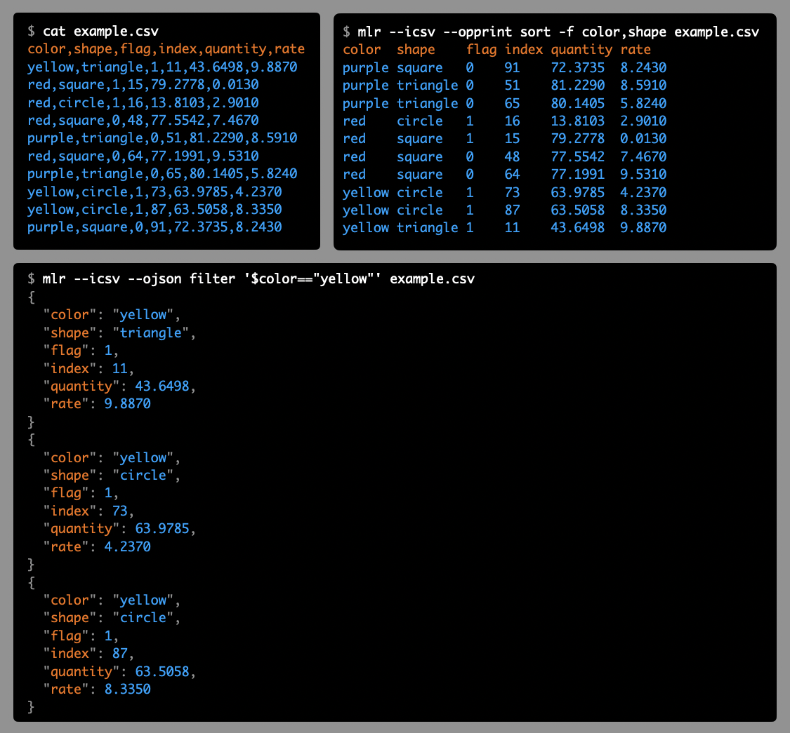

# What is Miller?

**Miller is like awk, sed, cut, join, and sort for name-indexed data such as CSV, TSV, and tabular JSON.**

# Build status

[License: BSD2](https://github.com/johnkerl/miller/blob/master/LICENSE.txt)

[Docs](https://miller.readthedocs.io/en/latest/?badge=latest)

# Community

* Discussion forum: https://github.com/johnkerl/miller/discussions
* Feature requests / bug reports: https://github.com/johnkerl/miller/issues

# Distributions

There's a good chance you can get Miller pre-built for your system:

|OS|Installation command|
|---|---|
|Linux|`yum install miller`  `apt-get install miller`|
|Mac|`brew install miller` `port install miller`|
|Windows|`choco install miller`|

See also [building from source](https://miller.readthedocs.io/en/latest/build.html).

# What can Miller do for me?

With Miller, you get to use named fields without needing to count positional
indices, using familiar formats such as CSV, TSV, JSON, and
positionally-indexed.  Then, on the fly, you can add new fields which are
functions of existing fields, drop fields, sort, aggregate statistically,
pretty-print, and more.

* Miller operates on **key-value-pair data** while the familiar
Unix tools operate on integer-indexed fields: if the natural data structure for
the latter is the array, then Miller's natural data structure is the
insertion-ordered hash map.

* Miller handles a **variety of data formats**,
including but not limited to the familiar **CSV**, **TSV**, and **JSON**.
(Miller can handle **positionally-indexed data** too!)

# Getting started

* [A quick tutorial on Miller](https://www.ict4g.net/adolfo/notes/data-analysis/miller-quick-tutorial.html)
* [Tools to manipulate CSV files from the Command Line](https://www.ict4g.net/adolfo/notes/data-analysis/tools-to-manipulate-csv.html)
* [www.togaware.com/linux/survivor/CSV_Files.html](https://www.togaware.com/linux/survivor/CSV_Files.html)
* [MLR for CSV manipulation](https://guillim.github.io/terminal/2018/06/19/MLR-for-CSV-manipulation.html)
* [Miller in 10 minutes](https://miller.readthedocs.io/en/latest/10min.html).

# Features

* Miller is **multi-purpose**: it's useful for **data cleaning**,
**data reduction**, **statistical reporting**, **devops**, **system
administration**, **log-file processing**, **format conversion**, and
**database-query post-processing**.

* You can use Miller to snarf and munge **log-file data**, including selecting
out relevant substreams, then produce CSV format and load that into
all-in-memory/data-frame utilities for further statistical and/or graphical
processing.

* Miller complements **data-analysis tools** such as **R**, **pandas**, etc.:
you can use Miller to **clean** and **prepare** your data. While you can do
**basic statistics** entirely in Miller, its streaming-data feature and
single-pass algorithms enable you to **reduce very large data sets**.

* Miller complements SQL **databases**: you can slice, dice, and reformat data
on the client side on its way into or out of a database. You can also reap some
of the benefits of databases for quick, setup-free one-off tasks when you just
need to query some data in disk files in a hurry.

* Miller also goes beyond the classic Unix tools by stepping fully into our
modern, **no-SQL** world: its essential record-heterogeneity property allows
Miller to operate on data where records with different schema (field names) are
interleaved.

* Miller is **streaming**: most operations need only a single record in
memory at a time, rather than ingesting all input before producing any output.
For those operations which require deeper retention (`sort`, `tac`, `stats1`),
Miller retains only as much data as needed. This means that whenever
functionally possible, you can operate on files which are larger than your
system&rsquo;s available RAM, and you can use Miller in **tail -f** contexts.

* Miller is **pipe-friendly** and interoperates with the Unix toolkit

* Miller's I/O formats include **tabular pretty-printing**, **positionally
  indexed** (Unix-toolkit style), CSV, JSON, and others

* Miller does **conversion** between formats

* Miller's **processing is format-aware**: e.g. CSV `sort` and `tac` keep header lines first

* Miller has high-throughput **performance** on par with the Unix toolkit

* Not unlike `jq` (http://stedolan.github.io/jq/) for JSON, Miller is written
in portable, modern C, with **zero runtime dependencies**. You can download or
compile a single binary, `scp` it to a faraway machine, and expect it to work.

# Contributors

Thanks to all the fine people who help make Miller better by contributing commits/PRs! (I wish there
were an equally fine way to honor all the fine people who contribute through issues and feature requests!)

# More documentation links

* [**Full documentation**](https://miller.readthedocs.io/)
* [Miller's license is two-clause BSD](https://github.com/johnkerl/miller/blob/master/LICENSE.txt).
* [Notes about issue-labeling in the Github repo](https://github.com/johnkerl/miller/wiki/Issue-labeling)
* [Active issues](https://github.com/johnkerl/miller/issues?q=is%3Aissue+is%3Aopen+sort%3Aupdated-desc)
