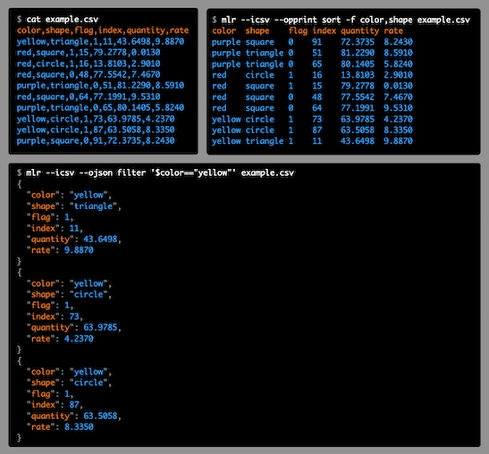

# What is Miller?

**Miller is like awk, sed, cut, join, and sort for data formats such as CSV, TSV, tabular JSON and positionally-indexed.**

# What can Miller do for me?

With Miller, you get to use named fields without needing to count positional
indices, using familiar formats such as CSV, TSV, JSON, and
positionally-indexed.  Then, on the fly, you can add new fields which are
functions of existing fields, drop fields, sort, aggregate statistically,
pretty-print, and more.

* Miller operates on **key-value-pair data** while the familiar
Unix tools operate on integer-indexed fields: if the natural data structure for
the latter is the array, then Miller's natural data structure is the
insertion-ordered hash map.

* Miller handles a **variety of data formats**,
including but not limited to the familiar **CSV**, **TSV**, and **JSON**.
(Miller can handle **positionally-indexed data** too!)

In the above image you can see how Miller embraces the common themes of
key-value-pair data in a variety of data formats.

# Getting started

* [Miller in 10 minutes](https://miller.readthedocs.io/en/latest/10min)
* [A quick tutorial on Miller](https://www.ict4g.net/adolfo/notes/data-analysis/miller-quick-tutorial.html)
* [Tools to manipulate CSV files from the Command Line](https://www.ict4g.net/adolfo/notes/data-analysis/tools-to-manipulate-csv.html)
* [www.togaware.com/linux/survivor/CSV_Files.html](https://www.togaware.com/linux/survivor/CSV_Files.html)
* [MLR for CSV manipulation](https://guillim.github.io/terminal/2018/06/19/MLR-for-CSV-manipulation.html)
* [Linux Magazine: Process structured text files with Miller](https://www.linux-magazine.com/Issues/2016/187/Miller)
* [Miller: Command Line CSV File Processing](https://onepointzero.app/posts/miller-command-line-csv-file-processing/)

# More documentation links

* [**Full documentation**](https://miller.readthedocs.io/)
* [Miller's license is two-clause BSD](https://github.com/johnkerl/miller/blob/main/LICENSE.txt)
* [Notes about issue-labeling in the Github repo](https://github.com/johnkerl/miller/wiki/Issue-labeling)
* [Active issues](https://github.com/johnkerl/miller/issues?q=is%3Aissue+is%3Aopen+sort%3Aupdated-desc)

# Installing

There's a good chance you can get Miller pre-built for your system:

|OS|Installation command|
|---|---|
|Linux|`yum install miller`  `apt-get install miller`|
|Mac|`brew install miller` `port install miller`|
|Windows|`choco install miller`|

See also [building from source](https://miller.readthedocs.io/en/latest/build.html).

# Build status

# Building from source

* `make`: takes just a few seconds and produces the Miller executable, which is `./mlr` (or `.\mlr.exe` on Windows).
  * Without `make`: `go build github.com/johnkerl/miller/cmd/mlr`
* `make check` runs tests.
  * Without `make`: `go test github.com/johnkerl/miller/internal/pkg/...` and `mlr regtest`
* `make install` installs executable `/usr/local/bin/mlr` and manual page `/usr/local/share/man/man1/mlr.1` (so you can do `man mlr`).
  * You can instead do `./configure --prefix=/some/install/path` followed by `make install` if you want to install somewhere other than `/usr/local`.
  * Without make: `go install github.com/johnkerl/miller/cmd/mlr` will install to _GOPATH_`/bin/mlr`
* See also the doc page on [building from source](https://miller.readthedocs.io/en/latest/build).
* For more developer information please see [README-go-port.md](./README-go-port.md).

# License

[License: BSD2](https://github.com/johnkerl/miller/blob/main/LICENSE.txt)

# Community

* Discussion forum: https://github.com/johnkerl/miller/discussions
* Feature requests / bug reports: https://github.com/johnkerl/miller/issues

<!-- ALL-CONTRIBUTORS-BADGE:START - Do not remove or modify this section -->

<!-- ALL-CONTRIBUTORS-BADGE:END -->

# Features

* Miller is **multi-purpose**: it's useful for **data cleaning**,
**data reduction**, **statistical reporting**, **devops**, **system
administration**, **log-file processing**, **format conversion**, and
**database-query post-processing**.

* You can use Miller to snarf and munge **log-file data**, including selecting
out relevant substreams, then produce CSV format and load that into
all-in-memory/data-frame utilities for further statistical and/or graphical
processing.

* Miller complements **data-analysis tools** such as **R**, **pandas**, etc.:
you can use Miller to **clean** and **prepare** your data. While you can do
**basic statistics** entirely in Miller, its streaming-data feature and
single-pass algorithms enable you to **reduce very large data sets**.

* Miller complements SQL **databases**: you can slice, dice, and reformat data
on the client side on its way into or out of a database. You can also reap some
of the benefits of databases for quick, setup-free one-off tasks when you just
need to query some data in disk files in a hurry.

* Miller also goes beyond the classic Unix tools by stepping fully into our
modern, **no-SQL** world: its essential record-heterogeneity property allows
Miller to operate on data where records with different schema (field names) are
interleaved.

* Miller is **streaming**: most operations need only a single record in
memory at a time, rather than ingesting all input before producing any output.
For those operations which require deeper retention (`sort`, `tac`, `stats1`),
Miller retains only as much data as needed. This means that whenever
functionally possible, you can operate on files which are larger than your
system&rsquo;s available RAM, and you can use Miller in **tail -f** contexts.

* Miller is **pipe-friendly** and interoperates with the Unix toolkit.

* Miller's I/O formats include **tabular pretty-printing**, **positionally
  indexed** (Unix-toolkit style), CSV, JSON, and others.

* Miller does **conversion** between formats.

* Miller's **processing is format-aware**: e.g. CSV `sort` and `tac` keep header lines first.

* Miller has high-throughput **performance** on par with the Unix toolkit.

* Miller is written in portable, modern Go, with **zero runtime dependencies**.
You can download or compile a single binary, `scp` it to a faraway machine,
and expect it to work.

# What people are saying about Miller

<blockquote class="twitter-tweet">
Today I discovered Miller—it&#39;s like jq but for CSV: <a href="https://t.co/pn5Ni241KM">https://t.co/pn5Ni241KM</a>  Also, &quot;Miller complements data-analysis tools such as R, pandas, etc.: you can use Miller to clean and prepare your data.&quot; <a href="https://twitter.com/GreatBlueC?ref_src=twsrc%5Etfw">@GreatBlueC</a> <a href="https://twitter.com/nfmcclure?ref_src=twsrc%5Etfw">@nfmcclure</a>
&mdash; Adrien Trouillaud (@adrienjt) <a href="https://twitter.com/adrienjt/status/1308963056592891904?ref_src=twsrc%5Etfw">September 24, 2020</a></blockquote>

<blockquote class="twitter-tweet">
Underappreciated swiss-army command-line chainsaw.  &quot;Miller is like awk, sed, cut, join, and sort for [...] CSV, TSV, and [...] JSON.&quot; <a href="https://t.co/TrQqSUK3KK">https://t.co/TrQqSUK3KK</a>
&mdash; Dirk Eddelbuettel (@eddelbuettel) <a href="https://twitter.com/eddelbuettel/status/836555980771061760?ref_src=twsrc%5Etfw">February 28, 2017</a></blockquote>

<blockquote class="twitter-tweet">
Miller looks like a great command line tool for working with CSV data. Sed, awk, cut, join all rolled into one: <a href="http://t.co/9BBb6VCZ6Y">http://t.co/9BBb6VCZ6Y</a>
&mdash; Mike Loukides (@mikeloukides) <a href="https://twitter.com/mikeloukides/status/632885317389950976?ref_src=twsrc%5Etfw">August 16, 2015</a></blockquote>

<blockquote class="twitter-tweet">
Miller is like sed, awk, cut, join, and sort for name-indexed data such as CSV: <a href="http://t.co/1zPbfg6B2W">http://t.co/1zPbfg6B2W</a> - handy tool!
&mdash; Ilya Grigorik (@igrigorik) <a href="https://twitter.com/igrigorik/status/635134857283153920?ref_src=twsrc%5Etfw">August 22, 2015</a></blockquote>

<blockquote class="twitter-tweet">
Btw, I think Miller is the best CLI tool to deal with CSV. I used to use this when I need to preprocess too big CSVs to load into R (now we have vroom, so such cases might be rare, though...)<a href="https://t.co/kUjrSSGJoT">https://t.co/kUjrSSGJoT</a>
&mdash; Hiroaki Yutani (@yutannihilat_en) <a href="https://twitter.com/yutannihilat_en/status/1252392795676934144?ref_src=twsrc%5Etfw">April 21, 2020</a></blockquote>

<blockquote class="twitter-tweet">
Miller: a *format-aware* data munging tool By <a href="https://twitter.com/__jo_ker__?ref_src=twsrc%5Etfw">@__jo_ker__</a> to overcome limitations with *line-aware* workshorses like awk, sed et al <a href="https://t.co/LCyPkhYvt9">https://t.co/LCyPkhYvt9</a>  The project website is a fantastic example of good software documentation!!
&mdash; Donny Daniel (@dnnydnl) <a href="https://twitter.com/dnnydnl/status/1038883999391932416?ref_src=twsrc%5Etfw">September 9, 2018</a></blockquote>

<blockquote class="twitter-tweet">
Holy holly data swiss army knife batman! How did no one suggest Miller <a href="https://t.co/JGQpmRAZLv">https://t.co/JGQpmRAZLv</a> for solving database cleaning / ETL issues to me before   Congrats to <a href="https://twitter.com/__jo_ker__?ref_src=twsrc%5Etfw">@__jo_ker__</a> for amazingly intuitive tool for critical data management tasks!<a href="https://twitter.com/hashtag/DataScienceandLaw?src=hash&amp;ref_src=twsrc%5Etfw">#DataScienceandLaw</a> <a href="https://twitter.com/hashtag/ComputationalLaw?src=hash&amp;ref_src=twsrc%5Etfw">#ComputationalLaw</a>
&mdash; James Miller (@japanlawprof) <a href="https://twitter.com/japanlawprof/status/1006547451409518597?ref_src=twsrc%5Etfw">June 12, 2018</a></blockquote>

<blockquote class="twitter-tweet">
🤯<a href="https://twitter.com/__jo_ker__?ref_src=twsrc%5Etfw">@__jo_ker__</a>&#39;s Miller easily reads, transforms, + writes all sorts of tabular data. It&#39;s standalone, fast, and built for streaming data (operating on one line at a time, so you can work on files larger than memory).  And the docs are dream. I&#39;ve been reading them all morning! <a href="https://t.co/Be2pGPZK6t">https://t.co/Be2pGPZK6t</a>
&mdash; Benjamin Wolfe (he/him) (@BenjaminWolfe) <a href="https://twitter.com/BenjaminWolfe/status/1435966268499128324?ref_src=twsrc%5Etfw">September 9, 2021</a></blockquote>

## Contributors ✨

Thanks to all the fine people who help make Miller better ([emoji key](https://allcontributors.org/docs/en/emoji-key)):

<!-- ALL-CONTRIBUTORS-LIST:START - Do not remove or modify this section -->
<!-- prettier-ignore-start -->
<!-- markdownlint-disable -->
<table>
  <tr>
    <td align="center"><a href="https://github.com/aborruso"> <b>Andrea Borruso</b></a> <a href="#ideas-aborruso" title="Ideas, Planning, & Feedback">🤔</a> <a href="#design-aborruso" title="Design">🎨</a></td>
    <td align="center"><a href="https://sjackman.ca/"> <b>Shaun Jackman</b></a> <a href="#ideas-sjackman" title="Ideas, Planning, & Feedback">🤔</a></td>
    <td align="center"><a href="http://www.fredtrotter.com/"> <b>Fred Trotter</b></a> <a href="#ideas-ftrotter" title="Ideas, Planning, & Feedback">🤔</a> <a href="#design-ftrotter" title="Design">🎨</a></td>
    <td align="center"><a href="https://github.com/Komosa"> <b>komosa</b></a> <a href="#ideas-Komosa" title="Ideas, Planning, & Feedback">🤔</a></td>
    <td align="center"><a href="https://github.com/jungle-boogie"> <b>jungle-boogie</b></a> <a href="#ideas-jungle-boogie" title="Ideas, Planning, & Feedback">🤔</a></td>
    <td align="center"><a href="https://github.com/0-wiz-0"> <b>Thomas Klausner</b></a> <a href="#infra-0-wiz-0" title="Infrastructure (Hosting, Build-Tools, etc)">🚇</a></td>
    <td align="center"><a href="https://github.com/skitt"> <b>Stephen Kitt</b></a> <a href="#platform-skitt" title="Packaging/porting to new platform">📦</a></td>
  </tr>
  <tr>
    <td align="center"><a href="http://leahneukirchen.org/"> <b>Leah Neukirchen</b></a> <a href="#ideas-leahneukirchen" title="Ideas, Planning, & Feedback">🤔</a></td>
    <td align="center"><a href="https://github.com/lgbaldoni"> <b>Luigi Baldoni</b></a> <a href="#platform-lgbaldoni" title="Packaging/porting to new platform">📦</a></td>
    <td align="center"><a href="https://yutani.rbind.io/"> <b>Hiroaki Yutani</b></a> <a href="#ideas-yutannihilation" title="Ideas, Planning, & Feedback">🤔</a></td>
    <td align="center"><a href="https://3e.org/"> <b>Daniel M. Drucker</b></a> <a href="#ideas-dmd" title="Ideas, Planning, & Feedback">🤔</a></td>
    <td align="center"><a href="https://github.com/NikosAlexandris"> <b>Nikos Alexandris</b></a> <a href="#ideas-NikosAlexandris" title="Ideas, Planning, & Feedback">🤔</a></td>
    <td align="center"><a href="https://github.com/kundeng"> <b>kundeng</b></a> <a href="#platform-kundeng" title="Packaging/porting to new platform">📦</a></td>
    <td align="center"><a href="http://victorsergienko.com/"> <b>Victor Sergienko</b></a> <a href="#platform-singalen" title="Packaging/porting to new platform">📦</a></td>
  </tr>
  <tr>
    <td align="center"><a href="https://github.com/gromgit"> <b>Adrian Ho</b></a> <a href="#design-gromgit" title="Design">🎨</a></td>
    <td align="center"><a href="https://github.com/Zachp"> <b>zachp</b></a> <a href="#platform-Zachp" title="Packaging/porting to new platform">📦</a></td>
    <td align="center"><a href="https://dsel.net/"> <b>David Selassie</b></a> <a href="#ideas-davidselassie" title="Ideas, Planning, & Feedback">🤔</a></td>
    <td align="center"><a href="http://www.joelparkerhenderson.com/"> <b>Joel Parker Henderson</b></a> <a href="#ideas-joelparkerhenderson" title="Ideas, Planning, & Feedback">🤔</a></td>
    <td align="center"><a href="https://github.com/divtiply"> <b>Michel Ace</b></a> <a href="#ideas-divtiply" title="Ideas, Planning, & Feedback">🤔</a></td>
    <td align="center"><a href="http://fuco1.github.io/sitemap.html"> <b>Matus Goljer</b></a> <a href="#ideas-Fuco1" title="Ideas, Planning, & Feedback">🤔</a></td>
    <td align="center"><a href="https://github.com/terorie"> <b>Richard Patel</b></a> <a href="#platform-terorie" title="Packaging/porting to new platform">📦</a></td>
  </tr>
  <tr>
    <td align="center"><a href="https://blog.kub1x.org/"> <b>Jakub Podlaha</b></a> <a href="#design-kub1x" title="Design">🎨</a></td>
    <td align="center"><a href="https://goo.gl/ZGZynx"> <b>Miodrag Milić</b></a> <a href="#platform-majkinetor" title="Packaging/porting to new platform">📦</a></td>
    <td align="center"><a href="https://github.com/derekmahar"> <b>Derek Mahar</b></a> <a href="#ideas-derekmahar" title="Ideas, Planning, & Feedback">🤔</a></td>
    <td align="center"><a href="https://github.com/spmundi"> <b>spmundi</b></a> <a href="#ideas-spmundi" title="Ideas, Planning, & Feedback">🤔</a></td>
    <td align="center"><a href="https://github.com/koernepr"> <b>Peter Körner</b></a> <a href="#security-koernepr" title="Security">🛡️</a></td>
    <td align="center"><a href="https://github.com/rubyFeedback"> <b>rubyFeedback</b></a> <a href="#ideas-rubyFeedback" title="Ideas, Planning, & Feedback">🤔</a></td>
    <td align="center"><a href="https://github.com/rbolsius"> <b>rbolsius</b></a> <a href="#platform-rbolsius" title="Packaging/porting to new platform">📦</a></td>
  </tr>
  <tr>
    <td align="center"><a href="https://github.com/awildturtok"> <b>awildturtok</b></a> <a href="#ideas-awildturtok" title="Ideas, Planning, & Feedback">🤔</a></td>
    <td align="center"><a href="https://github.com/agguser"> <b>agguser</b></a> <a href="#ideas-agguser" title="Ideas, Planning, & Feedback">🤔</a></td>
    <td align="center"><a href="https://github.com/jganong"> <b>jganong</b></a> <a href="#ideas-jganong" title="Ideas, Planning, & Feedback">🤔</a></td>
    <td align="center"><a href="https://www.linkedin.com/in/fulvio-scapin"> <b>Fulvio Scapin</b></a> <a href="#ideas-trantor" title="Ideas, Planning, & Feedback">🤔</a></td>
    <td align="center"><a href="https://github.com/torbiak"> <b>Jordan Torbiak</b></a> <a href="#ideas-torbiak" title="Ideas, Planning, & Feedback">🤔</a></td>
    <td align="center"><a href="https://github.com/Andy1978"> <b>Andreas Weber</b></a> <a href="#ideas-Andy1978" title="Ideas, Planning, & Feedback">🤔</a></td>
    <td align="center"><a href="https://github.com/vapniks"> <b>vapniks</b></a> <a href="#platform-vapniks" title="Packaging/porting to new platform">📦</a></td>
  </tr>
  <tr>
    <td align="center"><a href="https://github.com/89z"> <b>Zombo</b></a> <a href="#platform-89z" title="Packaging/porting to new platform">📦</a></td>
    <td align="center"><a href="https://github.com/BEFH"> <b>Brian Fulton-Howard</b></a> <a href="#platform-BEFH" title="Packaging/porting to new platform">📦</a></td>
    <td align="center"><a href="https://github.com/ChCyrill"> <b>ChCyrill</b></a> <a href="#ideas-ChCyrill" title="Ideas, Planning, & Feedback">🤔</a></td>
    <td align="center"><a href="https://github.com/jauderho"> <b>Jauder Ho</b></a> <a href="https://github.com/johnkerl/miller/commits?author=jauderho" title="Code">💻</a></td>
    <td align="center"><a href="https://github.com/psacawa"> <b>Paweł Sacawa</b></a> <a href="https://github.com/johnkerl/miller/issues?q=author%3Apsacawa" title="Bug reports">🐛</a></td>
  </tr>
</table>

<!-- markdownlint-restore -->
<!-- prettier-ignore-end -->

<!-- ALL-CONTRIBUTORS-LIST:END -->

This project follows the [all-contributors](https://github.com/all-contributors/all-contributors) specification. Contributions of any kind are welcome!
