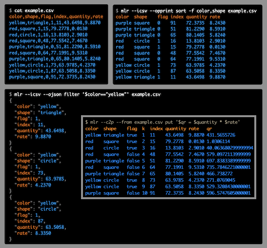

<!---  PLEASE DO NOT EDIT DIRECTLY. EDIT THE .md.in FILE PLEASE. --->

Quick links:
&nbsp;
<a class="quicklink" href="./reference-main-flag-list/index.html">Flags</a>
&nbsp;
<a class="quicklink" href="./reference-verbs/index.html">Verbs</a>
&nbsp;
<a class="quicklink" href="./reference-dsl-builtin-functions/index.html">Functions</a>
&nbsp;
<a class="quicklink" href="./glossary/index.html">Glossary</a>
&nbsp;
<a class="quicklink" href="./release-docs/index.html">Release docs</a>

# Introduction

**Miller is a command-line tool for querying, shaping, and reformatting data files in various formats including CSV, TSV, JSON, and JSON Lines.**

In several senses, Miller is more than one tool:

**Format conversion:** You can convert CSV files to JSON, or vice versa, or
pretty-print your data horizontally or vertically to make it easier to read.

**Data manipulation:** With a few keystrokes you can remove columns you don't care about -- or, make new ones.

**Pre-processing/post-processing vs standalone use:** You can use Miller to clean data files and put them into standard formats, perhaps in preparation to load them into a database or a hands-off data-processing pipeline. Or you can use it post-process and summary database-query output. As well, you can use Miller to explore and analyze your data interactively.

**Compact verbs vs programming language:** For low-keystroking you can do things like

<pre class="pre-highlight-non-pair">
<b>mlr --csv sort -f name input.csv</b>
</pre>

<pre class="pre-highlight-non-pair">
<b>mlr --json head -n 1 myfile.json</b>
</pre>

The `sort`, `head`, etc are called *verbs*. They're analogs of familiar command-line tools like `sort`, `head`, and so on -- but they're aware of name-indexed, multi-line file formats like CSV, TSV, and JSON. In addition, though, using Miller's `put` verb you can use programming-language statements for expressions like

<pre class="pre-highlight-non-pair">
<b>mlr --csv put '$rate = $units / $seconds' input.csv</b>
</pre>

which allow you to succintly express your own logic.

**Multiple domains:** People use Miller for data analysis, data science, software engineering, devops/system-administration, journalism, scientific research, and more.

In the following you can see how CSV, TSV, tabular, JSON, and other **file formats** share a common theme which is **lists of key-value-pairs**. Miller embraces this common theme.

**The big picture:** Even well into the 21st century, our world is full of text-formatted data like CSV. Google _CSV memes_, for example. We need tooling to _thrive in this world_, nimbly manipulating data which is in CSVs. And we need tooling to _move beyond CSV_, to be able to pull data out and into other storage and processing systems. Miller is designed for both these goals.
