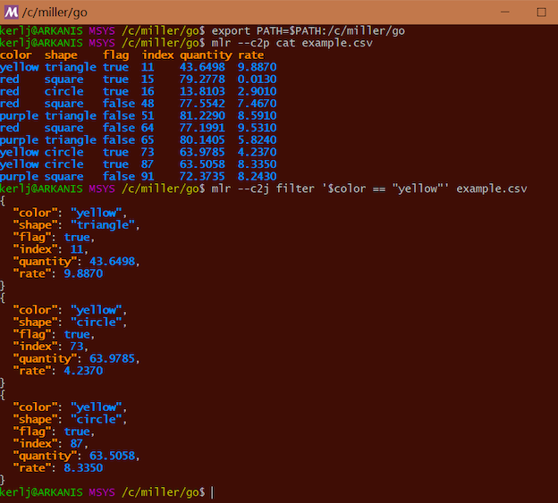
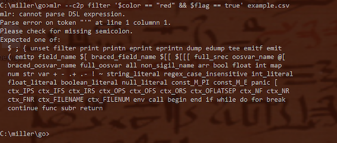

<!---  PLEASE DO NOT EDIT DIRECTLY. EDIT THE .md.in FILE PLEASE. --->

Quick links:
&nbsp;
<a class="quicklink" href="../reference-main-flag-list/index.html">Flags</a>
&nbsp;
<a class="quicklink" href="../reference-verbs/index.html">Verbs</a>
&nbsp;
<a class="quicklink" href="../reference-dsl-builtin-functions/index.html">Functions</a>
&nbsp;
<a class="quicklink" href="../glossary/index.html">Glossary</a>
&nbsp;
<a class="quicklink" href="../release-docs/index.html">Release docs</a>

# Miller on Windows

## Native builds as of Miller 6

Miller was originally developed for Unix-like operating systems, including Linux and MacOS. Since Miller 5.2.0, which was the first version to support Windows at all, that support has been partial. But as of version 6.0.0, Miller builds directly on Windows.

**The experience is now almost the same on Windows as it is on Linux, NetBSD/FreeBSD, and MacOS.**

MSYS2 is no longer required -- although you can of course still use Miller from within MSYS2 if you prefer. There is now simply a single `mlr.exe`, with no `msys2.dll` alongside anymore.

See [Installation](installing-miller.md) for how to get a copy of `mlr.exe`.

## Setup

Place `mlr.exe` somewhere within your `PATH` variable.

To use Miller from within MSYS2/Cygwin, also make sure `mlr.exe` is within the `PATH` variable.

## Differences

The Windows-support code within Miller makes an effort to support Linux/Unix/MacOS-like command-line syntax, including single-quoting of expressions for `mlr put` and `mlr filter` -- and in the examples above, this often works. However, there are still some cases where more complex expressions aren't successfully parsed from the Windows prompt, even though they are from MSYS2:

Single quotes with `&&` or `||` inside are fundamentally unhandleable within Windows; there is nothing Miller can do here as the Windows command line is split before Miller ever receives it.

One workaround is to use MSYS2. Another workaround is to put more complex DSL expressions into a file:

A third workaround is to replace `"` with `"""`, then `'` with `"`:

A fourth workaround is `mlr -s`: see [Scripting with Miller](scripting.md).
