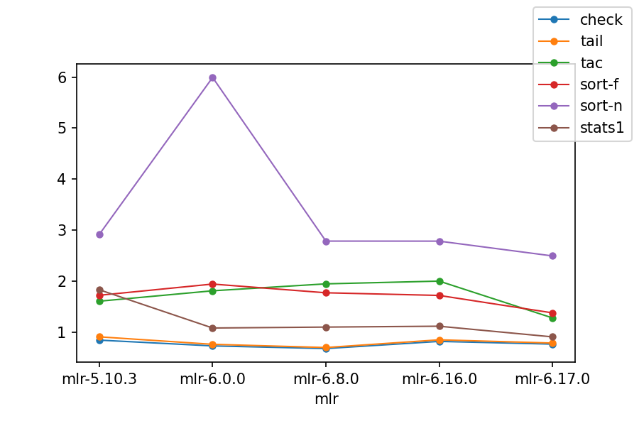
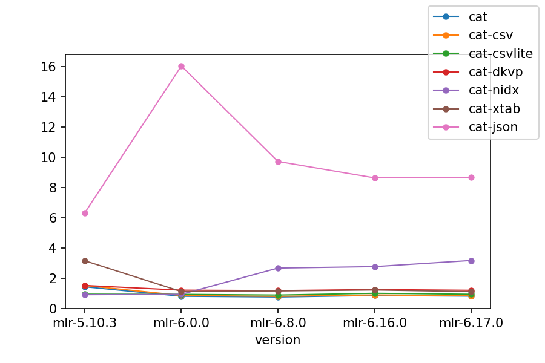
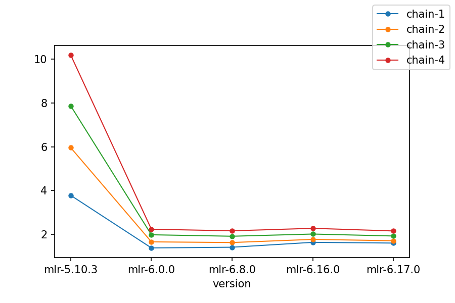

<!---  PLEASE DO NOT EDIT DIRECTLY. EDIT THE .md.in FILE PLEASE. --->
<div>
<span class="quicklinks">
Quick links:
&nbsp;
<a class="quicklink" href="../reference-main-flag-list/index.html">Flags</a>
&nbsp;
<a class="quicklink" href="../reference-verbs/index.html">Verbs</a>
&nbsp;
<a class="quicklink" href="../reference-dsl-builtin-functions/index.html">Functions</a>
&nbsp;
<a class="quicklink" href="../glossary/index.html">Glossary</a>
&nbsp;
<a class="quicklink" href="../release-docs/index.html">Release docs</a>
</span>
</div>
# Performance

## Disclaimer

In a previous version of this page, I compared Miller to some items in the Unix toolkit in terms of run time. But such comparisons are very much not apples-to-apples:

* Miller's principal strength is that it handles **key-value data in various formats** while the system tools **do not**. So if you time `mlr sort` on a CSV file against system `sort`, it's not relevant to say which is faster by how many percent -- Miller will respect the header line, leaving it in place, while the system sort will move it, sorting it along with all the other header lines. This would be comparing the run times of two programs produce different outputs.  Likewise, `awk` doesn't respect header lines, although you can code up some CSV-handling using `if (NR==1) { ... } else { ... }`. And that's just CSV: I don't know any simple way to get `sort`, `awk`, etc. to handle DKVP, JSON, etc. -- which is the main reason I wrote Miller.

* **Implementations differ by platform**: one `awk` may be fundamentally faster than another, and `mawk` has a very efficient bytecode implementation -- which handles positionally indexed data far faster than Miller does.

* The system `sort` command will, on some systems, handle too-large-for-RAM datasets by spilling to disk; Miller (as of version 5.2.0, mid-2017) does not. Miller sorts are always stable; GNU supports stable and unstable variants.

* Etc.

## Summary

Miller can do many kinds of processing on key-value-pair data using elapsed time roughly of the same order of magnitude as items in the Unix toolkit can handle positionally indexed data. Specific results vary widely by platform, implementation details, and multi-core use (or not). Lastly, specific special-purpose non-record-aware processing will run far faster if implemented in `grep`, `sed`, etc.

## Performance benchmarks

For performance testing, the [example.csv](https://github.com/johnkerl/miller/blob/main/docs/src/example.csv) file
[was expanded](https://github.com/johnkerl/miller/blob/main/scripts/perf/prep-perf-data.sh) into a million-line CSV file,
then converted to DKVP, JSON, etc.

Notes:

* These benchmarks were run in early 2026 on MacBook Air laptop with an M1 processor.
* As of late 2021, Miller was benchmarked using Go compiler versions 1.15.15, 1.16.12, 1.17.5, and 1.18beta1, with no significant performance changes attributable to compiler versions.

For the [first benchmark](https://github.com/johnkerl/miller/blob/main/scripts/perf/time-verbs.py), the format is CSV and the operations were varied:



For the [second benchmark](https://github.com/johnkerl/miller/blob/main/scripts/perf/time-verbs.py), we have `mlr cat` of those files, varying file types, with processing times shown. Catting out files as-is isn't a particularly useful operation in itself, but it gives an idea of how processing time depends on file format:



For the [third benchmark](https://github.com/johnkerl/miller/blob/main/scripts/perf/time-verbs.py), we have longer and longer then-chains: `mlr put ...`, then `mlr put ... then put ...`, etc. -- deepening the then-chain from one to four:



Notes:

* CSV processing was particularly improved in Miller 6.
* Record I/O was improved across the board, except that JSON continues to be a CPU-intensive format. Miller 6 JSON throughput was the same on Mac and Linux; Miller 5 did better than Miller 6 but only on Linux, not Mac.
* Miller 6.0.0's initial issues with `sort` and JSON processing have been resolved.
* Even single-verb processing with `put` and `stats1` was significantly faster on both platforms.
* Longer then-chains benefit even more from Miller 6's [multicore approach](cpu.md).

## Decompression options

This is some data from [https://community.opencellid.org](https://community.opencellid.org): approximately 40
million records, 1.2GB compressed, 2.9GB uncompressed:

```
$ wc -l cell_towers.csv
 40496649 cell_towers.csv

$ gunzip < cell_towers.csv.gz | wc -l
 40496649

$ ls -lh cell_towers.csv*
-rw-r--r--  1 kerl  staff   2.9G Feb 22 12:04 cell_towers.csv
-rw-r--r--  1 kerl  staff   1.2G Feb 22 11:10 cell_towers.csv.gz
```

First we see that decompression is much cheaper than compression: 10 seconds vs. 2.5 minutes:

```
$ time gunzip < cell_towers.csv.gz  > /dev/null
real  0m5.546s
user  0m5.352s
sys 0m0.183s

$ time gzip < cell_towers.csv  > /dev/null
real  3m25.274s
user  3m16.391s
sys 0m1.618s
```

Next we look at system `cut` which needs to split on lines and fields. Since `cut` is in the
[Unix toolkit](unix-toolkit-context.md) it handles integer column names, starting with 1.

This takes a little over a minute on my M1 MacBook Air:

```
$ time cut -d, -f 1,2,12,13 cell_towers.csv > /dev/null
real  1m8.347s
user  1m7.051s
sys 0m1.167s
```

Columns `1,2,12,13` are the same as `radio,mcc,created,updated`. Since
decompression is quick, it's perhaps unsurprising that whether we decompress
and have Miller read uncompressed data, or have it [decompress
in-process](reference-main-compressed-data.md#automatic-detection-on-input), or
use an [external decompressor with
`--prepipe`](reference-main-compressed-data.md#external-decompressors-on-input),
the results are about the same.

```
$ time mlr --csv --from cell_towers.csv cut -f radio,mcc,created,updated
real    1m27.557s
user    3m8.856s
sys     0m6.984s

$ time mlr --csv --from cell_towers.csv.gz --gzin cut -f radio,mcc,created,updated
real    1m35.121s
user    3m58.336s
sys     0m6.591s

$ time mlr --csv --from cell_towers.csv.gz --prepipe gunzip cut -f radio,mcc,created,updated
real    1m27.430s
user    3m18.665s
sys     0m10.017s
```
