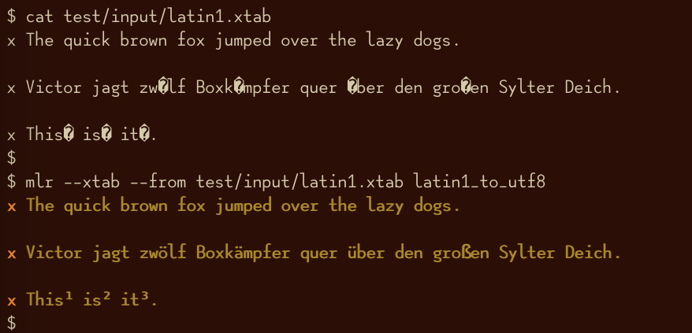
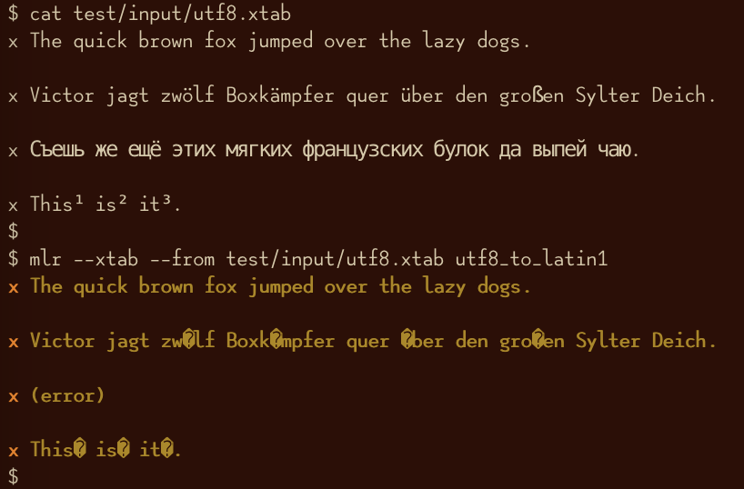
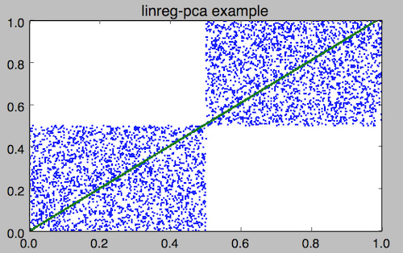

<!---  PLEASE DO NOT EDIT DIRECTLY. EDIT THE .md.in FILE PLEASE. --->

Quick links:
&nbsp;
<a class="quicklink" href="../reference-main-flag-list/index.html">Flags</a>
&nbsp;
<a class="quicklink" href="../reference-verbs/index.html">Verbs</a>
&nbsp;
<a class="quicklink" href="../reference-dsl-builtin-functions/index.html">Functions</a>
&nbsp;
<a class="quicklink" href="../glossary/index.html">Glossary</a>
&nbsp;
<a class="quicklink" href="../release-docs/index.html">Release docs</a>

# List of verbs

Verbs are the building blocks of how you can use Miller to process your data.
When you type

<pre class="pre-highlight-in-pair">
<b>mlr --icsv --opprint sort -n quantity then head -n 4 example.csv</b>
</pre>
<pre class="pre-non-highlight-in-pair">
color  shape    flag k index quantity rate
red    circle   true 3 16    13.8103  2.9010
yellow triangle true 1 11    43.6498  9.8870
yellow circle   true 9 87    63.5058  8.3350
yellow circle   true 8 73    63.9785  4.2370
</pre>

the `sort` and `head` bits are _verbs_.  See the [Miller command
structure](reference-main-overview.md) page for context.

At the command line, you can use `mlr -l` and `mlr -L` for information much
like what's on this page.

## Overview

Whereas the Unix toolkit is made of the separate executables `cat`, `tail`, `cut`,
`sort`, etc., Miller has subcommands, or **verbs**, such as `mlr cat`, `mlr tail`, `mlr cut`, and
`mlr sort`, invoked as follows:

<pre class="pre-non-highlight-non-pair">
mlr tac *.dat
mlr cut --complement -f os_version *.dat
mlr sort -f hostname,uptime *.dat
</pre>

These fall into categories as follows:

* Analogs of their Unix-toolkit namesakes, discussed below as well as in [Unix-toolkit Context](unix-toolkit-context.md): [cat](reference-verbs.md#cat), [cut](reference-verbs.md#cut), [grep](reference-verbs.md#grep), [head](reference-verbs.md#head), [join](reference-verbs.md#join), [sort](reference-verbs.md#sort), [tac](reference-verbs.md#tac), [tail](reference-verbs.md#tail), [top](reference-verbs.md#top), [uniq](reference-verbs.md#uniq).

* `awk`-like functionality: [filter](reference-verbs.md#filter), [put](reference-verbs.md#put), [sec2gmt](reference-verbs.md#sec2gmt), [sec2gmtdate](reference-verbs.md#sec2gmtdate), [step](reference-verbs.md#step), [tee](reference-verbs.md#tee).

* Statistically oriented: [bar](reference-verbs.md#bar), [bootstrap](reference-verbs.md#bootstrap), [decimate](reference-verbs.md#decimate), [histogram](reference-verbs.md#histogram), [least-frequent](reference-verbs.md#least-frequent), [most-frequent](reference-verbs.md#most-frequent), [sample](reference-verbs.md#sample), [shuffle](reference-verbs.md#shuffle), [stats1](reference-verbs.md#stats1), [stats2](reference-verbs.md#stats2).

* Particularly oriented toward [Record Heterogeneity](record-heterogeneity.md), although all Miller commands can handle heterogeneous records: [group-by](reference-verbs.md#group-by), [group-like](reference-verbs.md#group-like), [having-fields](reference-verbs.md#having-fields).

* These draw from other sources (see also [How Original Is Miller?](originality.md)): [count-distinct](reference-verbs.md#count-distinct) is SQL-ish, and [rename](reference-verbs.md#rename) can be done by `sed` (which does it faster: see [Performance](performance.md)). Verbs: [check](reference-verbs.md#check), [count-distinct](reference-verbs.md#count-distinct), [label](reference-verbs.md#label), [merge-fields](reference-verbs.md#merge-fields), [nest](reference-verbs.md#nest), [nothing](reference-verbs.md#nothing), [regularize](reference-verbs.md#regularize), [rename](reference-verbs.md#rename), [reorder](reference-verbs.md#reorder), [reshape](reference-verbs.md#reshape), [seqgen](reference-verbs.md#seqgen).

## altkv

Map list of values to alternating key/value pairs.

<pre class="pre-highlight-in-pair">
<b>mlr altkv -h</b>
</pre>
<pre class="pre-non-highlight-in-pair">
Usage: mlr altkv [options]
Given fields with values of the form a,b,c,d,e,f emits a=b,c=d,e=f pairs.
Options:
-h|--help Show this message.
</pre>

<pre class="pre-highlight-in-pair">
<b>echo 'a,b,c,d,e,f' | mlr altkv</b>
</pre>
<pre class="pre-non-highlight-in-pair">
a=b,c=d,e=f
</pre>

<pre class="pre-highlight-in-pair">
<b>echo 'a,b,c,d,e,f,g' | mlr altkv</b>
</pre>
<pre class="pre-non-highlight-in-pair">
a=b,c=d,e=f,4=g
</pre>

## bar

Cheesy bar-charting.

<pre class="pre-highlight-in-pair">
<b>mlr bar -h</b>
</pre>
<pre class="pre-non-highlight-in-pair">
Usage: mlr bar [options]
Replaces a numeric field with a number of asterisks, allowing for cheesy
bar plots. These align best with --opprint or --oxtab output format.
Options:
-f   {a,b,c}      Field names to convert to bars.
--lo {lo}         Lower-limit value for min-width bar: default '0.000000'.
--hi {hi}         Upper-limit value for max-width bar: default '100.000000'.
-w   {n}          Bar-field width: default '40'.
--auto            Automatically computes limits, ignoring --lo and --hi.
                  Holds all records in memory before producing any output.
-c   {character}  Fill character: default '*'.
-x   {character}  Out-of-bounds character: default '#'.
-b   {character}  Blank character: default '.'.
Nominally the fill, out-of-bounds, and blank characters will be strings of length 1.
However you can make them all longer if you so desire.
-h|--help Show this message.
</pre>

<pre class="pre-highlight-in-pair">
<b>mlr --opprint cat data/small</b>
</pre>
<pre class="pre-non-highlight-in-pair">
a   b   i x        y
pan pan 1 0.346791 0.726802
eks pan 2 0.758679 0.522151
wye wye 3 0.204603 0.338318
eks wye 4 0.381399 0.134188
wye pan 5 0.573288 0.863624
</pre>

<pre class="pre-highlight-in-pair">
<b>mlr --opprint bar --lo 0 --hi 1 -f x,y data/small</b>
</pre>
<pre class="pre-non-highlight-in-pair">
a   b   i x                                        y
pan pan 1 *************........................... *****************************...........
eks pan 2 ******************************.......... ********************....................
wye wye 3 ********................................ *************...........................
eks wye 4 ***************......................... *****...................................
wye pan 5 **********************.................. **********************************......
</pre>

<pre class="pre-highlight-in-pair">
<b>mlr --opprint bar --lo 0.4 --hi 0.6 -f x,y data/small</b>
</pre>
<pre class="pre-non-highlight-in-pair">
a   b   i x                                        y
pan pan 1 #....................................... ***************************************#
eks pan 2 ***************************************# ************************................
wye wye 3 #....................................... #.......................................
eks wye 4 #....................................... #.......................................
wye pan 5 **********************************...... ***************************************#
</pre>

<pre class="pre-highlight-in-pair">
<b>mlr --opprint bar --auto -f x,y -w 20 data/small</b>
</pre>
<pre class="pre-non-highlight-in-pair">
a   b   i x                                        y
pan pan 1 [0.204603]*****...............[0.758679] [0.134188]****************....[0.863624]
eks pan 2 [0.204603]*******************#[0.758679] [0.134188]**********..........[0.863624]
wye wye 3 [0.204603]#...................[0.758679] [0.134188]*****...............[0.863624]
eks wye 4 [0.204603]******..............[0.758679] [0.134188]#...................[0.863624]
wye pan 5 [0.204603]*************.......[0.758679] [0.134188]*******************#[0.863624]
</pre>

## bootstrap

<pre class="pre-highlight-in-pair">
<b>mlr bootstrap --help</b>
</pre>
<pre class="pre-non-highlight-in-pair">
Usage: mlr bootstrap [options]
Emits an n-sample, with replacement, of the input records.
See also mlr sample and mlr shuffle.
Options:
 -n Number of samples to output. Defaults to number of input records.
    Must be non-negative.
-h|--help Show this message.
</pre>

The canonical use for bootstrap sampling is to put error bars on statistical quantities, such as mean. For example:

<!--- hard-coded, not live-code, since random sampling would generate different data on each doc run
    which would needlessly complicate git diff -->

<pre class="pre-highlight-in-pair">
<b>mlr --c2p stats1 -a mean,count -f u -g color data/colored-shapes.csv</b>
</pre>
<pre class="pre-non-highlight-in-pair">
color  u_mean              u_count
yellow 0.4971291160651098  1413
red    0.49255964641241273 4641
purple 0.49400496322241666 1142
green  0.5048610595130744  1109
blue   0.5177171537414964  1470
orange 0.49053241584158375 303
</pre>

<pre class="pre-highlight-in-pair">
<b>mlr --c2p bootstrap then stats1 -a mean,count -f u -g color data/colored-shapes.csv</b>
</pre>
<pre class="pre-non-highlight-in-pair">
color  u_mean              u_count
red    0.49183858109559747 4655
yellow 0.487271566995769   1418
green  0.5018994641860465  1075
orange 0.5005396620689654  290
blue   0.5309761257817928  1439
purple 0.4917481873438798  1201
</pre>

<pre class="pre-highlight-in-pair">
<b>color  u_mean              u_count</b>
</pre>
<pre class="pre-non-highlight-in-pair">
yellow 0.4809714157857651  1419
blue   0.5057790647530039  1498
red    0.49114305508382283 4593
purple 0.49652395202020194 1188
green  0.5011425433212993  1108
orange 0.48935696323529426 272
</pre>

<pre class="pre-highlight-in-pair">
<b>mlr --c2p bootstrap then stats1 -a mean,count -f u -g color data/colored-shapes.csv</b>
</pre>
<pre class="pre-non-highlight-in-pair">
color  u_mean              u_count
red    0.49934473217726466 4671
purple 0.4934976176735793  1109
blue   0.5097866573146287  1497
yellow 0.4987188126740959  1436
orange 0.4802164827586204  290
green  0.5129018241860459  1075
</pre>

## case

<pre class="pre-highlight-in-pair">
<b>mlr case --help</b>
</pre>
<pre class="pre-non-highlight-in-pair">
Usage: mlr case [options]
Uppercases strings in record keys and/or values.
Options:
-k  Case only keys, not keys and values.
-v  Case only values, not keys and values.
-f  {a,b,c} Specify which field names to case (default: all)
-u  Convert to uppercase
-l  Convert to lowercase
-s  Convert to sentence case (capitalize first letter)
-t  Convert to title case (capitalize words)
-h|--help Show this message.
</pre>

<pre class="pre-highlight-non-pair">
<b>mlr --from test/input/cases.csv --icsv --ojson case -u</b>
</pre>

<pre class="pre-highlight-non-pair">
<b>mlr --from test/input/cases.csv --icsv --ojson case -u -k</b>
</pre>

<pre class="pre-highlight-non-pair">
<b>mlr --from test/input/cases.csv --icsv --ojson case -u -v</b>
</pre>

<pre class="pre-highlight-non-pair">
<b>mlr --from test/input/cases.csv --icsv --ojson case -k -t then case -v -s</b>
</pre>

<pre class="pre-highlight-non-pair">
<b>mlr --from test/input/cases.csv --icsv --ojson case -u -f apple,ball then case -l -f cat,dog</b>
</pre>

## cat

Most useful for format conversions (see [File Formats](file-formats.md)) and concatenating multiple same-schema CSV files to have the same header:

<pre class="pre-highlight-in-pair">
<b>mlr cat -h</b>
</pre>
<pre class="pre-non-highlight-in-pair">
Usage: mlr cat [options]
Passes input records directly to output. Most useful for format conversion.
Options:
-n         Prepend field "n" to each record with record-counter starting at 1.
-N {name}  Prepend field {name} to each record with record-counter starting at 1.
-g {a,b,c} Optional group-by-field names for counters, e.g. a,b,c
--filename Prepend current filename to each record.
--filenum  Prepend current filenum (1-up) to each record.
-h|--help Show this message.
</pre>

<pre class="pre-highlight-in-pair">
<b>cat data/a.csv</b>
</pre>
<pre class="pre-non-highlight-in-pair">
a,b,c
1,2,3
4,5,6
</pre>

<pre class="pre-highlight-in-pair">
<b>cat data/b.csv</b>
</pre>
<pre class="pre-non-highlight-in-pair">
a,b,c
7,8,9
</pre>

<pre class="pre-highlight-in-pair">
<b>mlr --csv cat data/a.csv data/b.csv</b>
</pre>
<pre class="pre-non-highlight-in-pair">
a,b,c
1,2,3
4,5,6
7,8,9
</pre>

<pre class="pre-highlight-in-pair">
<b>mlr --icsv --oxtab cat data/a.csv data/b.csv</b>
</pre>
<pre class="pre-non-highlight-in-pair">
a 1
b 2
c 3

a 4
b 5
c 6

a 7
b 8
c 9
</pre>

<pre class="pre-highlight-in-pair">
<b>mlr --csv cat -n data/a.csv data/b.csv</b>
</pre>
<pre class="pre-non-highlight-in-pair">
n,a,b,c
1,1,2,3
2,4,5,6
3,7,8,9
</pre>

<pre class="pre-highlight-in-pair">
<b>mlr --opprint cat data/small</b>
</pre>
<pre class="pre-non-highlight-in-pair">
a   b   i x        y
pan pan 1 0.346791 0.726802
eks pan 2 0.758679 0.522151
wye wye 3 0.204603 0.338318
eks wye 4 0.381399 0.134188
wye pan 5 0.573288 0.863624
</pre>

<pre class="pre-highlight-in-pair">
<b>mlr --opprint cat -n -g a data/small</b>
</pre>
<pre class="pre-non-highlight-in-pair">
n a   b   i x        y
1 pan pan 1 0.346791 0.726802
1 eks pan 2 0.758679 0.522151
1 wye wye 3 0.204603 0.338318
2 eks wye 4 0.381399 0.134188
2 wye pan 5 0.573288 0.863624
</pre>

## check

<pre class="pre-highlight-in-pair">
<b>mlr check --help</b>
</pre>
<pre class="pre-non-highlight-in-pair">
Usage: mlr check [options]
Consumes records without printing any output,
Useful for doing a well-formatted check on input data.
with the exception that warnings are printed to stderr.
Current checks are:
* Data are parseable
* If any key is the empty string
Options:
-h|--help Show this message.
</pre>

## clean-whitespace

<pre class="pre-highlight-in-pair">
<b>mlr clean-whitespace --help</b>
</pre>
<pre class="pre-non-highlight-in-pair">
Usage: mlr clean-whitespace [options]
For each record, for each field in the record, whitespace-cleans the keys and/or
values. Whitespace-cleaning entails stripping leading and trailing whitespace,
and replacing multiple whitespace with singles. For finer-grained control,
please see the DSL functions lstrip, rstrip, strip, collapse_whitespace,
and clean_whitespace.

Options:
-k|--keys-only    Do not touch values.
-v|--values-only  Do not touch keys.
It is an error to specify -k as well as -v -- to clean keys and values,
leave off -k as well as -v.
-h|--help Show this message.
</pre>

<pre class="pre-highlight-in-pair">
<b>mlr --icsv --ojson cat data/clean-whitespace.csv</b>
</pre>
<pre class="pre-non-highlight-in-pair">
[
{
  "  Name  ": "  Ann  Simons",
  " Preference  ": "  blue  "
},
{
  "  Name  ": "Bob Wang  ",
  " Preference  ": " red       "
},
{
  "  Name  ": " Carol  Vee",
  " Preference  ": "    yellow"
}
]
</pre>

<pre class="pre-highlight-in-pair">
<b>mlr --icsv --ojson clean-whitespace -k data/clean-whitespace.csv</b>
</pre>
<pre class="pre-non-highlight-in-pair">
[
{
  "Name": "  Ann  Simons",
  "Preference": "  blue  "
},
{
  "Name": "Bob Wang  ",
  "Preference": " red       "
},
{
  "Name": " Carol  Vee",
  "Preference": "    yellow"
}
]
</pre>

<pre class="pre-highlight-in-pair">
<b>mlr --icsv --ojson clean-whitespace -v data/clean-whitespace.csv</b>
</pre>
<pre class="pre-non-highlight-in-pair">
[
{
  "  Name  ": "Ann Simons",
  " Preference  ": "blue"
},
{
  "  Name  ": "Bob Wang",
  " Preference  ": "red"
},
{
  "  Name  ": "Carol Vee",
  " Preference  ": "yellow"
}
]
</pre>

<pre class="pre-highlight-in-pair">
<b>mlr --icsv --ojson clean-whitespace data/clean-whitespace.csv</b>
</pre>
<pre class="pre-non-highlight-in-pair">
[
{
  "Name": "Ann Simons",
  "Preference": "blue"
},
{
  "Name": "Bob Wang",
  "Preference": "red"
},
{
  "Name": "Carol Vee",
  "Preference": "yellow"
}
]
</pre>

Function links:

* [lstrip](reference-dsl-builtin-functions.md#lstrip)
* [rstrip](reference-dsl-builtin-functions.md#rstrip)
* [strip](reference-dsl-builtin-functions.md#strip)
* [collapse_whitespace](reference-dsl-builtin-functions.md#collapse_whitespace)
* [clean_whitespace](reference-dsl-builtin-functions.md#clean_whitespace)

## count

<pre class="pre-highlight-in-pair">
<b>mlr count --help</b>
</pre>
<pre class="pre-non-highlight-in-pair">
Usage: mlr count [options]
Prints number of records, optionally grouped by distinct values for specified field names.
Options:
-g {a,b,c} Optional group-by-field names for counts, e.g. a,b,c
-n {n} Show only the number of distinct values. Not interesting without -g.
-o {name} Field name for output-count. Default "count".
-h|--help Show this message.
</pre>

<pre class="pre-highlight-in-pair">
<b>mlr count data/medium</b>
</pre>
<pre class="pre-non-highlight-in-pair">
count=10000
</pre>

<pre class="pre-highlight-in-pair">
<b>mlr count -g a data/medium</b>
</pre>
<pre class="pre-non-highlight-in-pair">
a=pan,count=2081
a=eks,count=1965
a=wye,count=1966
a=zee,count=2047
a=hat,count=1941
</pre>

<pre class="pre-highlight-in-pair">
<b>mlr count -n -g a data/medium</b>
</pre>
<pre class="pre-non-highlight-in-pair">
count=5
</pre>

<pre class="pre-highlight-in-pair">
<b>mlr count -g b data/medium</b>
</pre>
<pre class="pre-non-highlight-in-pair">
b=pan,count=1942
b=wye,count=2057
b=zee,count=1943
b=eks,count=2008
b=hat,count=2050
</pre>

<pre class="pre-highlight-in-pair">
<b>mlr count -n -g b data/medium</b>
</pre>
<pre class="pre-non-highlight-in-pair">
count=5
</pre>

<pre class="pre-highlight-in-pair">
<b>mlr count -g a,b data/medium</b>
</pre>
<pre class="pre-non-highlight-in-pair">
a=pan,b=pan,count=427
a=eks,b=pan,count=371
a=wye,b=wye,count=377
a=eks,b=wye,count=407
a=wye,b=pan,count=392
a=zee,b=pan,count=389
a=eks,b=zee,count=357
a=zee,b=wye,count=455
a=hat,b=wye,count=423
a=pan,b=wye,count=395
a=zee,b=eks,count=391
a=hat,b=zee,count=385
a=hat,b=eks,count=389
a=wye,b=hat,count=426
a=pan,b=eks,count=429
a=eks,b=eks,count=413
a=hat,b=hat,count=381
a=hat,b=pan,count=363
a=zee,b=zee,count=403
a=pan,b=hat,count=417
a=pan,b=zee,count=413
a=zee,b=hat,count=409
a=wye,b=zee,count=385
a=eks,b=hat,count=417
a=wye,b=eks,count=386
</pre>

## count-distinct

<pre class="pre-highlight-in-pair">
<b>mlr count-distinct --help</b>
</pre>
<pre class="pre-non-highlight-in-pair">
Usage: mlr count-distinct [options]
Prints number of records having distinct values for specified field names.
Same as uniq -c.

Options:
-f {a,b,c}    Field names for distinct count.
-n            Show only the number of distinct values. Not compatible with -u.
-o {name}     Field name for output count. Default "count".
              Ignored with -u.
-u            Do unlashed counts for multiple field names. With -f a,b and
              without -u, computes counts for distinct combinations of a
              and b field values. With -f a,b and with -u, computes counts
              for distinct a field values and counts for distinct b field
              values separately.
</pre>

<pre class="pre-highlight-in-pair">
<b>mlr count-distinct -f a,b then sort -nr count data/medium</b>
</pre>
<pre class="pre-non-highlight-in-pair">
a=zee,b=wye,count=455
a=pan,b=eks,count=429
a=pan,b=pan,count=427
a=wye,b=hat,count=426
a=hat,b=wye,count=423
a=pan,b=hat,count=417
a=eks,b=hat,count=417
a=eks,b=eks,count=413
a=pan,b=zee,count=413
a=zee,b=hat,count=409
a=eks,b=wye,count=407
a=zee,b=zee,count=403
a=pan,b=wye,count=395
a=wye,b=pan,count=392
a=zee,b=eks,count=391
a=zee,b=pan,count=389
a=hat,b=eks,count=389
a=wye,b=eks,count=386
a=hat,b=zee,count=385
a=wye,b=zee,count=385
a=hat,b=hat,count=381
a=wye,b=wye,count=377
a=eks,b=pan,count=371
a=hat,b=pan,count=363
a=eks,b=zee,count=357
</pre>

<pre class="pre-highlight-in-pair">
<b>mlr count-distinct -u -f a,b data/medium</b>
</pre>
<pre class="pre-non-highlight-in-pair">
field=a,value=pan,count=2081
field=a,value=eks,count=1965
field=a,value=wye,count=1966
field=a,value=zee,count=2047
field=a,value=hat,count=1941
field=b,value=pan,count=1942
field=b,value=wye,count=2057
field=b,value=zee,count=1943
field=b,value=eks,count=2008
field=b,value=hat,count=2050
</pre>

<pre class="pre-highlight-in-pair">
<b>mlr count-distinct -f a,b -o someothername then sort -nr someothername data/medium</b>
</pre>
<pre class="pre-non-highlight-in-pair">
a=zee,b=wye,someothername=455
a=pan,b=eks,someothername=429
a=pan,b=pan,someothername=427
a=wye,b=hat,someothername=426
a=hat,b=wye,someothername=423
a=pan,b=hat,someothername=417
a=eks,b=hat,someothername=417
a=eks,b=eks,someothername=413
a=pan,b=zee,someothername=413
a=zee,b=hat,someothername=409
a=eks,b=wye,someothername=407
a=zee,b=zee,someothername=403
a=pan,b=wye,someothername=395
a=wye,b=pan,someothername=392
a=zee,b=eks,someothername=391
a=zee,b=pan,someothername=389
a=hat,b=eks,someothername=389
a=wye,b=eks,someothername=386
a=hat,b=zee,someothername=385
a=wye,b=zee,someothername=385
a=hat,b=hat,someothername=381
a=wye,b=wye,someothername=377
a=eks,b=pan,someothername=371
a=hat,b=pan,someothername=363
a=eks,b=zee,someothername=357
</pre>

<pre class="pre-highlight-in-pair">
<b>mlr count-distinct -n -f a,b data/medium</b>
</pre>
<pre class="pre-non-highlight-in-pair">
count=25
</pre>

## count-similar

<pre class="pre-highlight-in-pair">
<b>mlr count-similar --help</b>
</pre>
<pre class="pre-non-highlight-in-pair">
Usage: mlr count-similar [options]
Ingests all records, then emits each record augmented by a count of
the number of other records having the same group-by field values.
Options:
-g {a,b,c} Group-by-field names for counts, e.g. a,b,c
-o {name} Field name for output-counts. Defaults to "count".
-h|--help Show this message.
</pre>

<pre class="pre-highlight-in-pair">
<b>mlr --opprint head -n 20 data/medium</b>
</pre>
<pre class="pre-non-highlight-in-pair">
a   b   i  x                   y
pan pan 1  0.3467901443380824  0.7268028627434533
eks pan 2  0.7586799647899636  0.5221511083334797
wye wye 3  0.20460330576630303 0.33831852551664776
eks wye 4  0.38139939387114097 0.13418874328430463
wye pan 5  0.5732889198020006  0.8636244699032729
zee pan 6  0.5271261600918548  0.49322128674835697
eks zee 7  0.6117840605678454  0.1878849191181694
zee wye 8  0.5985540091064224  0.976181385699006
hat wye 9  0.03144187646093577 0.7495507603507059
pan wye 10 0.5026260055412137  0.9526183602969864
pan pan 11 0.7930488423451967  0.6505816637259333
zee pan 12 0.3676141320555616  0.23614420670296965
eks pan 13 0.4915175580479536  0.7709126592971468
eks zee 14 0.5207382318405251  0.34141681118811673
eks pan 15 0.07155556372719507 0.3596137145616235
pan pan 16 0.5736853980681922  0.7554169353781729
zee eks 17 0.29081949506712723 0.054478717073354166
hat zee 18 0.05727869223575699 0.13343527626645157
zee pan 19 0.43144132839222604 0.8442204830496998
eks wye 20 0.38245149780530685 0.4730652428100751
</pre>

<pre class="pre-highlight-in-pair">
<b>mlr --opprint head -n 20 then count-similar -g a data/medium</b>
</pre>
<pre class="pre-non-highlight-in-pair">
a   b   i  x                   y                    count
pan pan 1  0.3467901443380824  0.7268028627434533   4
pan wye 10 0.5026260055412137  0.9526183602969864   4
pan pan 11 0.7930488423451967  0.6505816637259333   4
pan pan 16 0.5736853980681922  0.7554169353781729   4
eks pan 2  0.7586799647899636  0.5221511083334797   7
eks wye 4  0.38139939387114097 0.13418874328430463  7
eks zee 7  0.6117840605678454  0.1878849191181694   7
eks pan 13 0.4915175580479536  0.7709126592971468   7
eks zee 14 0.5207382318405251  0.34141681118811673  7
eks pan 15 0.07155556372719507 0.3596137145616235   7
eks wye 20 0.38245149780530685 0.4730652428100751   7
wye wye 3  0.20460330576630303 0.33831852551664776  2
wye pan 5  0.5732889198020006  0.8636244699032729   2
zee pan 6  0.5271261600918548  0.49322128674835697  5
zee wye 8  0.5985540091064224  0.976181385699006    5
zee pan 12 0.3676141320555616  0.23614420670296965  5
zee eks 17 0.29081949506712723 0.054478717073354166 5
zee pan 19 0.43144132839222604 0.8442204830496998   5
hat wye 9  0.03144187646093577 0.7495507603507059   2
hat zee 18 0.05727869223575699 0.13343527626645157  2
</pre>

<pre class="pre-highlight-in-pair">
<b>mlr --opprint head -n 20 then count-similar -g a then sort -f a data/medium</b>
</pre>
<pre class="pre-non-highlight-in-pair">
a   b   i  x                   y                    count
eks pan 2  0.7586799647899636  0.5221511083334797   7
eks wye 4  0.38139939387114097 0.13418874328430463  7
eks zee 7  0.6117840605678454  0.1878849191181694   7
eks pan 13 0.4915175580479536  0.7709126592971468   7
eks zee 14 0.5207382318405251  0.34141681118811673  7
eks pan 15 0.07155556372719507 0.3596137145616235   7
eks wye 20 0.38245149780530685 0.4730652428100751   7
hat wye 9  0.03144187646093577 0.7495507603507059   2
hat zee 18 0.05727869223575699 0.13343527626645157  2
pan pan 1  0.3467901443380824  0.7268028627434533   4
pan wye 10 0.5026260055412137  0.9526183602969864   4
pan pan 11 0.7930488423451967  0.6505816637259333   4
pan pan 16 0.5736853980681922  0.7554169353781729   4
wye wye 3  0.20460330576630303 0.33831852551664776  2
wye pan 5  0.5732889198020006  0.8636244699032729   2
zee pan 6  0.5271261600918548  0.49322128674835697  5
zee wye 8  0.5985540091064224  0.976181385699006    5
zee pan 12 0.3676141320555616  0.23614420670296965  5
zee eks 17 0.29081949506712723 0.054478717073354166 5
zee pan 19 0.43144132839222604 0.8442204830496998   5
</pre>

## cut

<pre class="pre-highlight-in-pair">
<b>mlr cut --help</b>
</pre>
<pre class="pre-non-highlight-in-pair">
Usage: mlr cut [options]
Passes through input records with specified fields included/excluded.
Options:
 -f {a,b,c} Comma-separated field names for cut, e.g. a,b,c.
 -o Retain fields in the order specified here in the argument list.
    Default is to retain them in the order found in the input data.
 -x|--complement  Exclude, rather than include, field names specified by -f.
 -r Treat field names as regular expressions. "ab", "a.*b" will
   match any field name containing the substring "ab" or matching
   "a.*b", respectively; anchors of the form "^ab$", "^a.*b$" may
   be used. The -o flag is ignored when -r is present.
-h|--help Show this message.
Examples:
  mlr cut -f hostname,status
  mlr cut -x -f hostname,status
  mlr cut -r -f '^status$,sda[0-9]'
  mlr cut -r -f '^status$,"sda[0-9]"'
  mlr cut -r -f '^status$,"sda[0-9]"i' (this is case-insensitive)
</pre>

<pre class="pre-highlight-in-pair">
<b>mlr --opprint cat data/small</b>
</pre>
<pre class="pre-non-highlight-in-pair">
a   b   i x        y
pan pan 1 0.346791 0.726802
eks pan 2 0.758679 0.522151
wye wye 3 0.204603 0.338318
eks wye 4 0.381399 0.134188
wye pan 5 0.573288 0.863624
</pre>

<pre class="pre-highlight-in-pair">
<b>mlr --opprint cut -f y,x,i data/small</b>
</pre>
<pre class="pre-non-highlight-in-pair">
i x        y
1 0.346791 0.726802
2 0.758679 0.522151
3 0.204603 0.338318
4 0.381399 0.134188
5 0.573288 0.863624
</pre>

<pre class="pre-highlight-in-pair">
<b>echo 'a=1,b=2,c=3' | mlr cut -f b,c,a</b>
</pre>
<pre class="pre-non-highlight-in-pair">
a=1,b=2,c=3
</pre>

<pre class="pre-highlight-in-pair">
<b>echo 'a=1,b=2,c=3' | mlr cut -o -f b,c,a</b>
</pre>
<pre class="pre-non-highlight-in-pair">
b=2,c=3,a=1
</pre>

## decimate

<pre class="pre-highlight-in-pair">
<b>mlr decimate --help</b>
</pre>
<pre class="pre-non-highlight-in-pair">
Usage: mlr decimate [options]
Passes through one of every n records, optionally by category.
Options:
 -b Decimate by printing first of every n.
 -e Decimate by printing last of every n (default).
 -g {a,b,c} Optional group-by-field names for decimate counts, e.g. a,b,c.
 -n {n} Decimation factor (default 10).
-h|--help Show this message.
</pre>

## fill-down

<pre class="pre-highlight-in-pair">
<b>mlr fill-down --help</b>
</pre>
<pre class="pre-non-highlight-in-pair">
Usage: mlr fill-down [options]
If a given record has a missing value for a given field, fill that from
the corresponding value from a previous record, if any.
By default, a 'missing' field either is absent, or has the empty-string value.
With -a, a field is 'missing' only if it is absent.

Options:
 --all Operate on all fields in the input.
 -a|--only-if-absent If a given record has a missing value for a given field,
     fill that from the corresponding value from a previous record, if any.
     By default, a 'missing' field either is absent, or has the empty-string value.
     With -a, a field is 'missing' only if it is absent.
 -f  Field names for fill-down.
 -h|--help Show this message.
</pre>

<pre class="pre-highlight-in-pair">
<b>cat data/fillable.csv</b>
</pre>
<pre class="pre-non-highlight-in-pair">
a,b,c
1,,3
4,5,6
7,,9
</pre>

<pre class="pre-highlight-in-pair">
<b>mlr --csv fill-down -f b data/fillable.csv</b>
</pre>
<pre class="pre-non-highlight-in-pair">
a,b,c
1,,3
4,5,6
7,5,9
</pre>

<pre class="pre-highlight-in-pair">
<b>mlr --csv fill-down -a -f b data/fillable.csv</b>
</pre>
<pre class="pre-non-highlight-in-pair">
a,b,c
1,,3
4,5,6
7,,9
</pre>

## fill-empty

<pre class="pre-highlight-in-pair">
<b>mlr fill-empty --help</b>
</pre>
<pre class="pre-non-highlight-in-pair">
Usage: mlr fill-empty [options]
Fills empty-string fields with specified fill-value.
Options:
-v {string} Fill-value: defaults to "N/A"
-S          Don't infer type -- so '-v 0' would fill string 0 not int 0.
</pre>

<pre class="pre-highlight-in-pair">
<b>cat data/fillable.csv</b>
</pre>
<pre class="pre-non-highlight-in-pair">
a,b,c
1,,3
4,5,6
7,,9
</pre>

<pre class="pre-highlight-in-pair">
<b>mlr --csv fill-empty data/fillable.csv</b>
</pre>
<pre class="pre-non-highlight-in-pair">
a,b,c
1,N/A,3
4,5,6
7,N/A,9
</pre>

<pre class="pre-highlight-in-pair">
<b>mlr --csv fill-empty -v something data/fillable.csv</b>
</pre>
<pre class="pre-non-highlight-in-pair">
a,b,c
1,something,3
4,5,6
7,something,9
</pre>

## filter

<pre class="pre-highlight-in-pair">
<b>mlr filter --help</b>
</pre>
<pre class="pre-non-highlight-in-pair">
Usage: mlr filter [options] {DSL expression}
Options:
-f {file name} File containing a DSL expression (see examples below). If the filename
   is a directory, all *.mlr files in that directory are loaded.

-e {expression} You can use this after -f to add an expression. Example use
   case: define functions/subroutines in a file you specify with -f, then call
   them with an expression you specify with -e.

(If you mix -e and -f then the expressions are evaluated in the order encountered.
Since the expression pieces are simply concatenated, please be sure to use intervening
semicolons to separate expressions.)

-s name=value: Predefines out-of-stream variable @name to have 
    Thus mlr put -s foo=97 '$column += @foo' is like
    mlr put 'begin {@foo = 97} $column += @foo'.
    The value part is subject to type-inferencing.
    May be specified more than once, e.g. -s name1=value1 -s name2=value2.
    Note: the value may be an environment variable, e.g. -s sequence=$SEQUENCE

-x (default false) Prints records for which {expression} evaluates to false, not true,
   i.e. invert the sense of the filter expression.

-q Does not include the modified record in the output stream.
   Useful for when all desired output is in begin and/or end blocks.

-S and -F: There are no-ops in Miller 6 and above, since now type-inferencing is done
   by the record-readers before filter/put is executed. Supported as no-op pass-through
   flags for backward compatibility.

-h|--help Show this message.

Parser-info options:

-w Print warnings about things like uninitialized variables.

-W Same as -w, but exit the process if there are any warnings.

-p Prints the expressions's AST (abstract syntax tree), which gives full
  transparency on the precedence and associativity rules of Miller's grammar,
  to stdout.

-d Like -p but uses a parenthesized-expression format for the AST.

-D Like -d but with output all on one line.

-E Echo DSL expression before printing parse-tree

-v Same as -E -p.

-X Exit after parsing but before stream-processing. Useful with -v/-d/-D, if you
   only want to look at parser information.

Records will pass the filter depending on the last bare-boolean statement in
the DSL expression. That can be the result of <, ==, >, etc., the return value of a function call
which returns boolean, etc.

Examples:
  mlr --csv --from example.csv filter '$color == "red"'
  mlr --csv --from example.csv filter '$color == "red" && flag == true'
More example filter expressions:
  First record in each file:
    'FNR == 1'
  Subsampling:
    'urand() < 0.001'
  Compound booleans:
    '$color != "blue" && $value > 4.2'
    '($x < 0.5 && $y < 0.5) || ($x > 0.5 && $y > 0.5)'
  Regexes with case-insensitive flag
    '($name =~ "^sys.*east$") || ($name =~ "^dev.[0-9]+"i)'
  Assignments, then bare-boolean filter statement:
    '$ab = $a+$b; $cd = $c+$d; $ab != $cd'
  Bare-boolean filter statement within a conditional:
    'if (NR < 100) {
      $x > 0.3;
    } else {
      $x > 0.002;
    }
    '
  Using 'any' higher-order function to see if $index is 10, 20, or 30:
    'any([10,20,30], func(e) {return $index == e})'

See also https://miller.readthedocs.io/reference-dsl for more context.
</pre>

### Features which filter shares with put

Please see [DSL reference](reference-dsl.md) for more information about the expression language for `mlr filter`.

## flatten

<pre class="pre-highlight-in-pair">
<b>mlr flatten --help</b>
</pre>
<pre class="pre-non-highlight-in-pair">
Usage: mlr flatten [options]
Flattens multi-level maps to single-level ones. Example: field with name 'a'
and value '{"b": { "c": 4 }}' becomes name 'a.b.c' and value 4.
Options:
-f Comma-separated list of field names to flatten (default all).
-s Separator, defaulting to mlr --flatsep value.
-h|--help Show this message.
</pre>

## format-values

<pre class="pre-highlight-in-pair">
<b>mlr format-values --help</b>
</pre>
<pre class="pre-non-highlight-in-pair">
Usage: mlr format-values [options]
Applies format strings to all field values, depending on autodetected type.
* If a field value is detected to be integer, applies integer format.
* Else, if a field value is detected to be float, applies float format.
* Else, applies string format.

Note: this is a low-keystroke way to apply formatting to many fields. To get
finer control, please see the fmtnum function within the mlr put DSL.

Note: this verb lets you apply arbitrary format strings, which can produce
undefined behavior and/or program crashes.  See your system's "man printf".

Options:
-i {integer format} Defaults to "%d".
                    Examples: "%06lld", "%08llx".
                    Note that Miller integers are long long so you must use
                    formats which apply to long long, e.g. with ll in them.
                    Undefined behavior results otherwise.
-f {float format}   Defaults to "%f".
                    Examples: "%8.3lf", "%.6le".
                    Note that Miller floats are double-precision so you must
                    use formats which apply to double, e.g. with l[efg] in them.
                    Undefined behavior results otherwise.
-s {string format}  Defaults to "%s".
                    Examples: "_%s", "%08s".
                    Note that you must use formats which apply to string, e.g.
                    with s in them. Undefined behavior results otherwise.
-n                  Coerce field values autodetected as int to float, and then
                    apply the float format.
</pre>

<pre class="pre-highlight-in-pair">
<b>mlr --opprint format-values data/small</b>
</pre>
<pre class="pre-non-highlight-in-pair">
a   b   i x        y
pan pan 1 0.346791 0.726802
eks pan 2 0.758679 0.522151
wye wye 3 0.204603 0.338318
eks wye 4 0.381399 0.134188
wye pan 5 0.573288 0.863624
</pre>

<pre class="pre-highlight-in-pair">
<b>mlr --opprint format-values -n data/small</b>
</pre>
<pre class="pre-non-highlight-in-pair">
a   b   i        x        y
pan pan 1.000000 0.346791 0.726802
eks pan 2.000000 0.758679 0.522151
wye wye 3.000000 0.204603 0.338318
eks wye 4.000000 0.381399 0.134188
wye pan 5.000000 0.573288 0.863624
</pre>

<pre class="pre-highlight-in-pair">
<b>mlr --opprint format-values -i %08llx -f %.6le -s X%sX data/small</b>
</pre>
<pre class="pre-non-highlight-in-pair">
a     b     i        x            y
XpanX XpanX 00000001 3.467910e-01 7.268020e-01
XeksX XpanX 00000002 7.586790e-01 5.221510e-01
XwyeX XwyeX 00000003 2.046030e-01 3.383180e-01
XeksX XwyeX 00000004 3.813990e-01 1.341880e-01
XwyeX XpanX 00000005 5.732880e-01 8.636240e-01
</pre>

<pre class="pre-highlight-in-pair">
<b>mlr --opprint format-values -i %08llx -f %.6le -s X%sX -n data/small</b>
</pre>
<pre class="pre-non-highlight-in-pair">
a     b     i            x            y
XpanX XpanX 1.000000e+00 3.467910e-01 7.268020e-01
XeksX XpanX 2.000000e+00 7.586790e-01 5.221510e-01
XwyeX XwyeX 3.000000e+00 2.046030e-01 3.383180e-01
XeksX XwyeX 4.000000e+00 3.813990e-01 1.341880e-01
XwyeX XpanX 5.000000e+00 5.732880e-01 8.636240e-01
</pre>

## fraction

<pre class="pre-highlight-in-pair">
<b>mlr fraction --help</b>
</pre>
<pre class="pre-non-highlight-in-pair">
Usage: mlr fraction [options]
For each record's value in specified fields, computes the ratio of that
value to the sum of values in that field over all input records.
E.g. with input records  x=1  x=2  x=3  and  x=4, emits output records
x=1,x_fraction=0.1  x=2,x_fraction=0.2  x=3,x_fraction=0.3  and  x=4,x_fraction=0.4

Note: this is internally a two-pass algorithm: on the first pass it retains
input records and accumulates sums; on the second pass it computes quotients
and emits output records. This means it produces no output until all input is read.

Options:
-f {a,b,c}    Field name(s) for fraction calculation
-g {d,e,f}    Optional group-by-field name(s) for fraction counts
-p            Produce percents [0..100], not fractions [0..1]. Output field names
              end with "_percent" rather than "_fraction"
-c            Produce cumulative distributions, i.e. running sums: each output
              value folds in the sum of the previous for the specified group
              E.g. with input records  x=1  x=2  x=3  and  x=4, emits output records
              x=1,x_cumulative_fraction=0.1  x=2,x_cumulative_fraction=0.3
              x=3,x_cumulative_fraction=0.6  and  x=4,x_cumulative_fraction=1.0
</pre>

For example, suppose you have the following CSV file:

<pre class="pre-non-highlight-non-pair">
u=female,v=red,n=2458
u=female,v=green,n=192
u=female,v=blue,n=337
u=female,v=purple,n=468
u=female,v=yellow,n=3
u=female,v=orange,n=17
u=male,v=red,n=143
u=male,v=green,n=227
u=male,v=blue,n=2034
u=male,v=purple,n=12
u=male,v=yellow,n=1192
u=male,v=orange,n=448
</pre>

Then we can see what each record's `n` contributes to the total `n`:

<pre class="pre-highlight-in-pair">
<b>mlr --opprint fraction -f n data/fraction-example.csv</b>
</pre>
<pre class="pre-non-highlight-in-pair">
u      v      n    n_fraction
female red    2458 0.32638427831629263
female green  192  0.025494622228123754
female blue   337  0.04474837338998805
female purple 468  0.06214314168105165
female yellow 3    0.00039835347231443366
female orange 17   0.002257336343115124
male   red    143  0.018988182180321337
male   green  227  0.03014207940512548
male   blue   2034 0.270083654229186
male   purple 12   0.0015934138892577346
male   yellow 1192 0.15827911299960165
male   orange 448  0.0594874518656221
</pre>

Using `-g` we can split those out by gender, or by color:

<pre class="pre-highlight-in-pair">
<b>mlr --opprint fraction -f n -g u data/fraction-example.csv</b>
</pre>
<pre class="pre-non-highlight-in-pair">
u      v      n    n_fraction
female red    2458 0.7073381294964028
female green  192  0.05525179856115108
female blue   337  0.09697841726618706
female purple 468  0.13467625899280575
female yellow 3    0.0008633093525179857
female orange 17   0.004892086330935252
male   red    143  0.035256410256410256
male   green  227  0.05596646942800789
male   blue   2034 0.5014792899408284
male   purple 12   0.0029585798816568047
male   yellow 1192 0.2938856015779093
male   orange 448  0.11045364891518737
</pre>

<pre class="pre-highlight-in-pair">
<b>mlr --opprint fraction -f n -g v data/fraction-example.csv</b>
</pre>
<pre class="pre-non-highlight-in-pair">
u      v      n    n_fraction
female red    2458 0.9450211457131872
female green  192  0.45823389021479716
female blue   337  0.1421341206242092
female purple 468  0.975
female yellow 3    0.002510460251046025
female orange 17   0.03655913978494624
male   red    143  0.05497885428681276
male   green  227  0.5417661097852029
male   blue   2034 0.8578658793757908
male   purple 12   0.025
male   yellow 1192 0.9974895397489539
male   orange 448  0.9634408602150538
</pre>

We can see, for example, that 70.9% of females have red (on the left) while 94.5% of reds are for females.

To convert fractions to percents, you may use `-p`:

<pre class="pre-highlight-in-pair">
<b>mlr --opprint fraction -f n -p data/fraction-example.csv</b>
</pre>
<pre class="pre-non-highlight-in-pair">
u      v      n    n_percent
female red    2458 32.638427831629265
female green  192  2.5494622228123753
female blue   337  4.474837338998805
female purple 468  6.214314168105165
female yellow 3    0.039835347231443365
female orange 17   0.2257336343115124
male   red    143  1.8988182180321338
male   green  227  3.014207940512548
male   blue   2034 27.0083654229186
male   purple 12   0.15934138892577346
male   yellow 1192 15.827911299960165
male   orange 448  5.94874518656221
</pre>

Another often-used idiom is to convert from a point distribution to a cumulative distribution, also known as "running sums". Here, you can use `-c`:

<pre class="pre-highlight-in-pair">
<b>mlr --opprint fraction -f n -p -c data/fraction-example.csv</b>
</pre>
<pre class="pre-non-highlight-in-pair">
u      v      n    n_cumulative_percent
female red    2458 32.638427831629265
female green  192  35.18789005444164
female blue   337  39.66272739344044
female purple 468  45.87704156154561
female yellow 3    45.916876908777056
female orange 17   46.142610543088566
male   red    143  48.041428761120706
male   green  227  51.05563670163325
male   blue   2034 78.06400212455186
male   purple 12   78.22334351347763
male   yellow 1192 94.0512548134378
male   orange 448  100
</pre>

<pre class="pre-highlight-in-pair">
<b>mlr --opprint fraction -f n -g u -p -c data/fraction-example.csv</b>
</pre>
<pre class="pre-non-highlight-in-pair">
u      v      n    n_cumulative_percent
female red    2458 70.73381294964028
female green  192  76.2589928057554
female blue   337  85.9568345323741
female purple 468  99.42446043165467
female yellow 3    99.51079136690647
female orange 17   100
male   red    143  3.5256410256410255
male   green  227  9.122287968441814
male   blue   2034 59.27021696252466
male   purple 12   59.56607495069034
male   yellow 1192 88.95463510848126
male   orange 448  100
</pre>

## gap

<pre class="pre-highlight-in-pair">
<b>mlr gap -h</b>
</pre>
<pre class="pre-non-highlight-in-pair">
Usage: mlr gap [options]
Emits an empty record every n records, or when certain values change.
Options:
Emits an empty record every n records, or when certain values change.
-g {a,b,c} Print a gap whenever values of these fields (e.g. a,b,c) changes.
-n {n} Print a gap every n records.
One of -f or -g is required.
-n is ignored if -g is present.
-h|--help Show this message.
</pre>

## grep

<pre class="pre-highlight-in-pair">
<b>mlr grep -h</b>
</pre>
<pre class="pre-non-highlight-in-pair">
Usage: mlr grep [options] {regular expression}
Passes through records which match the regular expression.
Options:
-i  Use case-insensitive search.
-v  Invert: pass through records which do not match the regex.
-a  Only grep for values, not keys and values.
-h|--help Show this message.
Note that "mlr filter" is more powerful, but requires you to know field names.
By contrast, "mlr grep" allows you to regex-match the entire record. It does this
by formatting each record in memory as DKVP (or NIDX, if -a is supplied), using
OFS "," and OPS "=", and matching the resulting line against the regex specified
here. In particular, the regex is not applied to the input stream: if you have
CSV with header line "x,y,z" and data line "1,2,3" then the regex will be
matched, not against either of these lines, but against the DKVP line
"x=1,y=2,z=3".  Furthermore, not all the options to system grep are supported,
and this command is intended to be merely a keystroke-saver. To get all the
features of system grep, you can do
  "mlr --odkvp ... | grep ... | mlr --idkvp ..."
</pre>

## group-by

<pre class="pre-highlight-in-pair">
<b>mlr group-by --help</b>
</pre>
<pre class="pre-non-highlight-in-pair">
Usage: mlr group-by [options] {comma-separated field names}
Outputs records in batches having identical values at specified field names.Options:
-h|--help Show this message.
</pre>

This is similar to `sort` but with less work. Namely, Miller's sort has three steps: read through the data and append linked lists of records, one for each unique combination of the key-field values; after all records are read, sort the key-field values; then print each record-list. The group-by operation simply omits the middle sort.  An example should make this more clear:

<pre class="pre-highlight-in-pair">
<b>mlr --opprint sort -f a data/small</b>
</pre>
<pre class="pre-non-highlight-in-pair">
a   b   i x        y
eks pan 2 0.758679 0.522151
eks wye 4 0.381399 0.134188
pan pan 1 0.346791 0.726802
wye wye 3 0.204603 0.338318
wye pan 5 0.573288 0.863624
</pre>

<pre class="pre-highlight-in-pair">
<b>mlr --opprint group-by a data/small</b>
</pre>
<pre class="pre-non-highlight-in-pair">
a   b   i x        y
pan pan 1 0.346791 0.726802
eks pan 2 0.758679 0.522151
eks wye 4 0.381399 0.134188
wye wye 3 0.204603 0.338318
wye pan 5 0.573288 0.863624
</pre>

In this example, since the sort is on field `a`, the first step is to group together all records having the same value for field `a`; the second step is to sort the distinct `a`-field values `pan`, `eks`, and `wye` into `eks`, `pan`, and `wye`; the third step is to print out the record-list for `a=eks`, then the record-list for `a=pan`, then the record-list for `a=wye`.  The group-by operation omits the middle sort and just puts like records together, for those times when a sort isn't desired. In particular, the ordering of group-by fields for group-by is the order in which they were encountered in the data stream, which in some cases may be more interesting to you.

## group-like

<pre class="pre-highlight-in-pair">
<b>mlr group-like --help</b>
</pre>
<pre class="pre-non-highlight-in-pair">
Usage: mlr group-like [options]
Outputs records in batches having identical field names.
Options:
-h|--help Show this message.
</pre>

This groups together records having the same schema (i.e. same ordered list of field names) which is useful for making sense of time-ordered output as described in [Record Heterogeneity](record-heterogeneity.md) -- in particular, in preparation for CSV or pretty-print output.

<pre class="pre-highlight-in-pair">
<b>mlr cat data/het.dkvp</b>
</pre>
<pre class="pre-non-highlight-in-pair">
resource=/path/to/file,loadsec=0.45,ok=true
record_count=100,resource=/path/to/file
resource=/path/to/second/file,loadsec=0.32,ok=true
record_count=150,resource=/path/to/second/file
resource=/some/other/path,loadsec=0.97,ok=false
</pre>

<pre class="pre-highlight-in-pair">
<b>mlr --opprint group-like data/het.dkvp</b>
</pre>
<pre class="pre-non-highlight-in-pair">
resource             loadsec ok
/path/to/file        0.45    true
/path/to/second/file 0.32    true
/some/other/path     0.97    false

record_count resource
100          /path/to/file
150          /path/to/second/file
</pre>

## gsub

<pre class="pre-highlight-in-pair">
<b>mlr gsub -h</b>
</pre>
<pre class="pre-non-highlight-in-pair">
Usage: mlr gsub [options]
Replaces old string with new string in specified field(s), with regex support
for the old string and handling multiple matches, like the `gsub` DSL function.
See also the `sub` and `ssub` verbs.
Options:
-f {a,b,c}  Field names to convert.
-h|--help   Show this message.
</pre>

<pre class="pre-highlight-in-pair">
<b>mlr --icsv --opprint --from example.csv cat --filename then sub -f color,shape l X</b>
</pre>
<pre class="pre-non-highlight-in-pair">
filename    color  shape    flag  k  index quantity rate
example.csv yeXlow triangXe true  1  11    43.6498  9.8870
example.csv red    square   true  2  15    79.2778  0.0130
example.csv red    circXe   true  3  16    13.8103  2.9010
example.csv red    square   false 4  48    77.5542  7.4670
example.csv purpXe triangXe false 5  51    81.2290  8.5910
example.csv red    square   false 6  64    77.1991  9.5310
example.csv purpXe triangXe false 7  65    80.1405  5.8240
example.csv yeXlow circXe   true  8  73    63.9785  4.2370
example.csv yeXlow circXe   true  9  87    63.5058  8.3350
example.csv purpXe square   false 10 91    72.3735  8.2430
</pre>

<pre class="pre-highlight-in-pair">
<b>mlr --icsv --opprint --from example.csv cat --filename then gsub -f color,shape l X</b>
</pre>
<pre class="pre-non-highlight-in-pair">
filename    color  shape    flag  k  index quantity rate
example.csv yeXXow triangXe true  1  11    43.6498  9.8870
example.csv red    square   true  2  15    79.2778  0.0130
example.csv red    circXe   true  3  16    13.8103  2.9010
example.csv red    square   false 4  48    77.5542  7.4670
example.csv purpXe triangXe false 5  51    81.2290  8.5910
example.csv red    square   false 6  64    77.1991  9.5310
example.csv purpXe triangXe false 7  65    80.1405  5.8240
example.csv yeXXow circXe   true  8  73    63.9785  4.2370
example.csv yeXXow circXe   true  9  87    63.5058  8.3350
example.csv purpXe square   false 10 91    72.3735  8.2430
</pre>

## having-fields

<pre class="pre-highlight-in-pair">
<b>mlr having-fields --help</b>
</pre>
<pre class="pre-non-highlight-in-pair">
Usage: mlr having-fields [options]
Conditionally passes through records depending on each record's field names.
Options:
  --at-least      {comma-separated names}
  --which-are     {comma-separated names}
  --at-most       {comma-separated names}
  --all-matching  {regular expression}
  --any-matching  {regular expression}
  --none-matching {regular expression}
Examples:
  mlr having-fields --which-are amount,status,owner
  mlr having-fields --any-matching 'sda[0-9]'
  mlr having-fields --any-matching '"sda[0-9]"'
  mlr having-fields --any-matching '"sda[0-9]"i' (this is case-insensitive)
</pre>

Similar to [group-like](reference-verbs.md#group-like), this retains records with specified schema.

<pre class="pre-highlight-in-pair">
<b>mlr cat data/het.dkvp</b>
</pre>
<pre class="pre-non-highlight-in-pair">
resource=/path/to/file,loadsec=0.45,ok=true
record_count=100,resource=/path/to/file
resource=/path/to/second/file,loadsec=0.32,ok=true
record_count=150,resource=/path/to/second/file
resource=/some/other/path,loadsec=0.97,ok=false
</pre>

<pre class="pre-highlight-in-pair">
<b>mlr having-fields --at-least resource data/het.dkvp</b>
</pre>
<pre class="pre-non-highlight-in-pair">
resource=/path/to/file,loadsec=0.45,ok=true
record_count=100,resource=/path/to/file
resource=/path/to/second/file,loadsec=0.32,ok=true
record_count=150,resource=/path/to/second/file
resource=/some/other/path,loadsec=0.97,ok=false
</pre>

<pre class="pre-highlight-in-pair">
<b>mlr having-fields --which-are resource,ok,loadsec data/het.dkvp</b>
</pre>
<pre class="pre-non-highlight-in-pair">
resource=/path/to/file,loadsec=0.45,ok=true
resource=/path/to/second/file,loadsec=0.32,ok=true
resource=/some/other/path,loadsec=0.97,ok=false
</pre>

## head

<pre class="pre-highlight-in-pair">
<b>mlr head --help</b>
</pre>
<pre class="pre-non-highlight-in-pair">
Usage: mlr head [options]
Passes through the first n records, optionally by category.
Without -g, ceases consuming more input (i.e. is fast) when n records have been read.
Options:
-g {a,b,c} Optional group-by-field names for head counts, e.g. a,b,c.
-n {n} Head-count to print. Default 10.
-h|--help Show this message.
</pre>

Note that `head` is distinct from [top](reference-verbs.md#top) -- `head` shows fields which appear first in the data stream; `top` shows fields which are numerically largest (or smallest).

<pre class="pre-highlight-in-pair">
<b>mlr --opprint head -n 4 data/medium</b>
</pre>
<pre class="pre-non-highlight-in-pair">
a   b   i x                   y
pan pan 1 0.3467901443380824  0.7268028627434533
eks pan 2 0.7586799647899636  0.5221511083334797
wye wye 3 0.20460330576630303 0.33831852551664776
eks wye 4 0.38139939387114097 0.13418874328430463
</pre>

<pre class="pre-highlight-in-pair">
<b>mlr --opprint head -n 1 -g b data/medium</b>
</pre>
<pre class="pre-non-highlight-in-pair">
a   b   i  x                   y
pan pan 1  0.3467901443380824  0.7268028627434533
wye wye 3  0.20460330576630303 0.33831852551664776
eks zee 7  0.6117840605678454  0.1878849191181694
zee eks 17 0.29081949506712723 0.054478717073354166
wye hat 24 0.7286126830627567  0.19441962592638418
</pre>

## histogram

<pre class="pre-highlight-in-pair">
<b>mlr histogram --help</b>
</pre>
<pre class="pre-non-highlight-in-pair">
Just a histogram. Input values < lo or > hi are not counted.
Usage: mlr histogram [options]
-f {a,b,c}    Value-field names for histogram counts
--lo {lo}     Histogram low value
--hi {hi}     Histogram high value
--nbins {n}   Number of histogram bins. Defaults to 20.
--auto        Automatically computes limits, ignoring --lo and --hi.
              Holds all values in memory before producing any output.
-o {prefix}   Prefix for output field name. Default: no prefix.
-h|--help Show this message.
</pre>

This is just a histogram; there's not too much to say here. A note about binning, by example: Suppose you use `--lo 0.0 --hi 1.0 --nbins 10 -f x`.  The input numbers less than 0 or greater than 1 aren't counted in any bin.  Input numbers equal to 1 are counted in the last bin. That is, bin 0 has `0.0 < x < 0.1`, bin 1 has `0.1 < x < 0.2`, etc., but bin 9 has `0.9 < x < 1.0`.

<pre class="pre-highlight-in-pair">
<b>mlr --opprint put '$x2=$x**2;$x3=$x2*$x' \</b>
<b>  then histogram -f x,x2,x3 --lo 0 --hi 1 --nbins 10 \</b>
<b>  data/medium</b>
</pre>
<pre class="pre-non-highlight-in-pair">
bin_lo bin_hi x_count x2_count x3_count
0      0.1    1072    3231     4661
0.1    0.2    938     1254     1184
0.2    0.3    1037    988      845
0.3    0.4    988     832      676
0.4    0.5    950     774      576
0.5    0.6    1002    692      476
0.6    0.7    1007    591      438
0.7    0.8    1007    560      420
0.8    0.9    986     571      383
0.9    1      1013    507      341
</pre>

<pre class="pre-highlight-in-pair">
<b>mlr --opprint put '$x2=$x**2;$x3=$x2*$x' \</b>
<b>  then histogram -f x,x2,x3 --lo 0 --hi 1 --nbins 10 -o my_ \</b>
<b>  data/medium</b>
</pre>
<pre class="pre-non-highlight-in-pair">
my_bin_lo my_bin_hi my_x_count my_x2_count my_x3_count
0         0.1       1072       3231        4661
0.1       0.2       938        1254        1184
0.2       0.3       1037       988         845
0.3       0.4       988        832         676
0.4       0.5       950        774         576
0.5       0.6       1002       692         476
0.6       0.7       1007       591         438
0.7       0.8       1007       560         420
0.8       0.9       986        571         383
0.9       1         1013       507         341
</pre>

## join

<pre class="pre-highlight-in-pair">
<b>mlr join --help</b>
</pre>
<pre class="pre-non-highlight-in-pair">
Usage: mlr join [options]
Joins records from specified left file name with records from all file names
at the end of the Miller argument list.
Functionality is essentially the same as the system "join" command, but for
record streams.
Options:
  -f {left file name}
  -j {a,b,c}   Comma-separated join-field names for output
  -l {a,b,c}   Comma-separated join-field names for left input file;
               defaults to -j values if omitted.
  -r {a,b,c}   Comma-separated join-field names for right input file(s);
               defaults to -j values if omitted.
  --lk|--left-keep-field-names {a,b,c} If supplied, this means keep only the specified field
               names from the left file. Automatically includes the join-field name(s). Helpful
               for when you only want a limited subset of information from the left file.
  --lp {text}  Additional prefix for non-join output field names from
               the left file
  --rp {text}  Additional prefix for non-join output field names from
               the right file(s)
  --np         Do not emit paired records
  --ul         Emit unpaired records from the left file
  --ur         Emit unpaired records from the right file(s)
  -s|--sorted-input  Require sorted input: records must be sorted
               lexically by their join-field names, else not all records will
               be paired. The only likely use case for this is with a left
               file which is too big to fit into system memory otherwise.
  -u           Enable unsorted input. (This is the default even without -u.)
               In this case, the entire left file will be loaded into memory.
  --prepipe {command} As in main input options; see mlr --help for details.
               If you wish to use a prepipe command for the main input as well
               as here, it must be specified there as well as here.
  --prepipex {command} Likewise.
File-format options default to those for the right file names on the Miller
argument list, but may be overridden for the left file as follows. Please see
the main "mlr --help" for more information on syntax for these arguments:
  -i {one of csv,dkvp,nidx,pprint,xtab}
  --irs {record-separator character}
  --ifs {field-separator character}
  --ips {pair-separator character}
  --repifs
  --implicit-csv-header
  --implicit-tsv-header
  --no-implicit-csv-header
  --no-implicit-tsv-header
For example, if you have 'mlr --csv ... join -l foo ... ' then the left-file format will
be specified CSV as well unless you override with 'mlr --csv ... join --ijson -l foo' etc.
Likewise, if you have 'mlr --csv --implicit-csv-header ...' then the join-in file will be
expected to be headerless as well unless you put '--no-implicit-csv-header' after 'join'.
Please use "mlr --usage-separator-options" for information on specifying separators.
Please see https://miller.readthedocs.io/en/latest/reference-verbs.html#join for more information
including examples.
</pre>

Examples:

Join larger table with IDs with smaller ID-to-name lookup table, showing only paired records:

<pre class="pre-highlight-in-pair">
<b>mlr --icsvlite --opprint cat data/join-left-example.csv</b>
</pre>
<pre class="pre-non-highlight-in-pair">
id  name
100 alice
200 bob
300 carol
400 david
500 edgar
</pre>

<pre class="pre-highlight-in-pair">
<b>mlr --icsvlite --opprint cat data/join-right-example.csv</b>
</pre>
<pre class="pre-non-highlight-in-pair">
status  idcode
present 400
present 100
missing 200
present 100
present 200
missing 100
missing 200
present 300
missing 600
present 400
present 400
present 300
present 100
missing 400
present 200
present 200
present 200
present 200
present 400
present 300
</pre>

<pre class="pre-highlight-in-pair">
<b>mlr --icsvlite --opprint \</b>
<b>  join -u -j id -r idcode -f data/join-left-example.csv \</b>
<b>  data/join-right-example.csv</b>
</pre>
<pre class="pre-non-highlight-in-pair">
id  name  status
400 david present
100 alice present
200 bob   missing
100 alice present
200 bob   present
100 alice missing
200 bob   missing
300 carol present
400 david present
400 david present
300 carol present
100 alice present
400 david missing
200 bob   present
200 bob   present
200 bob   present
200 bob   present
400 david present
300 carol present
</pre>

Same, but with sorting the input first:

<pre class="pre-highlight-in-pair">
<b>mlr --icsvlite --opprint sort -f idcode \</b>
<b>  then join -j id -r idcode -f data/join-left-example.csv \</b>
<b>  data/join-right-example.csv</b>
</pre>
<pre class="pre-non-highlight-in-pair">
id  name  status
100 alice present
100 alice present
100 alice missing
100 alice present
200 bob   missing
200 bob   present
200 bob   missing
200 bob   present
200 bob   present
200 bob   present
200 bob   present
300 carol present
300 carol present
300 carol present
400 david present
400 david present
400 david present
400 david missing
400 david present
</pre>

Same, but showing only unpaired records:

<pre class="pre-highlight-in-pair">
<b>mlr --icsvlite --opprint \</b>
<b>  join --np --ul --ur -u -j id -r idcode -f data/join-left-example.csv \</b>
<b>  data/join-right-example.csv</b>
</pre>
<pre class="pre-non-highlight-in-pair">
status  idcode
missing 600

id  name
500 edgar
</pre>

Use prefixing options to disambiguate between otherwise identical non-join field names:

<pre class="pre-highlight-in-pair">
<b>mlr --csvlite --opprint cat data/self-join.csv data/self-join.csv</b>
</pre>
<pre class="pre-non-highlight-in-pair">
a b c
1 2 3
1 4 5
1 2 3
1 4 5
</pre>

<pre class="pre-highlight-in-pair">
<b>mlr --csvlite --opprint join -j a --lp left_ --rp right_ -f data/self-join.csv data/self-join.csv</b>
</pre>
<pre class="pre-non-highlight-in-pair">
a left_b left_c right_b right_c
1 2      3      2       3
1 4      5      2       3
1 2      3      4       5
1 4      5      4       5
</pre>

Use zero join columns:

<pre class="pre-highlight-in-pair">
<b>mlr --csvlite --opprint join -j "" --lp left_ --rp right_ -f data/self-join.csv data/self-join.csv</b>
</pre>
<pre class="pre-non-highlight-in-pair">
left_a left_b left_c right_a right_b right_c
1      2      3      1       2       3
1      4      5      1       2       3
1      2      3      1       4       5
1      4      5      1       4       5
</pre>

## json-parse

<pre class="pre-highlight-in-pair">
<b>mlr json-parse --help</b>
</pre>
<pre class="pre-non-highlight-in-pair">
Usage: mlr json-parse [options]
Tries to convert string field values to parsed JSON, e.g. "[1,2,3]" -> [1,2,3].
Options:
-f {...} Comma-separated list of field names to json-parse (default all).
-k       If supplied, then on parse fail for any cell, keep the (unparsable)
         input value for the cell.
-h|--help Show this message.
</pre>

## json-stringify

<pre class="pre-highlight-in-pair">
<b>mlr json-stringify --help</b>
</pre>
<pre class="pre-non-highlight-in-pair">
Usage: mlr json-stringify [options]
Produces string field values from field-value data, e.g. [1,2,3] -> "[1,2,3]".
Options:
-f {...} Comma-separated list of field names to json-parse (default all).
--jvstack Produce multi-line JSON output.
--no-jvstack Produce single-line JSON output per record (default).
-h|--help Show this message.
</pre>

## label

<pre class="pre-highlight-in-pair">
<b>mlr label --help</b>
</pre>
<pre class="pre-non-highlight-in-pair">
Usage: mlr label [options] {new1,new2,new3,...}
Given n comma-separated names, renames the first n fields of each record to
have the respective name. (Fields past the nth are left with their original
names.) Particularly useful with --inidx or --implicit-csv-header, to give
useful names to otherwise integer-indexed fields.

Options:
-h|--help Show this message.
</pre>

See also [rename](reference-verbs.md#rename).

Example: Files such as `/etc/passwd`, `/etc/group`, and so on have implicit field names which are found in section-5 manpages. These field names may be made explicit as follows:

<pre class="pre-non-highlight-non-pair">
% grep -v '^#' /etc/passwd | mlr --nidx --fs : --opprint label name,password,uid,gid,gecos,home_dir,shell | head
name                  password uid gid gecos                         home_dir           shell
nobody                *        -2  -2  Unprivileged User             /var/empty         /usr/bin/false
root                  *        0   0   System Administrator          /var/root          /bin/sh
daemon                *        1   1   System Services               /var/root          /usr/bin/false
_uucp                 *        4   4   Unix to Unix Copy Protocol    /var/spool/uucp    /usr/sbin/uucico
_taskgated            *        13  13  Task Gate Daemon              /var/empty         /usr/bin/false
_networkd             *        24  24  Network Services              /var/networkd      /usr/bin/false
_installassistant     *        25  25  Install Assistant             /var/empty         /usr/bin/false
_lp                   *        26  26  Printing Services             /var/spool/cups    /usr/bin/false
_postfix              *        27  27  Postfix Mail Server           /var/spool/postfix /usr/bin/false
</pre>

Likewise, if you have CSV/CSV-lite input data which has somehow been bereft of its header line, you can re-add a header line using `--implicit-csv-header` and `label`:

<pre class="pre-highlight-in-pair">
<b>cat data/headerless.csv</b>
</pre>
<pre class="pre-non-highlight-in-pair">
John,23,present
Fred,34,present
Alice,56,missing
Carol,45,present
</pre>

<pre class="pre-highlight-in-pair">
<b>mlr  --csv --implicit-csv-header cat data/headerless.csv</b>
</pre>
<pre class="pre-non-highlight-in-pair">
1,2,3
John,23,present
Fred,34,present
Alice,56,missing
Carol,45,present
</pre>

<pre class="pre-highlight-in-pair">
<b>mlr  --csv --implicit-csv-header label name,age,status data/headerless.csv</b>
</pre>
<pre class="pre-non-highlight-in-pair">
name,age,status
John,23,present
Fred,34,present
Alice,56,missing
Carol,45,present
</pre>

<pre class="pre-highlight-in-pair">
<b>mlr --icsv --implicit-csv-header --opprint label name,age,status data/headerless.csv</b>
</pre>
<pre class="pre-non-highlight-in-pair">
name  age status
John  23  present
Fred  34  present
Alice 56  missing
Carol 45  present
</pre>

## latin1-to-utf8

<pre class="pre-highlight-in-pair">
<b>mlr latin1-to-utf8 -h</b>
</pre>
<pre class="pre-non-highlight-in-pair">
Usage: mlr latin1-to-utf8, with no options.
Recursively converts record strings from Latin-1 to UTF-8.
For field-level control, please see the latin1_to_utf8 DSL function.
Options:
-h|--help Show this message.
</pre>

## utf8-to-latin1

<pre class="pre-highlight-in-pair">
<b>mlr utf8-to-latin1 -h</b>
</pre>
<pre class="pre-non-highlight-in-pair">
Usage: mlr utf8-to-latin1, with no options.
Recursively converts record strings from Latin-1 to UTF-8.
For field-level control, please see the utf8_to_latin1 DSL function.
Options:
-h|--help Show this message.
</pre>

In this example, the English and German pangrams are convertible from UTF-8 to Latin-1, but the
Russian one is not:

## least-frequent

<pre class="pre-highlight-in-pair">
<b>mlr least-frequent -h</b>
</pre>
<pre class="pre-non-highlight-in-pair">
Usage: mlr least-frequent [options]
Shows the least frequently occurring distinct values for specified field names.
The first entry is the statistical anti-mode; the remaining are runners-up.
Options:
-f {one or more comma-separated field names}. Required flag.
-n {count}. Optional flag defaulting to 10.
-b          Suppress counts; show only field values.
-o {name}   Field name for output count. Default "count".
See also "mlr most-frequent".
</pre>

<pre class="pre-highlight-in-pair">
<b>mlr --c2p --from data/colored-shapes.csv least-frequent -f shape -n 5</b>
</pre>
<pre class="pre-non-highlight-in-pair">
shape    count
circle   2591
triangle 3372
square   4115
</pre>

<pre class="pre-highlight-in-pair">
<b>mlr --c2p --from data/colored-shapes.csv least-frequent -f shape,color -n 5</b>
</pre>
<pre class="pre-non-highlight-in-pair">
shape    color  count
circle   orange 68
triangle orange 107
square   orange 128
circle   green  287
circle   purple 289
</pre>

<pre class="pre-highlight-in-pair">
<b>mlr --c2p --from data/colored-shapes.csv least-frequent -f shape,color -n 5 -o someothername</b>
</pre>
<pre class="pre-non-highlight-in-pair">
shape    color  someothername
circle   orange 68
triangle orange 107
square   orange 128
circle   green  287
circle   purple 289
</pre>

<pre class="pre-highlight-in-pair">
<b>mlr --c2p --from data/colored-shapes.csv least-frequent -f shape,color -n 5 -b</b>
</pre>
<pre class="pre-non-highlight-in-pair">
shape    color
circle   orange
triangle orange
square   orange
circle   green
circle   purple
</pre>

See also [most-frequent](reference-verbs.md#most-frequent).

## merge-fields

<pre class="pre-highlight-in-pair">
<b>mlr merge-fields --help</b>
</pre>
<pre class="pre-non-highlight-in-pair">
Usage: mlr merge-fields [options]
Computes univariate statistics for each input record, accumulated across
specified fields.
Options:
-a {sum,count,...}  Names of accumulators. One or more of:
  count    Count instances of fields
  null_count Count number of empty-string/JSON-null instances per field
  distinct_count Count number of distinct values per field
  mode     Find most-frequently-occurring values for fields; first-found wins tie
  antimode Find least-frequently-occurring values for fields; first-found wins tie
  sum      Compute sums of specified fields
  mean     Compute averages (sample means) of specified fields
  var      Compute sample variance of specified fields
  stddev   Compute sample standard deviation of specified fields
  meaneb   Estimate error bars for averages (assuming no sample autocorrelation)
  skewness Compute sample skewness of specified fields
  kurtosis Compute sample kurtosis of specified fields
  min      Compute minimum values of specified fields
  max      Compute maximum values of specified fields
  minlen   Compute minimum string-lengths of specified fields
  maxlen   Compute maximum string-lengths of specified fields
-f {a,b,c}  Value-field names on which to compute statistics. Requires -o.
-r {a,b,c}  Regular expressions for value-field names on which to compute
            statistics. Requires -o.
-c {a,b,c}  Substrings for collapse mode. All fields which have the same names
            after removing substrings will be accumulated together. Please see
            examples below.
-i          Use interpolated percentiles, like R's type=7; default like type=1.
            Not sensical for string-valued fields.
-o {name}   Output field basename for -f/-r.
-k          Keep the input fields which contributed to the output statistics;
            the default is to omit them.

String-valued data make sense unless arithmetic on them is required,
e.g. for sum, mean, interpolated percentiles, etc. In case of mixed data,
numbers are less than strings.

Example input data: "a_in_x=1,a_out_x=2,b_in_y=4,b_out_x=8".
Example: mlr merge-fields -a sum,count -f a_in_x,a_out_x -o foo
  produces "b_in_y=4,b_out_x=8,foo_sum=3,foo_count=2" since "a_in_x,a_out_x" are
  summed over.
Example: mlr merge-fields -a sum,count -r in_,out_ -o bar
  produces "bar_sum=15,bar_count=4" since all four fields are summed over.
Example: mlr merge-fields -a sum,count -c in_,out_
  produces "a_x_sum=3,a_x_count=2,b_y_sum=4,b_y_count=1,b_x_sum=8,b_x_count=1"
  since "a_in_x" and "a_out_x" both collapse to "a_x", "b_in_y" collapses to
  "b_y", and "b_out_x" collapses to "b_x".
</pre>

This is like `mlr stats1` but all accumulation is done across fields within each given record: horizontal rather than vertical statistics, if you will.

Examples:

<pre class="pre-highlight-in-pair">
<b>mlr --csvlite --opprint cat data/inout.csv</b>
</pre>
<pre class="pre-non-highlight-in-pair">
a_in a_out b_in b_out
436  490   446  195
526  320   963  780
220  888   705  831
</pre>

<pre class="pre-highlight-in-pair">
<b>mlr --csvlite --opprint merge-fields -a min,max,sum -c _in,_out data/inout.csv</b>
</pre>
<pre class="pre-non-highlight-in-pair">
a_min a_max a_sum b_min b_max b_sum
436   490   926   195   446   641
320   526   846   780   963   1743
220   888   1108  705   831   1536
</pre>

<pre class="pre-highlight-in-pair">
<b>mlr --csvlite --opprint merge-fields -k -a sum -c _in,_out data/inout.csv</b>
</pre>
<pre class="pre-non-highlight-in-pair">
a_in a_out b_in b_out a_sum b_sum
436  490   446  195   926   641
526  320   963  780   846   1743
220  888   705  831   1108  1536
</pre>

## most-frequent

<pre class="pre-highlight-in-pair">
<b>mlr most-frequent -h</b>
</pre>
<pre class="pre-non-highlight-in-pair">
Usage: mlr most-frequent [options]
Shows the most frequently occurring distinct values for specified field names.
The first entry is the statistical mode; the remaining are runners-up.
Options:
-f {one or more comma-separated field names}. Required flag.
-n {count}. Optional flag defaulting to 10.
-b          Suppress counts; show only field values.
-o {name}   Field name for output count. Default "count".
See also "mlr least-frequent".
</pre>

<pre class="pre-highlight-in-pair">
<b>mlr --c2p --from data/colored-shapes.csv most-frequent -f shape -n 5</b>
</pre>
<pre class="pre-non-highlight-in-pair">
shape    count
square   4115
triangle 3372
circle   2591
</pre>

<pre class="pre-highlight-in-pair">
<b>mlr --c2p --from data/colored-shapes.csv  most-frequent -f shape,color -n 5</b>
</pre>
<pre class="pre-non-highlight-in-pair">
shape    color  count
square   red    1874
triangle red    1560
circle   red    1207
square   blue   589
square   yellow 589
</pre>

<pre class="pre-highlight-in-pair">
<b>mlr --c2p --from data/colored-shapes.csv  most-frequent -f shape,color -n 5 -o someothername</b>
</pre>
<pre class="pre-non-highlight-in-pair">
shape    color  someothername
square   red    1874
triangle red    1560
circle   red    1207
square   blue   589
square   yellow 589
</pre>

<pre class="pre-highlight-in-pair">
<b>mlr --c2p --from data/colored-shapes.csv  most-frequent -f shape,color -n 5 -b</b>
</pre>
<pre class="pre-non-highlight-in-pair">
shape    color
square   red
triangle red
circle   red
square   blue
square   yellow
</pre>

See also [least-frequent](reference-verbs.md#least-frequent).

## nest

<pre class="pre-highlight-in-pair">
<b>mlr nest -h</b>
</pre>
<pre class="pre-non-highlight-in-pair">
Usage: mlr nest [options]
Explodes specified field values into separate fields/records, or reverses this.
Options:
  --explode,--implode   One is required.
  --values,--pairs      One is required.
  --across-records,--across-fields One is required.
  -f {field name}       Required.
  --nested-fs {string}  Defaults to ";". Field separator for nested values.
  --nested-ps {string}  Defaults to ":". Pair separator for nested key-value pairs.
  --evar {string}       Shorthand for --explode --values --across-records --nested-fs {string}
  --ivar {string}       Shorthand for --implode --values --across-records --nested-fs {string}
Please use "mlr --usage-separator-options" for information on specifying separators.

Examples:

  mlr nest --explode --values --across-records -f x
  with input record "x=a;b;c,y=d" produces output records
    "x=a,y=d"
    "x=b,y=d"
    "x=c,y=d"
  Use --implode to do the reverse.

  mlr nest --explode --values --across-fields -f x
  with input record "x=a;b;c,y=d" produces output records
    "x_1=a,x_2=b,x_3=c,y=d"
  Use --implode to do the reverse.

  mlr nest --explode --pairs --across-records -f x
  with input record "x=a:1;b:2;c:3,y=d" produces output records
    "a=1,y=d"
    "b=2,y=d"
    "c=3,y=d"

  mlr nest --explode --pairs --across-fields -f x
  with input record "x=a:1;b:2;c:3,y=d" produces output records
    "a=1,b=2,c=3,y=d"

Notes:
* With --pairs, --implode doesn't make sense since the original field name has
  been lost.
* The combination "--implode --values --across-records" is non-streaming:
  no output records are produced until all input records have been read. In
  particular, this means it won't work in `tail -f` contexts. But all other flag
  combinations result in streaming (`tail -f` friendly) data processing.
  If input is coming from `tail -f`, be sure to use `--records-per-batch 1`.
* It's up to you to ensure that the nested-fs is distinct from your data's IFS:
  e.g. by default the former is semicolon and the latter is comma.
See also mlr reshape.
</pre>

## nothing

<pre class="pre-highlight-in-pair">
<b>mlr nothing -h</b>
</pre>
<pre class="pre-non-highlight-in-pair">
Usage: mlr nothing [options]
Drops all input records. Useful for testing, or after tee/print/etc. have
produced other output.
Options:
-h|--help Show this message.
</pre>

## put

<pre class="pre-highlight-in-pair">
<b>mlr put --help</b>
</pre>
<pre class="pre-non-highlight-in-pair">
Usage: mlr put [options] {DSL expression}
Options:
-f {file name} File containing a DSL expression (see examples below). If the filename
   is a directory, all *.mlr files in that directory are loaded.

-e {expression} You can use this after -f to add an expression. Example use
   case: define functions/subroutines in a file you specify with -f, then call
   them with an expression you specify with -e.

(If you mix -e and -f then the expressions are evaluated in the order encountered.
Since the expression pieces are simply concatenated, please be sure to use intervening
semicolons to separate expressions.)

-s name=value: Predefines out-of-stream variable @name to have 
    Thus mlr put -s foo=97 '$column += @foo' is like
    mlr put 'begin {@foo = 97} $column += @foo'.
    The value part is subject to type-inferencing.
    May be specified more than once, e.g. -s name1=value1 -s name2=value2.
    Note: the value may be an environment variable, e.g. -s sequence=$SEQUENCE

-x (default false) Prints records for which {expression} evaluates to false, not true,
   i.e. invert the sense of the filter expression.

-q Does not include the modified record in the output stream.
   Useful for when all desired output is in begin and/or end blocks.

-S and -F: There are no-ops in Miller 6 and above, since now type-inferencing is done
   by the record-readers before filter/put is executed. Supported as no-op pass-through
   flags for backward compatibility.

-h|--help Show this message.

Parser-info options:

-w Print warnings about things like uninitialized variables.

-W Same as -w, but exit the process if there are any warnings.

-p Prints the expressions's AST (abstract syntax tree), which gives full
  transparency on the precedence and associativity rules of Miller's grammar,
  to stdout.

-d Like -p but uses a parenthesized-expression format for the AST.

-D Like -d but with output all on one line.

-E Echo DSL expression before printing parse-tree

-v Same as -E -p.

-X Exit after parsing but before stream-processing. Useful with -v/-d/-D, if you
   only want to look at parser information.

Examples:
  mlr --from example.csv put '$qr = $quantity * $rate'
More example put expressions:
  If-statements:
    'if ($flag == true) { $quantity *= 10}'
    'if ($x > 0.0) { $y=log10($x); $z=sqrt($y) } else {$y = 0.0; $z = 0.0}'
  Newly created fields can be read after being written:
    '$new_field = $index**2; $qn = $quantity * $new_field'
  Regex-replacement:
    '$name = sub($name, "http.*com"i, "")'
  Regex-capture:
	'if ($a =~ "([a-z]+)_([0-9]+)") { $b = "left_\1"; $c = "right_\2" }'
  Built-in variables:
    '$filename = FILENAME'
  Aggregations (use mlr put -q):
    '@sum += $x; end {emit @sum}'
    '@sum[$shape] += $quantity; end {emit @sum, "shape"}'
    '@sum[$shape][$color] += $x; end {emit @sum, "shape", "color"}'
    '
      @min = min(@min,$x);
      @max=max(@max,$x);
      end{emitf @min, @max}
    '

See also https://miller.readthedocs.io/reference-dsl for more context.
</pre>

### Features which put shares with filter

Please see the [DSL reference](reference-dsl.md) for more information about the expression language for `mlr put`.

## regularize

<pre class="pre-highlight-in-pair">
<b>mlr regularize --help</b>
</pre>
<pre class="pre-non-highlight-in-pair">
Usage: mlr regularize [options]
Outputs records sorted lexically ascending by keys.
Options:
-h|--help Show this message.
</pre>

This exists since hash-map software in various languages and tools encountered in the wild does not always print similar rows with fields in the same order: `mlr regularize` helps clean that up.

See also [reorder](reference-verbs.md#reorder).

## remove-empty-columns

<pre class="pre-highlight-in-pair">
<b>mlr remove-empty-columns --help</b>
</pre>
<pre class="pre-non-highlight-in-pair">
Usage: mlr remove-empty-columns [options]
Omits fields which are empty on every input row. Non-streaming.
Options:
-h|--help Show this message.
</pre>

<pre class="pre-highlight-in-pair">
<b>cat data/remove-empty-columns.csv</b>
</pre>
<pre class="pre-non-highlight-in-pair">
a,b,c,d,e
1,,3,,5
2,,4,,5
3,,5,,7
</pre>

<pre class="pre-highlight-in-pair">
<b>mlr --csv remove-empty-columns data/remove-empty-columns.csv</b>
</pre>
<pre class="pre-non-highlight-in-pair">
a,c,e
1,3,5
2,4,5
3,5,7
</pre>

Since this verb needs to read all records to see if any of them has a non-empty value for a given field name, it is non-streaming: it will ingest all records before writing any.

## rename

<pre class="pre-highlight-in-pair">
<b>mlr rename --help</b>
</pre>
<pre class="pre-non-highlight-in-pair">
Usage: mlr rename [options] {old1,new1,old2,new2,...}
Renames specified fields.
Options:
-r         Treat old field  names as regular expressions. "ab", "a.*b"
           will match any field name containing the substring "ab" or
           matching "a.*b", respectively; anchors of the form "^ab$",
           "^a.*b$" may be used. New field names may be plain strings,
           or may contain capture groups of the form "\1" through
           "\9". Wrapping the regex in double quotes is optional, but
           is required if you wish to follow it with 'i' to indicate
           case-insensitivity.
-g         Do global replacement within each field name rather than
           first-match replacement.
-h|--help Show this message.
Examples:
mlr rename old_name,new_name'
mlr rename old_name_1,new_name_1,old_name_2,new_name_2'
mlr rename -r 'Date_[0-9]+,Date,'  Rename all such fields to be "Date"
mlr rename -r '"Date_[0-9]+",Date' Same
mlr rename -r 'Date_([0-9]+).*,\1' Rename all such fields to be of the form 20151015
mlr rename -r '"name"i,Name'       Rename "name", "Name", "NAME", etc. to "Name"
</pre>

<pre class="pre-highlight-in-pair">
<b>mlr --opprint cat data/small</b>
</pre>
<pre class="pre-non-highlight-in-pair">
a   b   i x        y
pan pan 1 0.346791 0.726802
eks pan 2 0.758679 0.522151
wye wye 3 0.204603 0.338318
eks wye 4 0.381399 0.134188
wye pan 5 0.573288 0.863624
</pre>

<pre class="pre-highlight-in-pair">
<b>mlr --opprint rename i,INDEX,b,COLUMN2 data/small</b>
</pre>
<pre class="pre-non-highlight-in-pair">
a   COLUMN2 INDEX x        y
pan pan     1     0.346791 0.726802
eks pan     2     0.758679 0.522151
wye wye     3     0.204603 0.338318
eks wye     4     0.381399 0.134188
wye pan     5     0.573288 0.863624
</pre>

As discussed in [Performance](performance.md), `sed` is significantly faster than Miller at doing this. However, Miller is format-aware, so it knows to do renames only within specified field keys and not any others, nor in field values which may happen to contain the same pattern. Example:

<pre class="pre-highlight-in-pair">
<b>sed 's/y/COLUMN5/g' data/small</b>
</pre>
<pre class="pre-non-highlight-in-pair">
a=pan,b=pan,i=1,x=0.346791,COLUMN5=0.726802
a=eks,b=pan,i=2,x=0.758679,COLUMN5=0.522151
a=wCOLUMN5e,b=wCOLUMN5e,i=3,x=0.204603,COLUMN5=0.338318
a=eks,b=wCOLUMN5e,i=4,x=0.381399,COLUMN5=0.134188
a=wCOLUMN5e,b=pan,i=5,x=0.573288,COLUMN5=0.863624
</pre>

<pre class="pre-highlight-in-pair">
<b>mlr rename y,COLUMN5 data/small</b>
</pre>
<pre class="pre-non-highlight-in-pair">
a=pan,b=pan,i=1,x=0.346791,COLUMN5=0.726802
a=eks,b=pan,i=2,x=0.758679,COLUMN5=0.522151
a=wye,b=wye,i=3,x=0.204603,COLUMN5=0.338318
a=eks,b=wye,i=4,x=0.381399,COLUMN5=0.134188
a=wye,b=pan,i=5,x=0.573288,COLUMN5=0.863624
</pre>

See also [label](reference-verbs.md#label).

## reorder

<pre class="pre-highlight-in-pair">
<b>mlr reorder --help</b>
</pre>
<pre class="pre-non-highlight-in-pair">
Usage: mlr reorder [options]
Moves specified names to start of record, or end of record.
Options:
-e Put specified field names at record end: default is to put them at record start.
-f {a,b,c} Field names to reorder.
-b {x}     Put field names specified with -f before field name specified by {x},
           if any. If {x} isn't present in a given record, the specified fields
           will not be moved.
-a {x}     Put field names specified with -f after field name specified by {x},
           if any. If {x} isn't present in a given record, the specified fields
           will not be moved.
-h|--help Show this message.

Examples:
mlr reorder    -f a,b sends input record "d=4,b=2,a=1,c=3" to "a=1,b=2,d=4,c=3".
mlr reorder -e -f a,b sends input record "d=4,b=2,a=1,c=3" to "d=4,c=3,a=1,b=2".
</pre>

This pivots specified field names to the start or end of the record -- for
example when you have highly multi-column data and you want to bring a field or
two to the front of line where you can give a quick visual scan.

<pre class="pre-highlight-in-pair">
<b>mlr --opprint cat data/small</b>
</pre>
<pre class="pre-non-highlight-in-pair">
a   b   i x        y
pan pan 1 0.346791 0.726802
eks pan 2 0.758679 0.522151
wye wye 3 0.204603 0.338318
eks wye 4 0.381399 0.134188
wye pan 5 0.573288 0.863624
</pre>

<pre class="pre-highlight-in-pair">
<b>mlr --opprint reorder -f i,b data/small</b>
</pre>
<pre class="pre-non-highlight-in-pair">
i b   a   x        y
1 pan pan 0.346791 0.726802
2 pan eks 0.758679 0.522151
3 wye wye 0.204603 0.338318
4 wye eks 0.381399 0.134188
5 pan wye 0.573288 0.863624
</pre>

<pre class="pre-highlight-in-pair">
<b>mlr --opprint reorder -e -f i,b data/small</b>
</pre>
<pre class="pre-non-highlight-in-pair">
a   x        y        i b
pan 0.346791 0.726802 1 pan
eks 0.758679 0.522151 2 pan
wye 0.204603 0.338318 3 wye
eks 0.381399 0.134188 4 wye
wye 0.573288 0.863624 5 pan
</pre>

## repeat

<pre class="pre-highlight-in-pair">
<b>mlr repeat --help</b>
</pre>
<pre class="pre-non-highlight-in-pair">
Usage: mlr repeat [options]
Copies input records to output records multiple times.
Options must be exactly one of the following:
-n {repeat count}  Repeat each input record this many times.
-f {field name}    Same, but take the repeat count from the specified
                   field name of each input record.
-h|--help Show this message.
Example:
  echo x=0 | mlr repeat -n 4 then put '$x=urand()'
produces:
 x=0.488189
 x=0.484973
 x=0.704983
 x=0.147311
Example:
  echo a=1,b=2,c=3 | mlr repeat -f b
produces:
  a=1,b=2,c=3
  a=1,b=2,c=3
Example:
  echo a=1,b=2,c=3 | mlr repeat -f c
produces:
  a=1,b=2,c=3
  a=1,b=2,c=3
  a=1,b=2,c=3
</pre>

This is useful in at least two ways: one, as a data-generator as in the
above example using `urand()`; two, for reconstructing individual
samples from data which has been count-aggregated:

<pre class="pre-highlight-in-pair">
<b>cat data/repeat-example.dat</b>
</pre>
<pre class="pre-non-highlight-in-pair">
color=blue,count=5
color=red,count=4
color=green,count=3
</pre>

<pre class="pre-highlight-in-pair">
<b>mlr repeat -f count then cut -x -f count data/repeat-example.dat</b>
</pre>
<pre class="pre-non-highlight-in-pair">
color=blue
color=blue
color=blue
color=blue
color=blue
color=red
color=red
color=red
color=red
color=green
color=green
color=green
</pre>

After expansion with `repeat`, such data can then be sent on to
`stats1 -a mode`, or (if the data are numeric) to `stats1 -a
p10,p50,p90`, etc.

## reshape

<pre class="pre-highlight-in-pair">
<b>mlr reshape --help</b>
</pre>
<pre class="pre-non-highlight-in-pair">
Usage: mlr reshape [options]
Wide-to-long options:
  -i {input field names}   -o {key-field name,value-field name}
  -r {input field regex} -o {key-field name,value-field name}
  These pivot/reshape the input data such that the input fields are removed
  and separate records are emitted for each key/value pair.
  Note: if you have multiple regexes, please specify them using multiple -r,
  since regexes can contain commas within them.
  Note: this works with tail -f and produces output records for each input
  record seen.  If input is coming from `tail -f`, be sure to use
  `--records-per-batch 1`.
Long-to-wide options:
  -s {key-field name,value-field name}
  These pivot/reshape the input data to undo the wide-to-long operation.
  Note: this does not work with tail -f; it produces output records only after
  all input records have been read.

Examples:

  Input file "wide.txt":
    time       X           Y
    2009-01-01 0.65473572  2.4520609
    2009-01-02 -0.89248112 0.2154713
    2009-01-03 0.98012375  1.3179287

  mlr --pprint reshape -i X,Y -o item,value wide.txt
    time       item value
    2009-01-01 X    0.65473572
    2009-01-01 Y    2.4520609
    2009-01-02 X    -0.89248112
    2009-01-02 Y    0.2154713
    2009-01-03 X    0.98012375
    2009-01-03 Y    1.3179287

  mlr --pprint reshape -r '[A-Z]' -o item,value wide.txt
    time       item value
    2009-01-01 X    0.65473572
    2009-01-01 Y    2.4520609
    2009-01-02 X    -0.89248112
    2009-01-02 Y    0.2154713
    2009-01-03 X    0.98012375
    2009-01-03 Y    1.3179287

  Input file "long.txt":
    time       item value
    2009-01-01 X    0.65473572
    2009-01-01 Y    2.4520609
    2009-01-02 X    -0.89248112
    2009-01-02 Y    0.2154713
    2009-01-03 X    0.98012375
    2009-01-03 Y    1.3179287

  mlr --pprint reshape -s item,value long.txt
    time       X           Y
    2009-01-01 0.65473572  2.4520609
    2009-01-02 -0.89248112 0.2154713
    2009-01-03 0.98012375  1.3179287
See also mlr nest.
</pre>

## sample

<pre class="pre-highlight-in-pair">
<b>mlr sample --help</b>
</pre>
<pre class="pre-non-highlight-in-pair">
Usage: mlr sample [options]
Reservoir sampling (subsampling without replacement), optionally by category.
See also mlr bootstrap and mlr shuffle.
Options:
-g {a,b,c} Optional: group-by-field names for samples, e.g. a,b,c.
-k {k} Required: number of records to output in total, or by group if using -g.
-h|--help Show this message.
</pre>

This is reservoir-sampling: select *k* items from *n* with
uniform probability and no repeats in the sample. (If *n* is less than
*k*, then of course only *n* samples are produced.) With `-g
{field names}`, produce a *k*-sample for each distinct value of the
specified field names.

<pre class="pre-non-highlight-non-pair">
$ mlr --opprint sample -k 4 data/colored-shapes.dkvp 
color  shape    flag i     u                   v                    w                   x
purple triangle 0    90122 0.9986871176198068  0.3037738877233719   0.5154934457238382  5.365962021016529
red    circle   0    3139  0.04835898233323954 -0.03964684310055758 0.5263660881848111  5.3758779366493625
orange triangle 0    67847 0.36746306902109926 0.5161574810505635   0.5176199566173642  3.1748088656576567
yellow square   1    33576 0.3098376725521097  0.8525628505287842   0.49774122460981685 4.494754378604669

$ mlr --opprint sample -k 4 data/colored-shapes.dkvp 
color  shape  flag i     u                     v                   w                   x
blue   square 1    16783 0.09974385090654347   0.7243899920872646  0.5353718443278438  4.431057737383438
orange square 1    93291 0.5944176543007182    0.17744449786454086 0.49262281749172077 3.1548117990710653
yellow square 1    54436 0.5268161165014636    0.8785588662666121  0.5058773791931063  7.019185838783636
yellow square 1    55491 0.0025440267883102274 0.05474106287787284 0.5102729153751984  3.526301273728043

$ mlr --opprint sample -k 2 -g color data/colored-shapes.dkvp 
color  shape    flag i     u                    v                   w                    x
yellow triangle 1    11    0.6321695890307647   0.9887207810889004  0.4364983936735774   5.7981881667050565
yellow square   1    917   0.8547010348386344   0.7356782810796262  0.4531511689924275   5.774541777078352
red    circle   1    4000  0.05490416175132373  0.07392337815122155 0.49416101516594396  5.355725080701707
red    square   0    87506 0.6357719216821314   0.6970867759393995  0.4940826462055272   6.351579417310387
purple triangle 0    14898 0.7800986870203719   0.23998073813992293 0.5014775988383656   3.141006771777843
purple triangle 0    151   0.032614487569017414 0.7346633365041219  0.7812143304483805   2.6831992610568047
green  triangle 1    126   0.1513010528347546   0.40346767294704544 0.051213231883952326 5.955109300797182
green  circle   0    17635 0.029856606049114442 0.4724542934246524  0.49529606749929744  5.239153910272168
blue   circle   1    1020  0.414263129226617    0.8304946402876182  0.13151094520189244  4.397873687920433
blue   triangle 0    220   0.441773289968473    0.44597731903759075 0.6329360666849821   4.3064608776550894
orange square   0    1885  0.8079311983747106   0.8685956833908394  0.3116410800256374   4.390864584500387
orange triangle 0    1533  0.32904497195507487  0.23168161807490417 0.8722623057355134   5.164071635714438

$ mlr --opprint sample -k 2 -g color then sort -f color data/colored-shapes.dkvp 
color  shape    flag i     u                   v                    w                   x
blue   circle   0    215   0.7803586969333292  0.33146680638888126  0.04289047852629113 5.725365736377487
blue   circle   1    3616  0.8548431579124808  0.4989623130006362   0.3339426415875795  3.696785877560498
green  square   0    356   0.7674272008085286  0.341578843118008    0.4570224877870851  4.830320062215299
green  square   0    152   0.6684429446914862  0.016056003736548696 0.4656148241291592  5.434588759225423
orange triangle 0    587   0.5175826237797857  0.08989091493635304  0.9011709461770973  4.265854207755811
orange triangle 0    1533  0.32904497195507487 0.23168161807490417  0.8722623057355134  5.164071635714438
purple triangle 0    14192 0.5196327866973567  0.7860928603468063   0.4964368415453642  4.899167143824484
purple triangle 0    65    0.6842806710360729  0.5823723856331258   0.8014053396013747  5.805148213865135
red    square   1    2431  0.38378504852300466 0.11445015005595527  0.49355539228753786 5.146756570128739
red    triangle 0    57097 0.43763430414406546 0.3355450325004481   0.5322349637512487  4.144267240289442
yellow triangle 1    11    0.6321695890307647  0.9887207810889004   0.4364983936735774  5.7981881667050565
yellow square   1    158   0.41527900739142165 0.7118027080775757   0.4200799665161291  5.33279067554884

</pre>

Note that no output is produced until all inputs are in. Another way to do
sampling, which works in the streaming case, is `mlr filter 'urand() &
0.001'` where you tune the 0.001 to meet your needs.

## sec2gmt

<pre class="pre-highlight-in-pair">
<b>mlr sec2gmt -h</b>
</pre>
<pre class="pre-non-highlight-in-pair">
Usage: mlr sec2gmt [options] {comma-separated list of field names}
Replaces a numeric field representing seconds since the epoch with the
corresponding GMT timestamp; leaves non-numbers as-is. This is nothing
more than a keystroke-saver for the sec2gmt function:
  mlr sec2gmt time1,time2
is the same as
  mlr put '$time1 = sec2gmt($time1); $time2 = sec2gmt($time2)'
Options:
-1 through -9: format the seconds using 1..9 decimal places, respectively.
--millis Input numbers are treated as milliseconds since the epoch.
--micros Input numbers are treated as microseconds since the epoch.
--nanos  Input numbers are treated as nanoseconds since the epoch.
-h|--help Show this message.
</pre>

## sec2gmtdate

<pre class="pre-highlight-in-pair">
<b>mlr sec2gmtdate -h</b>
</pre>
<pre class="pre-non-highlight-in-pair">
Usage: ../c/mlr sec2gmtdate {comma-separated list of field names}
Replaces a numeric field representing seconds since the epoch with the
corresponding GMT year-month-day timestamp; leaves non-numbers as-is.
This is nothing more than a keystroke-saver for the sec2gmtdate function:
  ../c/mlr sec2gmtdate time1,time2
is the same as
  ../c/mlr put '$time1=sec2gmtdate($time1);$time2=sec2gmtdate($time2)'
</pre>

## seqgen

<pre class="pre-highlight-in-pair">
<b>mlr seqgen -h</b>
</pre>
<pre class="pre-non-highlight-in-pair">
Usage: mlr seqgen [options]
Passes input records directly to output. Most useful for format conversion.
Produces a sequence of counters.  Discards the input record stream. Produces
output as specified by the options

Options:
-f {name} (default "i") Field name for counters.
--start {value} (default 1) Inclusive start value.
--step {value} (default 1) Step value.
--stop {value} (default 100) Inclusive stop value.
-h|--help Show this message.
Start, stop, and/or step may be floating-point. Output is integer if start,
stop, and step are all integers. Step may be negative. It may not be zero
unless start == stop.
</pre>

<pre class="pre-highlight-in-pair">
<b>mlr seqgen --stop 10</b>
</pre>
<pre class="pre-non-highlight-in-pair">
i=1
i=2
i=3
i=4
i=5
i=6
i=7
i=8
i=9
i=10
</pre>

<pre class="pre-highlight-in-pair">
<b>mlr seqgen --start 20 --stop 40 --step 4</b>
</pre>
<pre class="pre-non-highlight-in-pair">
i=20
i=24
i=28
i=32
i=36
i=40
</pre>

<pre class="pre-highlight-in-pair">
<b>mlr seqgen --start 40 --stop 20 --step -4</b>
</pre>
<pre class="pre-non-highlight-in-pair">
i=40
i=36
i=32
i=28
i=24
i=20
</pre>

## shuffle

<pre class="pre-highlight-in-pair">
<b>mlr shuffle -h</b>
</pre>
<pre class="pre-non-highlight-in-pair">
Usage: mlr shuffle [options]
Outputs records randomly permuted. No output records are produced until
all input records are read. See also mlr bootstrap and mlr sample.
Options:
-h|--help Show this message.
</pre>

## skip-trivial-records

<pre class="pre-highlight-in-pair">
<b>mlr skip-trivial-records -h</b>
</pre>
<pre class="pre-non-highlight-in-pair">
Usage: mlr skip-trivial-records [options]
Passes through all records except those with zero fields,
or those for which all fields have empty value.
Options:
-h|--help Show this message.
</pre>

<pre class="pre-highlight-in-pair">
<b>cat data/trivial-records.csv</b>
</pre>
<pre class="pre-non-highlight-in-pair">
a,b,c
1,2,3
4,,6
,,
,8,9
</pre>

<pre class="pre-highlight-in-pair">
<b>mlr --csv skip-trivial-records data/trivial-records.csv</b>
</pre>
<pre class="pre-non-highlight-in-pair">
a,b,c
1,2,3
4,,6
,8,9
</pre>

## sort

<pre class="pre-highlight-in-pair">
<b>mlr sort --help</b>
</pre>
<pre class="pre-non-highlight-in-pair">
Usage: mlr sort {flags}
Sorts records primarily by the first specified field, secondarily by the second
field, and so on.  (Any records not having all specified sort keys will appear
at the end of the output, in the order they were encountered, regardless of the
specified sort order.) The sort is stable: records that compare equal will sort
in the order they were encountered in the input record stream.

Options:
-f  {comma-separated field names}  Lexical ascending
-r  {comma-separated field names}  Lexical descending
-c  {comma-separated field names}  Case-folded lexical ascending
-cr {comma-separated field names}  Case-folded lexical descending
-n  {comma-separated field names}  Numerical ascending; nulls sort last
-nf {comma-separated field names}  Same as -n
-nr {comma-separated field names}  Numerical descending; nulls sort first
-t  {comma-separated field names}  Natural ascending
-tr|-rt {comma-separated field names}  Natural descending
-h|--help Show this message.

Example:
  mlr sort -f a,b -nr x,y,z
which is the same as:
  mlr sort -f a -f b -nr x -nr y -nr z
</pre>

Example:

<pre class="pre-highlight-in-pair">
<b>mlr --opprint sort -f a -nr x data/small</b>
</pre>
<pre class="pre-non-highlight-in-pair">
a   b   i x        y
eks pan 2 0.758679 0.522151
eks wye 4 0.381399 0.134188
pan pan 1 0.346791 0.726802
wye pan 5 0.573288 0.863624
wye wye 3 0.204603 0.338318
</pre>

Here's an example filtering log data: suppose multiple threads (labeled here by color) are all logging progress counts to a single log file. The log file is (by nature) chronological, so the progress of various threads is interleaved:

<pre class="pre-highlight-in-pair">
<b>head -n 10 data/multicountdown.dat</b>
</pre>
<pre class="pre-non-highlight-in-pair">
upsec=0.002,color=green,count=1203
upsec=0.083,color=red,count=3817
upsec=0.188,color=red,count=3801
upsec=0.395,color=blue,count=2697
upsec=0.526,color=purple,count=953
upsec=0.671,color=blue,count=2684
upsec=0.899,color=purple,count=926
upsec=0.912,color=red,count=3798
upsec=1.093,color=blue,count=2662
upsec=1.327,color=purple,count=917
</pre>

We can group these by thread by sorting on the thread ID (here,
`color`). Since Miller's sort is stable, this means that
timestamps within each thread's log data are still chronological:

<pre class="pre-highlight-in-pair">
<b>head -n 20 data/multicountdown.dat | mlr --opprint sort -f color</b>
</pre>
<pre class="pre-non-highlight-in-pair">
upsec              color  count
0.395              blue   2697
0.671              blue   2684
1.093              blue   2662
2.064              blue   2659
2.2880000000000003 blue   2647
0.002              green  1203
1.407              green  1187
1.448              green  1177
2.313              green  1161
0.526              purple 953
0.899              purple 926
1.327              purple 917
1.703              purple 908
0.083              red    3817
0.188              red    3801
0.912              red    3798
1.416              red    3788
1.587              red    3782
1.601              red    3755
1.832              red    3717
</pre>

Any records not having all specified sort keys will appear at the end of the output, in the order they
were encountered, regardless of the specified sort order:

<pre class="pre-highlight-in-pair">
<b>mlr sort -n  x data/sort-missing.dkvp</b>
</pre>
<pre class="pre-non-highlight-in-pair">
x=1
x=2
x=4
a=3
</pre>

<pre class="pre-highlight-in-pair">
<b>mlr sort -nr x data/sort-missing.dkvp</b>
</pre>
<pre class="pre-non-highlight-in-pair">
x=4
x=2
x=1
a=3
</pre>

## sort-within-records

<pre class="pre-highlight-in-pair">
<b>mlr sort-within-records -h</b>
</pre>
<pre class="pre-non-highlight-in-pair">
Usage: mlr sort-within-records [options]
Outputs records sorted lexically ascending by keys.
Options:
-r        Recursively sort subobjects/submaps, e.g. for JSON input.
-h|--help Show this message.
</pre>

<pre class="pre-highlight-in-pair">
<b>cat data/sort-within-records.json</b>
</pre>
<pre class="pre-non-highlight-in-pair">
{
  "a": 1,
  "b": 2,
  "c": 3
}
{
  "b": 4,
  "a": 5,
  "c": 6
}
{
  "c": 7,
  "b": 8,
  "a": 9
}
</pre>

<pre class="pre-highlight-in-pair">
<b>mlr --ijson --opprint cat data/sort-within-records.json</b>
</pre>
<pre class="pre-non-highlight-in-pair">
a b c
1 2 3

b a c
4 5 6

c b a
7 8 9
</pre>

<pre class="pre-highlight-in-pair">
<b>mlr --json sort-within-records data/sort-within-records.json</b>
</pre>
<pre class="pre-non-highlight-in-pair">
[
{
  "a": 1,
  "b": 2,
  "c": 3
},
{
  "a": 5,
  "b": 4,
  "c": 6
},
{
  "a": 9,
  "b": 8,
  "c": 7
}
]
</pre>

<pre class="pre-highlight-in-pair">
<b>mlr --ijson --opprint sort-within-records data/sort-within-records.json</b>
</pre>
<pre class="pre-non-highlight-in-pair">
a b c
1 2 3
5 4 6
9 8 7
</pre>

## split

<pre class="pre-highlight-in-pair">
<b>mlr split --help</b>
</pre>
<pre class="pre-non-highlight-in-pair">
Usage: mlr split [options] {filename}
Options:
-n {n}:      Cap file sizes at N records.
-m {m}:      Produce M files, round-robining records among them.
-g {a,b,c}:  Write separate files with records having distinct values for fields named a,b,c.
Exactly one  of -m, -n, or -g must be supplied.
--prefix {p} Specify filename prefix; default "split".
--suffix {s} Specify filename suffix; default is from mlr output format, e.g. "csv".
-a           Append to existing file(s), if any, rather than overwriting.
-v           Send records along to downstream verbs as well as splitting to files.
-e           Do NOT URL-escape names of output files.
-j {J}       Use string J to join filename parts; default "_".
-h|--help    Show this message.
Any of the output-format command-line flags (see mlr -h). For example, using
  mlr --icsv --from myfile.csv split --ojson -n 1000
the input is CSV, but the output files are JSON.

Examples: Suppose myfile.csv has 1,000,000 records.

100 output files, 10,000 records each. First 10,000 records in split_1.csv, next in split_2.csv, etc.
  mlr --csv --from myfile.csv split -n 10000

10 output files, 100,000 records each. Records 1,11,21,etc in split_1.csv, records 2,12,22, etc in split_2.csv, etc.
  mlr --csv --from myfile.csv split -m 10
Same, but with JSON output.
  mlr --csv --from myfile.csv split -m 10 -o json

Same but instead of split_1.csv, split_2.csv, etc. there are test_1.dat, test_2.dat, etc.
  mlr --csv --from myfile.csv split -m 10 --prefix test --suffix dat
Same, but written to the /tmp/ directory.
  mlr --csv --from myfile.csv split -m 10 --prefix /tmp/test --suffix dat

If the shape field has values triangle and square, then there will be split_triangle.csv and split_square.csv.
  mlr --csv --from myfile.csv split -g shape

If the color field has values yellow and green, and the shape field has values triangle and square,
then there will be split_yellow_triangle.csv, split_yellow_square.csv, etc.
  mlr --csv --from myfile.csv split -g color,shape

See also the "tee" DSL function which lets you do more ad-hoc customization.
</pre>

## ssub

<pre class="pre-highlight-in-pair">
<b>mlr ssub -h</b>
</pre>
<pre class="pre-non-highlight-in-pair">
Usage: mlr ssub [options]
Replaces old string with new string in specified field(s), without regex support for
the old string, like the `ssub` DSL function. See also the `gsub` and `sub` verbs.
Options:
-f {a,b,c}  Field names to convert.
-h|--help   Show this message.
</pre>

<pre class="pre-highlight-in-pair">
<b>mlr --icsv --opprint --from example.csv cat --filename then sub -f filename . o</b>
</pre>
<pre class="pre-non-highlight-in-pair">
filename    color  shape    flag  k  index quantity rate
oxample.csv yellow triangle true  1  11    43.6498  9.8870
oxample.csv red    square   true  2  15    79.2778  0.0130
oxample.csv red    circle   true  3  16    13.8103  2.9010
oxample.csv red    square   false 4  48    77.5542  7.4670
oxample.csv purple triangle false 5  51    81.2290  8.5910
oxample.csv red    square   false 6  64    77.1991  9.5310
oxample.csv purple triangle false 7  65    80.1405  5.8240
oxample.csv yellow circle   true  8  73    63.9785  4.2370
oxample.csv yellow circle   true  9  87    63.5058  8.3350
oxample.csv purple square   false 10 91    72.3735  8.2430
</pre>

<pre class="pre-highlight-in-pair">
<b>mlr --icsv --opprint --from example.csv cat --filename then ssub -f filename . o</b>
</pre>
<pre class="pre-non-highlight-in-pair">
filename    color  shape    flag  k  index quantity rate
exampleocsv yellow triangle true  1  11    43.6498  9.8870
exampleocsv red    square   true  2  15    79.2778  0.0130
exampleocsv red    circle   true  3  16    13.8103  2.9010
exampleocsv red    square   false 4  48    77.5542  7.4670
exampleocsv purple triangle false 5  51    81.2290  8.5910
exampleocsv red    square   false 6  64    77.1991  9.5310
exampleocsv purple triangle false 7  65    80.1405  5.8240
exampleocsv yellow circle   true  8  73    63.9785  4.2370
exampleocsv yellow circle   true  9  87    63.5058  8.3350
exampleocsv purple square   false 10 91    72.3735  8.2430
</pre>

## stats1

<pre class="pre-highlight-in-pair">
<b>mlr stats1 --help</b>
</pre>
<pre class="pre-non-highlight-in-pair">
Usage: mlr stats1 [options]
Computes univariate statistics for one or more given fields, accumulated across
the input record stream.
Options:
-a {sum,count,...} Names of accumulators: one or more of:
  median   This is the same as p50
  p10 p25.2 p50 p98 p100 etc.
  count    Count instances of fields
  null_count Count number of empty-string/JSON-null instances per field
  distinct_count Count number of distinct values per field
  mode     Find most-frequently-occurring values for fields; first-found wins tie
  antimode Find least-frequently-occurring values for fields; first-found wins tie
  sum      Compute sums of specified fields
  mean     Compute averages (sample means) of specified fields
  var      Compute sample variance of specified fields
  stddev   Compute sample standard deviation of specified fields
  meaneb   Estimate error bars for averages (assuming no sample autocorrelation)
  skewness Compute sample skewness of specified fields
  kurtosis Compute sample kurtosis of specified fields
  min      Compute minimum values of specified fields
  max      Compute maximum values of specified fields
  minlen   Compute minimum string-lengths of specified fields
  maxlen   Compute maximum string-lengths of specified fields

-f {a,b,c}     Value-field names on which to compute statistics
--fr {regex}   Regex for value-field names on which to compute statistics
               (compute statistics on values in all field names matching regex
--fx {regex}   Inverted regex for value-field names on which to compute statistics
               (compute statistics on values in all field names not matching regex)

-g {d,e,f}     Optional group-by-field names
--gr {regex}   Regex for optional group-by-field names
               (group by values in field names matching regex)
--gx {regex}   Inverted regex for optional group-by-field names
               (group by values in field names not matching regex)

--grfx {regex} Shorthand for --gr {regex} --fx {that same regex}

-i             Use interpolated percentiles, like R's type=7; default like type=1.
               Not sensical for string-valued fields.\n");
-s             Print iterative stats. Useful in tail -f contexts, in which
               case please avoid pprint-format output since end of input
               stream will never be seen. Likewise, if input is coming from `tail -f`
               be sure to use `--records-per-batch 1`.
-h|--help      Show this message.
Example: mlr stats1 -a min,p10,p50,p90,max -f value -g size,shape
Example: mlr stats1 -a count,mode -f size
Example: mlr stats1 -a count,mode -f size -g shape
Example: mlr stats1 -a count,mode --fr '^[a-h].*$' -gr '^k.*$'
        This computes count and mode statistics on all field names beginning
         with a through h, grouped by all field names starting with k.

Notes:
* p50 and median are synonymous.
* min and max output the same results as p0 and p100, respectively, but use
  less memory.
* String-valued data make sense unless arithmetic on them is required,
  e.g. for sum, mean, interpolated percentiles, etc. In case of mixed data,
  numbers are less than strings.
* count and mode allow text input; the rest require numeric input.
  In particular, 1 and 1.0 are distinct text for count and mode.
* When there are mode ties, the first-encountered datum wins.
</pre>

These are simple univariate statistics on one or more number-valued fields
(`count` and `mode` apply to non-numeric fields as well),
optionally categorized by one or more other fields.

<pre class="pre-highlight-in-pair">
<b>mlr --oxtab stats1 -a count,sum,min,p10,p50,mean,p90,max -f x,y data/medium</b>
</pre>
<pre class="pre-non-highlight-in-pair">
x_count 10000
x_sum   4986.019681679581
x_min   0.00004509679127584487
x_p10   0.09332217805283527
x_p50   0.5011592202840128
x_mean  0.49860196816795804
x_p90   0.900794437962015
x_max   0.999952670371898
y_count 10000
y_sum   5062.057444929905
y_min   0.00008818962627266114
y_p10   0.10213207378968225
y_p50   0.5060212582772865
y_mean  0.5062057444929905
y_p90   0.9053657573378745
y_max   0.9999648102177897
</pre>

<pre class="pre-highlight-in-pair">
<b>mlr --opprint stats1 -a mean -f x,y -g b then sort -f b data/medium</b>
</pre>
<pre class="pre-non-highlight-in-pair">
b   x_mean             y_mean
eks 0.5063609846272304 0.510292657158104
hat 0.4878988625336502 0.5131176341556505
pan 0.4973036405471583 0.49959885012092725
wye 0.4975928392133964 0.5045964890907357
zee 0.5042419022900586 0.5029967546798116
</pre>

<pre class="pre-highlight-in-pair">
<b>mlr --c2p stats1 -a p50,p99 -f u,v -g color \</b>
<b>  then put '$ur=$u_p99/$u_p50;$vr=$v_p99/$v_p50' \</b>
<b>  data/colored-shapes.csv</b>
</pre>
<pre class="pre-non-highlight-in-pair">
color  u_p50    u_p99    v_p50    v_p99    ur                 vr
yellow 0.501019 0.989046 0.520630 0.987034 1.974068847688411  1.895845418051207
red    0.485038 0.990054 0.492586 0.994444 2.0411885254351203 2.0188231090611586
purple 0.501319 0.988893 0.504571 0.988287 1.9725823278192132 1.9586678584381585
green  0.502015 0.990764 0.505359 0.990175 1.9735744947860123 1.9593496900223406
blue   0.525226 0.992655 0.485170 0.993873 1.8899578467174132 2.048504647855391
orange 0.483548 0.993635 0.480913 0.989102 2.054883899840347  2.056717119312641
</pre>

<pre class="pre-highlight-in-pair">
<b>mlr --c2p count-distinct -f shape then sort -nr count data/colored-shapes.csv</b>
</pre>
<pre class="pre-non-highlight-in-pair">
shape    count
square   4115
triangle 3372
circle   2591
</pre>

<pre class="pre-highlight-in-pair">
<b>mlr --c2p stats1 -a mode -f color -g shape data/colored-shapes.csv</b>
</pre>
<pre class="pre-non-highlight-in-pair">
shape    color_mode
triangle red
square   red
circle   red
</pre>

## stats2

<pre class="pre-highlight-in-pair">
<b>mlr stats2 --help</b>
</pre>
<pre class="pre-non-highlight-in-pair">
Usage: mlr stats2 [options]
Computes bivariate statistics for one or more given field-name pairs,
accumulated across the input record stream.
-a {linreg-ols,corr,...}  Names of accumulators: one or more of:
  linreg-ols Linear regression using ordinary least squares
  linreg-pca Linear regression using principal component analysis
  r2       Quality metric for linreg-ols (linreg-pca emits its own)
  logireg  Logistic regression
  corr     Sample correlation
  cov      Sample covariance
  covx     Sample-covariance matrix
-f {a,b,c,d}   Value-field name-pairs on which to compute statistics.
               There must be an even number of names.
-g {e,f,g}     Optional group-by-field names.
-v             Print additional output for linreg-pca.
-s             Print iterative stats. Useful in tail -f contexts, in which
               case please avoid pprint-format output since end of input
               stream will never be seen. Likewise, if input is coming from
               `tail -f`, be sure to use `--records-per-batch 1`.
--fit          Rather than printing regression parameters, applies them to
               the input data to compute new fit fields. All input records are
               held in memory until end of input stream. Has effect only for
               linreg-ols, linreg-pca, and logireg.
Only one of -s or --fit may be used.
Example: mlr stats2 -a linreg-pca -f x,y
Example: mlr stats2 -a linreg-ols,r2 -f x,y -g size,shape
Example: mlr stats2 -a corr -f x,y
</pre>

These are simple bivariate statistics on one or more pairs of number-valued
fields, optionally categorized by one or more fields.

<pre class="pre-highlight-in-pair">
<b>mlr --oxtab put '$x2=$x*$x; $xy=$x*$y; $y2=$y**2' \</b>
<b>  then stats2 -a cov,corr -f x,y,y,y,x2,xy,x2,y2 \</b>
<b>  data/medium</b>
</pre>
<pre class="pre-non-highlight-in-pair">
x_y_cov    0.00004257482082749404
x_y_corr   0.0005042001844473328
y_y_cov    0.08461122467974005
y_y_corr   1
x2_xy_cov  0.041883822817793716
x2_xy_corr 0.6301743420379936
x2_y2_cov  -0.0003095372596253918
x2_y2_corr -0.003424908876111875
</pre>

<pre class="pre-highlight-in-pair">
<b>mlr --opprint put '$x2=$x*$x; $xy=$x*$y; $y2=$y**2' \</b>
<b>  then stats2 -a linreg-ols,r2 -f x,y,y,y,xy,y2 -g a \</b>
<b>  data/medium</b>
</pre>
<pre class="pre-non-highlight-in-pair">
a   x_y_ols_m             x_y_ols_b          x_y_ols_n x_y_r2                  y_y_ols_m y_y_ols_b                           y_y_ols_n y_y_r2 xy_y2_ols_m        xy_y2_ols_b         xy_y2_ols_n xy_y2_r2
pan 0.017025512736819345  0.500402892289764  2081      0.00028691820445815624  1         -0.00000000000000002890430283104539 2081      1      0.8781320866715664 0.11908230147563569 2081        0.4174982737731127
eks 0.04078049236855813   0.4814020796765104 1965      0.0016461239223448218   1         0.00000000000000017862676354313703  1965      1      0.897872861169018  0.1073405443361234  1965        0.4556322386425451
wye -0.03915349075204785  0.5255096523974457 1966      0.0015051268704373377   1         0.00000000000000004464425401127647  1966      1      0.8538317334220837 0.1267454301662969  1966        0.3899172181859931
zee 0.0027812364960401333 0.5043070448033061 2047      0.000007751652858787357 1         0.00000000000000004819404567023685  2047      1      0.8524439912011011 0.12401684308018947 2047        0.39356598090006495
hat -0.018620577041095272 0.5179005397264937 1941      0.00035200366460556604  1         -0.00000000000000003400445761787692 1941      1      0.8412305086345017 0.13557328318623207 1941        0.3687944261732266
</pre>

Here's an example simple line-fit. The `x` and `y`
fields of the `data/medium` dataset are just independent uniformly
distributed on the unit interval. Here we remove half the data and fit a line to it.

<pre class="pre-non-highlight-non-pair">

# Prepare input data:
mlr filter '($x&lt;.5 && $y&lt;.5) || ($x&gt;.5 && $y&gt;.5)' data/medium &gt; data/medium-squares

# Do a linear regression and examine coefficients:
mlr --ofs newline stats2 -a linreg-pca -f x,y data/medium-squares
x_y_pca_m=1.014419
x_y_pca_b=0.000308
x_y_pca_quality=0.861354

# Option 1 to apply the regression coefficients and produce a linear fit:
#   Set x_y_pca_m and x_y_pca_b as shell variables:
eval $(mlr --ofs newline stats2 -a linreg-pca -f x,y data/medium-squares)
#   In addition to x and y, make a new yfit which is the line fit, then plot
#   using your favorite tool:
mlr --onidx put '$yfit='$x_y_pca_m'*$x+'$x_y_pca_b then cut -x -f a,b,i data/medium-squares \
  | pgr -p -title 'linreg-pca example' -xmin 0 -xmax 1 -ymin 0 -ymax 1

# Option 2 to apply the regression coefficients and produce a linear fit: use --fit option
mlr --onidx stats2 -a linreg-pca --fit -f x,y then cut -f a,b,i data/medium-squares \
  | pgr -p -title 'linreg-pca example' -xmin 0 -xmax 1 -ymin 0 -ymax 1

</pre>

I use [pgr](https://github.com/johnkerl/pgr) for plotting; here's a screenshot.

(Thanks Drew Kunas for a good conversation about PCA!)

Here's an example estimating time-to-completion for a set of jobs. Input data comes from a log file, with number of work units left to do in the `count` field and accumulated seconds in the `upsec` field, labeled by the `color` field:

<pre class="pre-highlight-in-pair">
<b>head -n 10 data/multicountdown.dat</b>
</pre>
<pre class="pre-non-highlight-in-pair">
upsec=0.002,color=green,count=1203
upsec=0.083,color=red,count=3817
upsec=0.188,color=red,count=3801
upsec=0.395,color=blue,count=2697
upsec=0.526,color=purple,count=953
upsec=0.671,color=blue,count=2684
upsec=0.899,color=purple,count=926
upsec=0.912,color=red,count=3798
upsec=1.093,color=blue,count=2662
upsec=1.327,color=purple,count=917
</pre>

We can do a linear regression on count remaining as a function of time: with `c = m*u+b` we want to find the time when the count goes to zero, i.e. `u=-b/m`.

<pre class="pre-highlight-in-pair">
<b>mlr --oxtab stats2 -a linreg-pca -f upsec,count -g color \</b>
<b>  then put '$donesec = -$upsec_count_pca_b/$upsec_count_pca_m' \</b>
<b>  data/multicountdown.dat</b>
</pre>
<pre class="pre-non-highlight-in-pair">
color                   green
upsec_count_pca_m       -32.75691673397728
upsec_count_pca_b       1213.7227296044375
upsec_count_pca_n       24
upsec_count_pca_quality 0.9999839351341062
donesec                 37.052410624028525

color                   red
upsec_count_pca_m       -37.367646434187435
upsec_count_pca_b       3810.1334002923936
upsec_count_pca_n       30
upsec_count_pca_quality 0.9999894618183773
donesec                 101.9634299688333

color                   blue
upsec_count_pca_m       -29.2312120633493
upsec_count_pca_b       2698.9328203182517
upsec_count_pca_n       25
upsec_count_pca_quality 0.9999590846136102
donesec                 92.33051350964094

color                   purple
upsec_count_pca_m       -39.030097447953594
upsec_count_pca_b       979.9883413064917
upsec_count_pca_n       21
upsec_count_pca_quality 0.9999908956206317
donesec                 25.108529196302943
</pre>

## step

<pre class="pre-highlight-in-pair">
<b>mlr step --help</b>
</pre>
<pre class="pre-non-highlight-in-pair">
Usage: mlr step [options]
Computes values dependent on earlier/later records, optionally grouped by category.
Options:
-a {delta,rsum,...} Names of steppers: comma-separated, one or more of:
  counter    Count instances of field(s) between successive records
  delta      Compute differences in field(s) between successive records
  ewma       Exponentially weighted moving average over successive records
  from-first Compute differences in field(s) from first record
  ratio      Compute ratios in field(s) between successive records
  rprod      Compute running products of field(s) between successive records
  rsum       Compute running sums of field(s) between successive records
  shift      Alias for shift_lag
  shift_lag  Include value(s) in field(s) from the previous record, if any
  shift_lead Include value(s) in field(s) from the next record, if any
  slwin      Sliding-window averages over m records back and n forward. E.g. slwin_7_2 for 7 back and 2 forward.

-f {a,b,c}   Value-field names on which to compute statistics
-g {d,e,f}   Optional group-by-field names
-F           Computes integerable things (e.g. counter) in floating point.
             As of Miller 6 this happens automatically, but the flag is accepted
             as a no-op for backward compatibility with Miller 5 and below.
-d {x,y,z}   Weights for EWMA. 1 means current sample gets all weight (no
             smoothing), near under 1 is light smoothing, near over 0 is
             heavy smoothing. Multiple weights may be specified, e.g.
             "mlr step -a ewma -f sys_load -d 0.01,0.1,0.9". Default if omitted
             is "-d 0.5".
-o {a,b,c}   Custom suffixes for EWMA output fields. If omitted, these default to
             the -d values. If supplied, the number of -o values must be the same
             as the number of -d values.
-h|--help   Show this message.

Examples:
  mlr step -a rsum -f request_size
  mlr step -a delta -f request_size -g hostname
  mlr step -a ewma -d 0.1,0.9 -f x,y
  mlr step -a ewma -d 0.1,0.9 -o smooth,rough -f x,y
  mlr step -a ewma -d 0.1,0.9 -o smooth,rough -f x,y -g group_name
  mlr step -a slwin_9_0,slwin_0_9 -f x

Please see https://miller.readthedocs.io/en/latest/reference-verbs.html#filter or
https://en.wikipedia.org/wiki/Moving_average#Exponential_moving_average
for more information on EWMA.
</pre>

Most Miller commands are record-at-a-time, with the exception of `stats1`, `stats2`, and `histogram` which compute aggregate output. The `step` command is intermediate: it allows the option of adding fields which are functions of fields from previous records. Rsum is short for *running sum*.

<pre class="pre-highlight-in-pair">
<b>mlr --opprint step -a shift,delta,rsum,counter -f x data/medium | head -15</b>
</pre>
<pre class="pre-non-highlight-in-pair">
a   b   i     x                      y                      x_shift                x_delta                 x_rsum             x_counter
pan pan 1     0.3467901443380824     0.7268028627434533     -                      0                       0.3467901443380824 1
eks pan 2     0.7586799647899636     0.5221511083334797     0.3467901443380824     0.41188982045188116     1.105470109128046  2
wye wye 3     0.20460330576630303    0.33831852551664776    0.7586799647899636     -0.5540766590236605     1.3100734148943491 3
eks wye 4     0.38139939387114097    0.13418874328430463    0.20460330576630303    0.17679608810483793     1.6914728087654902 4
wye pan 5     0.5732889198020006     0.8636244699032729     0.38139939387114097    0.19188952593085962     2.264761728567491  5
zee pan 6     0.5271261600918548     0.49322128674835697    0.5732889198020006     -0.04616275971014583    2.7918878886593457 6
eks zee 7     0.6117840605678454     0.1878849191181694     0.5271261600918548     0.08465790047599064     3.403671949227191  7
zee wye 8     0.5985540091064224     0.976181385699006      0.6117840605678454     -0.013230051461422976   4.0022259583336135 8
hat wye 9     0.03144187646093577    0.7495507603507059     0.5985540091064224     -0.5671121326454867     4.033667834794549  9
pan wye 10    0.5026260055412137     0.9526183602969864     0.03144187646093577    0.47118412908027796     4.536293840335763  10
pan pan 11    0.7930488423451967     0.6505816637259333     0.5026260055412137     0.29042283680398295     5.32934268268096   11
zee pan 12    0.3676141320555616     0.23614420670296965    0.7930488423451967     -0.4254347102896351     5.696956814736522  12
eks pan 13    0.4915175580479536     0.7709126592971468     0.3676141320555616     0.12390342599239201     6.1884743727844755 13
eks zee 14    0.5207382318405251     0.34141681118811673    0.4915175580479536     0.02922067379257154     6.709212604625001  14
</pre>

<pre class="pre-highlight-in-pair">
<b>mlr --opprint step -a shift,delta,rsum,counter -f x -g a data/medium | head -15</b>
</pre>
<pre class="pre-non-highlight-in-pair">
a   b   i     x                      y                      x_shift                x_delta                 x_rsum              x_counter
pan pan 1     0.3467901443380824     0.7268028627434533     -                      0                       0.3467901443380824  1
eks pan 2     0.7586799647899636     0.5221511083334797     -                      0                       0.7586799647899636  1
wye wye 3     0.20460330576630303    0.33831852551664776    -                      0                       0.20460330576630303 1
eks wye 4     0.38139939387114097    0.13418874328430463    0.7586799647899636     -0.3772805709188226     1.1400793586611044  2
wye pan 5     0.5732889198020006     0.8636244699032729     0.20460330576630303    0.36868561403569755     0.7778922255683036  2
zee pan 6     0.5271261600918548     0.49322128674835697    -                      0                       0.5271261600918548  1
eks zee 7     0.6117840605678454     0.1878849191181694     0.38139939387114097    0.23038466669670443     1.75186341922895    3
zee wye 8     0.5985540091064224     0.976181385699006      0.5271261600918548     0.07142784901456767     1.1256801691982772  2
hat wye 9     0.03144187646093577    0.7495507603507059     -                      0                       0.03144187646093577 1
pan wye 10    0.5026260055412137     0.9526183602969864     0.3467901443380824     0.1558358612031313      0.8494161498792961  2
pan pan 11    0.7930488423451967     0.6505816637259333     0.5026260055412137     0.29042283680398295     1.6424649922244927  3
zee pan 12    0.3676141320555616     0.23614420670296965    0.5985540091064224     -0.23093987705086083    1.4932943012538389  3
eks pan 13    0.4915175580479536     0.7709126592971468     0.6117840605678454     -0.1202665025198918     2.2433809772769036  4
eks zee 14    0.5207382318405251     0.34141681118811673    0.4915175580479536     0.02922067379257154     2.7641192091174287  5
</pre>

<pre class="pre-highlight-in-pair">
<b>mlr --opprint step -a ewma -f x -d 0.1,0.9 data/medium | head -15</b>
</pre>
<pre class="pre-non-highlight-in-pair">
a   b   i     x                      y                      x_ewma_0.1          x_ewma_0.9
pan pan 1     0.3467901443380824     0.7268028627434533     0.3467901443380824  0.3467901443380824
eks pan 2     0.7586799647899636     0.5221511083334797     0.3879791263832706  0.7174909827447755
wye wye 3     0.20460330576630303    0.33831852551664776    0.36964154432157387 0.25589207346415027
eks wye 4     0.38139939387114097    0.13418874328430463    0.37081732927653055 0.3688486618304419
wye pan 5     0.5732889198020006     0.8636244699032729     0.3910644883290776  0.5528448940048447
zee pan 6     0.5271261600918548     0.49322128674835697    0.4046706555053553  0.5296980334831537
eks zee 7     0.6117840605678454     0.1878849191181694     0.4253819960116043  0.6035754578593763
zee wye 8     0.5985540091064224     0.976181385699006      0.44269919732108615 0.5990561539817179
hat wye 9     0.03144187646093577    0.7495507603507059     0.40157346523507115 0.08820330421301396
pan wye 10    0.5026260055412137     0.9526183602969864     0.41167871926568544 0.46118373540839375
pan pan 11    0.7930488423451967     0.6505816637259333     0.44981573157363663 0.7598623316515164
zee pan 12    0.3676141320555616     0.23614420670296965    0.4415955716218291  0.4068389520151571
eks pan 13    0.4915175580479536     0.7709126592971468     0.4465877702644416  0.48304969744467396
eks zee 14    0.5207382318405251     0.34141681118811673    0.4540028164220499  0.51696937840094
</pre>

<pre class="pre-highlight-in-pair">
<b>mlr --opprint step -a ewma -f x -d 0.1,0.9 -o smooth,rough data/medium | head -15</b>
</pre>
<pre class="pre-non-highlight-in-pair">
a   b   i     x                      y                      x_ewma_smooth       x_ewma_rough
pan pan 1     0.3467901443380824     0.7268028627434533     0.3467901443380824  0.3467901443380824
eks pan 2     0.7586799647899636     0.5221511083334797     0.3879791263832706  0.7174909827447755
wye wye 3     0.20460330576630303    0.33831852551664776    0.36964154432157387 0.25589207346415027
eks wye 4     0.38139939387114097    0.13418874328430463    0.37081732927653055 0.3688486618304419
wye pan 5     0.5732889198020006     0.8636244699032729     0.3910644883290776  0.5528448940048447
zee pan 6     0.5271261600918548     0.49322128674835697    0.4046706555053553  0.5296980334831537
eks zee 7     0.6117840605678454     0.1878849191181694     0.4253819960116043  0.6035754578593763
zee wye 8     0.5985540091064224     0.976181385699006      0.44269919732108615 0.5990561539817179
hat wye 9     0.03144187646093577    0.7495507603507059     0.40157346523507115 0.08820330421301396
pan wye 10    0.5026260055412137     0.9526183602969864     0.41167871926568544 0.46118373540839375
pan pan 11    0.7930488423451967     0.6505816637259333     0.44981573157363663 0.7598623316515164
zee pan 12    0.3676141320555616     0.23614420670296965    0.4415955716218291  0.4068389520151571
eks pan 13    0.4915175580479536     0.7709126592971468     0.4465877702644416  0.48304969744467396
eks zee 14    0.5207382318405251     0.34141681118811673    0.4540028164220499  0.51696937840094
</pre>

Example deriving uptime-delta from system uptime:

<pre class="pre-non-highlight-non-pair">
$ each 10 uptime | mlr -p step -a delta -f 11 
...
20:08 up 36 days, 10:38, 5 users, load averages: 1.42 1.62 1.73 0.000000
20:08 up 36 days, 10:38, 5 users, load averages: 1.55 1.64 1.74 0.020000
20:08 up 36 days, 10:38, 7 users, load averages: 1.58 1.65 1.74 0.010000
20:08 up 36 days, 10:38, 9 users, load averages: 1.78 1.69 1.76 0.040000
20:08 up 36 days, 10:39, 9 users, load averages: 2.12 1.76 1.78 0.070000
20:08 up 36 days, 10:39, 9 users, load averages: 2.51 1.85 1.81 0.090000
20:08 up 36 days, 10:39, 8 users, load averages: 2.79 1.92 1.83 0.070000
20:08 up 36 days, 10:39, 4 users, load averages: 2.64 1.90 1.83 -0.020000

</pre>

## sub

<pre class="pre-highlight-in-pair">
<b>mlr sub -h</b>
</pre>
<pre class="pre-non-highlight-in-pair">
Usage: mlr sub [options]
Replaces old string with new string in specified field(s), with regex support
for the old string and not handling multiple matches, like the `sub` DSL function.
See also the `gsub` and `ssub` verbs.
Options:
-f {a,b,c}  Field names to convert.
-h|--help   Show this message.
</pre>

<pre class="pre-highlight-in-pair">
<b>mlr --icsv --opprint --from example.csv cat --filename then sub -f color,shape l X</b>
</pre>
<pre class="pre-non-highlight-in-pair">
filename    color  shape    flag  k  index quantity rate
example.csv yeXlow triangXe true  1  11    43.6498  9.8870
example.csv red    square   true  2  15    79.2778  0.0130
example.csv red    circXe   true  3  16    13.8103  2.9010
example.csv red    square   false 4  48    77.5542  7.4670
example.csv purpXe triangXe false 5  51    81.2290  8.5910
example.csv red    square   false 6  64    77.1991  9.5310
example.csv purpXe triangXe false 7  65    80.1405  5.8240
example.csv yeXlow circXe   true  8  73    63.9785  4.2370
example.csv yeXlow circXe   true  9  87    63.5058  8.3350
example.csv purpXe square   false 10 91    72.3735  8.2430
</pre>

<pre class="pre-highlight-in-pair">
<b>mlr --icsv --opprint --from example.csv cat --filename then gsub -f color,shape l X</b>
</pre>
<pre class="pre-non-highlight-in-pair">
filename    color  shape    flag  k  index quantity rate
example.csv yeXXow triangXe true  1  11    43.6498  9.8870
example.csv red    square   true  2  15    79.2778  0.0130
example.csv red    circXe   true  3  16    13.8103  2.9010
example.csv red    square   false 4  48    77.5542  7.4670
example.csv purpXe triangXe false 5  51    81.2290  8.5910
example.csv red    square   false 6  64    77.1991  9.5310
example.csv purpXe triangXe false 7  65    80.1405  5.8240
example.csv yeXXow circXe   true  8  73    63.9785  4.2370
example.csv yeXXow circXe   true  9  87    63.5058  8.3350
example.csv purpXe square   false 10 91    72.3735  8.2430
</pre>

## summary

<pre class="pre-highlight-in-pair">
<b>mlr summary --help</b>
</pre>
<pre class="pre-non-highlight-in-pair">
Usage: mlr summary [options]
Show summary statistics about the input data.

All summarizers:
  field_type      string, int, etc. -- if a column has mixed types, all encountered types are printed
  count           +1 for every instance of the field across all records in the input record stream
  null_count      count of field values either empty string or JSON null
  distinct_count  count of distinct values for the field
  mode            most-frequently-occurring value for the field
  sum             sum of field values
  mean            mean of the field values
  stddev          standard deviation of the field values
  var             variance of the field values
  skewness        skewness of the field values
  minlen          length of shortest string representation for the field
  maxlen          length of longest string representation for the field
  min             minimum field value
  p25             first-quartile field value
  median          median field value
  p75             third-quartile field value
  max             maximum field value
  iqr             interquartile range: p75 - p25
  lof             lower outer fence: p25 - 3.0 * iqr
  lif             lower inner fence: p25 - 1.5 * iqr
  uif             upper inner fence: p75 + 1.5 * iqr
  uof             upper outer fence: p75 + 3.0 * iqr

Default summarizers:
  field_type count mean min max null_count distinct_count

Notes:
* min, p25, median, p75, and max work for strings as well as numbers
* Distinct-counts are computed on string representations -- so 4.1 and 4.10 are counted as distinct here.
* If the mode is not unique in the input data, the first-encountered value is reported as the mode.

Options:
-a {mean,sum,etc.} Use only the specified summarizers.
-x {mean,sum,etc.} Use all summarizers, except the specified ones.
--all              Use all available summarizers.
-h|--help Show this message.
</pre>

<pre class="pre-highlight-in-pair">
<b>mlr --ofmt %.3f --from data/medium --opprint summary</b>
</pre>
<pre class="pre-non-highlight-in-pair">
field_name field_type count null_count distinct_count mean     min   max
a          string     10000 0          5              -        eks   zee
b          string     10000 0          5              -        eks   zee
i          int        10000 0          10000          5000.500 1     10000
x          float      10000 0          10000          0.499    0.000 1.000
y          float      10000 0          10000          0.506    0.000 1.000
</pre>

<pre class="pre-highlight-in-pair">
<b>mlr --from data/medium --opprint summary --transpose --all</b>
</pre>
<pre class="pre-non-highlight-in-pair">
field_name     a      b      i                  x                      y
field_type     string string int                float                  float
count          10000  10000  10000              10000                  10000
null_count     0      0      0                  0                      0
distinct_count 5      5      10000              10000                  10000
mode           pan    wye    1                  0.3467901443380824     0.7268028627434533
sum            0      0      50005000           4986.019681679581      5062.057444929905
mean           -      -      5000.5             0.49860196816795804    0.5062057444929905
stddev         -      -      2886.8956799071675 0.29029251511440074    0.2908800864269331
var            -      -      8334166.666666667  0.08426974433144457    0.08461122467974005
skewness       -      -      0                  -0.0006899591185517494 -0.01784976012013298
minlen         3      3      1                  15                     13
maxlen         3      3      5                  22                     22
min            eks    eks    1                  0.00004509679127584487 0.00008818962627266114
p25            hat    hat    2501               0.24667037823231752    0.25213670524015686
median         pan    pan    5001               0.5011592202840128     0.5060212582772865
p75            wye    wye    7501               0.7481860062358446     0.7640028449996572
max            zee    zee    10000              0.999952670371898      0.9999648102177897
iqr            -      -      5000               0.5015156280035271     0.5118661397595003
lof            -      -      -12499             -1.2578765057782637    -1.2834617140383442
lif            -      -      -4999              -0.5056030637729731    -0.5156625043990937
uif            -      -      15001              1.5004594482411353     1.5318020546389077
uof            -      -      22501              2.252732890246426      2.2996012642781585
</pre>

<pre class="pre-highlight-in-pair">
<b>mlr --from data/medium --opprint summary --transpose -a mean,median,mode</b>
</pre>
<pre class="pre-non-highlight-in-pair">
field_name a   b   i      x                   y
mode       pan wye 1      0.3467901443380824  0.7268028627434533
mean       -   -   5000.5 0.49860196816795804 0.5062057444929905
median     pan pan 5001   0.5011592202840128  0.5060212582772865
</pre>

## tac

<pre class="pre-highlight-in-pair">
<b>mlr tac --help</b>
</pre>
<pre class="pre-non-highlight-in-pair">
Usage: mlr tac [options]
Prints records in reverse order from the order in which they were encountered.
Options:
-h|--help Show this message.
</pre>

Prints the records in the input stream in reverse order. Note: this requires Miller to retain all input records in memory before any output records are produced.

<pre class="pre-highlight-in-pair">
<b>mlr --icsv --opprint cat data/a.csv</b>
</pre>
<pre class="pre-non-highlight-in-pair">
a b c
1 2 3
4 5 6
</pre>

<pre class="pre-highlight-in-pair">
<b>mlr --icsv --opprint cat data/b.csv</b>
</pre>
<pre class="pre-non-highlight-in-pair">
a b c
7 8 9
</pre>

<pre class="pre-highlight-in-pair">
<b>mlr --icsv --opprint tac data/a.csv data/b.csv</b>
</pre>
<pre class="pre-non-highlight-in-pair">
a b c
7 8 9
4 5 6
1 2 3
</pre>

<pre class="pre-highlight-in-pair">
<b>mlr --icsv --opprint put '$filename=FILENAME' then tac data/a.csv data/b.csv</b>
</pre>
<pre class="pre-non-highlight-in-pair">
a b c filename
7 8 9 data/b.csv
4 5 6 data/a.csv
1 2 3 data/a.csv
</pre>

## tail

<pre class="pre-highlight-in-pair">
<b>mlr tail --help</b>
</pre>
<pre class="pre-non-highlight-in-pair">
Usage: mlr tail [options]
Passes through the last n records, optionally by category.
Options:
-g {a,b,c} Optional group-by-field names for head counts, e.g. a,b,c.
-n {n} Head-count to print. Default 10.
-h|--help Show this message.
</pre>

Prints the last *n* records in the input stream, optionally by category.

<pre class="pre-highlight-in-pair">
<b>mlr --c2p tail -n 4 data/colored-shapes.csv</b>
</pre>
<pre class="pre-non-highlight-in-pair">
color  shape    flag i      u        v        w        x
blue   square   1    499872 0.618906 0.263796 0.531147 6.210738
blue   triangle 0    499880 0.008111 0.826727 0.473296 6.146957
yellow triangle 0    499955 0.383942 0.559529 0.511376 4.307974
yellow circle   1    499974 0.764951 0.252842 0.499699 5.013810
</pre>

<pre class="pre-highlight-in-pair">
<b>mlr --c2p tail -n 1 -g shape data/colored-shapes.csv</b>
</pre>
<pre class="pre-non-highlight-in-pair">
color  shape    flag i      u        v        w        x
yellow triangle 0    499955 0.383942 0.559529 0.511376 4.307974
blue   square   1    499872 0.618906 0.263796 0.531147 6.210738
yellow circle   1    499974 0.764951 0.252842 0.499699 5.013810
</pre>

## tee

<pre class="pre-highlight-in-pair">
<b>mlr tee --help</b>
</pre>
<pre class="pre-non-highlight-in-pair">
Usage: mlr tee [options] {filename}
Options:
-a    Append to existing file, if any, rather than overwriting.
-p    Treat filename as a pipe-to command.
Any of the output-format command-line flags (see mlr -h). Example: using
  mlr --icsv --opprint put '...' then tee --ojson ./mytap.dat then stats1 ...
the input is CSV, the output is pretty-print tabular, but the tee-file output
is written in JSON format.

-h|--help Show this message.
</pre>

## template

<pre class="pre-highlight-in-pair">
<b>mlr template --help</b>
</pre>
<pre class="pre-non-highlight-in-pair">
Usage: mlr template [options]
Places input-record fields in the order specified by list of column names.
If the input record is missing a specified field, it will be filled with the fill-with.
If the input record possesses an unspecified field, it will be discarded.
Options:
 -f {a,b,c} Comma-separated field names for template, e.g. a,b,c.
 -t {filename} CSV file whose header line will be used for template.
--fill-with {filler string}  What to fill absent fields with. Defaults to the empty string.
-h|--help Show this message.
Example:
* Specified fields are a,b,c.
* Input record is c=3,a=1,f=6.
* Output record is a=1,b=,c=3.
</pre>

## top

<pre class="pre-highlight-in-pair">
<b>mlr top --help</b>
</pre>
<pre class="pre-non-highlight-in-pair">
Usage: mlr top [options]
-f {a,b,c}    Value-field names for top counts.
-g {d,e,f}    Optional group-by-field names for top counts.
-n {count}    How many records to print per category; default 1.
-a            Print all fields for top-value records; default is
              to print only value and group-by fields. Requires a single
              value-field name only.
--min         Print top smallest values; default is top largest values.
-F            Keep top values as floats even if they look like integers.
-o {name}     Field name for output indices. Default "top_idx".
              This is ignored if -a is used.
Prints the n records with smallest/largest values at specified fields,
optionally by category. If -a is given, then the top records are emitted
with the same fields as they appeared in the input. Without -a, only fields
from -f, fields from -g, and the top-index field are emitted. For more information
please see https://miller.readthedocs.io/en/latest/reference-verbs#top
</pre>

Note that `top` is distinct from [head](reference-verbs.md#head) -- `head` shows fields which appear first in the data stream; `top` shows fields which are numerically largest (or smallest).

<pre class="pre-highlight-in-pair">
<b>mlr --c2p cat example.csv</b>
</pre>
<pre class="pre-non-highlight-in-pair">
color  shape    flag  k  index quantity rate
yellow triangle true  1  11    43.6498  9.8870
red    square   true  2  15    79.2778  0.0130
red    circle   true  3  16    13.8103  2.9010
red    square   false 4  48    77.5542  7.4670
purple triangle false 5  51    81.2290  8.5910
red    square   false 6  64    77.1991  9.5310
purple triangle false 7  65    80.1405  5.8240
yellow circle   true  8  73    63.9785  4.2370
yellow circle   true  9  87    63.5058  8.3350
purple square   false 10 91    72.3735  8.2430
</pre>

<pre class="pre-highlight-in-pair">
<b>mlr --c2p top -n 1 -f quantity example.csv</b>
</pre>
<pre class="pre-non-highlight-in-pair">
top_idx quantity_top
1       81.2290
</pre>

<pre class="pre-highlight-in-pair">
<b>mlr --c2p top -n 1 -f quantity -g shape example.csv</b>
</pre>
<pre class="pre-non-highlight-in-pair">
shape    top_idx quantity_top
triangle 1       81.2290
square   1       79.2778
circle   1       63.9785
</pre>

<pre class="pre-highlight-in-pair">
<b>mlr --c2p top -n 1 -f quantity -g shape -o someothername example.csv</b>
</pre>
<pre class="pre-non-highlight-in-pair">
shape    someothername quantity_top
triangle 1             81.2290
square   1             79.2778
circle   1             63.9785
</pre>

<pre class="pre-highlight-in-pair">
<b>mlr --c2p top -n 1 -f quantity -g shape -a example.csv</b>
</pre>
<pre class="pre-non-highlight-in-pair">
color  shape    flag  k index quantity rate
purple triangle false 5 51    81.2290  8.5910
red    square   true  2 15    79.2778  0.0130
yellow circle   true  8 73    63.9785  4.2370
</pre>

<pre class="pre-highlight-in-pair">
<b>mlr --c2p top -n 1 -f quantity -g shape -a then sort -f shape example.csv</b>
</pre>
<pre class="pre-non-highlight-in-pair">
color  shape    flag  k index quantity rate
yellow circle   true  8 73    63.9785  4.2370
red    square   true  2 15    79.2778  0.0130
purple triangle false 5 51    81.2290  8.5910
</pre>

## unflatten

<pre class="pre-highlight-in-pair">
<b>mlr unflatten --help</b>
</pre>
<pre class="pre-non-highlight-in-pair">
Usage: mlr unflatten [options]
Reverses flatten. Example: field with name 'a.b.c' and value 4
becomes name 'a' and value '{"b": { "c": 4 }}'.
Options:
-f {a,b,c} Comma-separated list of field names to unflatten (default all).
-s {string} Separator, defaulting to mlr --flatsep value.
-h|--help Show this message.
</pre>

## uniq

<pre class="pre-highlight-in-pair">
<b>mlr uniq --help</b>
</pre>
<pre class="pre-non-highlight-in-pair">
Usage: mlr uniq [options]
Prints distinct values for specified field names. With -c, same as
count-distinct. For uniq, -f is a synonym for -g.

Options:
-g {d,e,f}    Group-by-field names for uniq counts.
-c            Show repeat counts in addition to unique values.
-n            Show only the number of distinct values.
-o {name}     Field name for output count. Default "count".
-a            Output each unique record only once. Incompatible with -g.
              With -c, produces unique records, with repeat counts for each.
              With -n, produces only one record which is the unique-record count.
              With neither -c nor -n, produces unique records.
</pre>

There are two main ways to use `mlr uniq`: the first way is with `-g` to specify group-by columns.

<pre class="pre-highlight-in-pair">
<b>wc -l data/colored-shapes.csv</b>
</pre>
<pre class="pre-non-highlight-in-pair">
   10079 data/colored-shapes.csv
</pre>

<pre class="pre-highlight-in-pair">
<b>mlr --csv uniq -g color,shape data/colored-shapes.csv</b>
</pre>
<pre class="pre-non-highlight-in-pair">
color,shape
yellow,triangle
red,square
red,circle
purple,triangle
yellow,circle
purple,square
yellow,square
red,triangle
green,triangle
green,square
blue,circle
blue,triangle
purple,circle
blue,square
green,circle
orange,triangle
orange,square
orange,circle
</pre>

<pre class="pre-highlight-in-pair">
<b>mlr --c2p uniq -g color,shape -c then sort -f color,shape data/colored-shapes.csv</b>
</pre>
<pre class="pre-non-highlight-in-pair">
color  shape    count
blue   circle   384
blue   square   589
blue   triangle 497
green  circle   287
green  square   454
green  triangle 368
orange circle   68
orange square   128
orange triangle 107
purple circle   289
purple square   481
purple triangle 372
red    circle   1207
red    square   1874
red    triangle 1560
yellow circle   356
yellow square   589
yellow triangle 468
</pre>

<pre class="pre-highlight-in-pair">
<b>mlr --c2p uniq -g color,shape -c -o someothername \</b>
<b>  then sort -nr someothername \</b>
<b>  data/colored-shapes.csv</b>
</pre>
<pre class="pre-non-highlight-in-pair">
color  shape    someothername
red    square   1874
red    triangle 1560
red    circle   1207
yellow square   589
blue   square   589
blue   triangle 497
purple square   481
yellow triangle 468
green  square   454
blue   circle   384
purple triangle 372
green  triangle 368
yellow circle   356
purple circle   289
green  circle   287
orange square   128
orange triangle 107
orange circle   68
</pre>

<pre class="pre-highlight-in-pair">
<b>mlr --c2p uniq -n -g color,shape data/colored-shapes.csv</b>
</pre>
<pre class="pre-non-highlight-in-pair">
count
18
</pre>

The second main way to use `mlr uniq` is without group-by columns, using `-a` instead:

<pre class="pre-highlight-in-pair">
<b>cat data/repeats.dkvp</b>
</pre>
<pre class="pre-non-highlight-in-pair">
color=red,shape=square,flag=0
color=purple,shape=triangle,flag=0
color=yellow,shape=circle,flag=1
color=red,shape=circle,flag=1
color=red,shape=square,flag=0
color=yellow,shape=circle,flag=1
color=red,shape=square,flag=0
color=red,shape=square,flag=0
color=yellow,shape=circle,flag=1
color=red,shape=circle,flag=1
color=yellow,shape=circle,flag=1
color=yellow,shape=circle,flag=1
color=purple,shape=triangle,flag=0
color=yellow,shape=circle,flag=1
color=yellow,shape=circle,flag=1
color=red,shape=circle,flag=1
color=red,shape=square,flag=0
color=purple,shape=triangle,flag=0
color=yellow,shape=circle,flag=1
color=red,shape=square,flag=0
color=purple,shape=square,flag=0
color=red,shape=square,flag=0
color=red,shape=square,flag=1
color=red,shape=square,flag=0
color=red,shape=square,flag=0
color=purple,shape=triangle,flag=0
color=red,shape=square,flag=0
color=purple,shape=triangle,flag=0
color=red,shape=square,flag=0
color=red,shape=square,flag=0
color=purple,shape=square,flag=0
color=red,shape=square,flag=0
color=red,shape=square,flag=0
color=purple,shape=triangle,flag=0
color=yellow,shape=triangle,flag=1
color=purple,shape=square,flag=0
color=yellow,shape=circle,flag=1
color=purple,shape=triangle,flag=0
color=red,shape=circle,flag=1
color=purple,shape=triangle,flag=0
color=purple,shape=triangle,flag=0
color=red,shape=square,flag=0
color=red,shape=circle,flag=1
color=red,shape=square,flag=1
color=red,shape=square,flag=0
color=red,shape=circle,flag=1
color=purple,shape=square,flag=0
color=purple,shape=square,flag=0
color=red,shape=square,flag=1
color=purple,shape=triangle,flag=0
color=purple,shape=triangle,flag=0
color=purple,shape=square,flag=0
color=yellow,shape=circle,flag=1
color=red,shape=square,flag=0
color=yellow,shape=triangle,flag=1
color=yellow,shape=circle,flag=1
color=purple,shape=square,flag=0
</pre>

<pre class="pre-highlight-in-pair">
<b>wc -l data/repeats.dkvp</b>
</pre>
<pre class="pre-non-highlight-in-pair">
      57 data/repeats.dkvp
</pre>

<pre class="pre-highlight-in-pair">
<b>mlr --opprint uniq -a data/repeats.dkvp</b>
</pre>
<pre class="pre-non-highlight-in-pair">
color  shape    flag
red    square   0
purple triangle 0
yellow circle   1
red    circle   1
purple square   0
red    square   1
yellow triangle 1
</pre>

<pre class="pre-highlight-in-pair">
<b>mlr --opprint uniq -a -n data/repeats.dkvp</b>
</pre>
<pre class="pre-non-highlight-in-pair">
count
7
</pre>

<pre class="pre-highlight-in-pair">
<b>mlr --opprint uniq -a -c data/repeats.dkvp</b>
</pre>
<pre class="pre-non-highlight-in-pair">
count color  shape    flag
17    red    square   0
11    purple triangle 0
11    yellow circle   1
6     red    circle   1
7     purple square   0
3     red    square   1
2     yellow triangle 1
</pre>

## unspace

<pre class="pre-highlight-in-pair">
<b>mlr unspace --help</b>
</pre>
<pre class="pre-non-highlight-in-pair">
Usage: mlr unspace [options]
Replaces spaces in record keys and/or values with _. This is helpful for PPRINT output.
Options:
-f {x}    Replace spaces with specified filler character.
-k        Unspace only keys, not keys and values.
-v        Unspace only values, not keys and values.
-h|--help Show this message.
</pre>

The primary use-case is for PPRINT output, which is space-delimited. For example:

<pre class="pre-highlight-in-pair">
<b>cat data/spaces.csv</b>
</pre>
<pre class="pre-non-highlight-in-pair">
column 1,column 2,column 3
apple,ball,cat
dale egg,fish,gale
</pre>

<pre class="pre-highlight-in-pair">
<b>mlr --icsv --opprint cat data/spaces.csv</b>
</pre>
<pre class="pre-non-highlight-in-pair">
column 1 column 2 column 3
apple    ball     cat
dale egg fish     gale
</pre>

<pre class="pre-highlight-in-pair">
<b>mlr --icsv --opprint cat data/spaces.csv</b>
</pre>
<pre class="pre-non-highlight-in-pair">
column 1 column 2 column 3
apple    ball     cat
dale egg fish     gale
</pre>

<pre class="pre-highlight-in-pair">
<b>mlr --icsv --opprint unspace data/spaces.csv</b>
</pre>
<pre class="pre-non-highlight-in-pair">
column_1 column_2 column_3
apple    ball     cat
dale_egg fish     gale
</pre>

<pre class="pre-highlight-in-pair">
<b>mlr --icsv --opprint unspace data/spaces.csv | mlr --ipprint --oxtab cat</b>
</pre>
<pre class="pre-non-highlight-in-pair">
column_1 apple
column_2 ball
column_3 cat

column_1 dale_egg
column_2 fish
column_3 gale
</pre>

## unsparsify

<pre class="pre-highlight-in-pair">
<b>mlr unsparsify --help</b>
</pre>
<pre class="pre-non-highlight-in-pair">
Usage: mlr unsparsify [options]
Prints records with the union of field names over all input records.
For field names absent in a given record but present in others, fills in
a value. This verb retains all input before producing any output.
Options:
--fill-with {filler string}  What to fill absent fields with. Defaults to
                             the empty string.
-f {a,b,c} Specify field names to be operated on. Any other fields won't be
           modified, and operation will be streaming.
-h|--help  Show this message.
Example: if the input is two records, one being 'a=1,b=2' and the other
being 'b=3,c=4', then the output is the two records 'a=1,b=2,c=' and
'a=,b=3,c=4'.
</pre>

Examples:

<pre class="pre-highlight-in-pair">
<b>cat data/sparse.json</b>
</pre>
<pre class="pre-non-highlight-in-pair">
{"a":1,"b":2,"v":3}
{"u":1,"b":2}
{"a":1,"v":2,"x":3}
{"v":1,"w":2}
</pre>

<pre class="pre-highlight-in-pair">
<b>mlr --json unsparsify data/sparse.json</b>
</pre>
<pre class="pre-non-highlight-in-pair">
[
{
  "a": 1,
  "b": 2,
  "v": 3,
  "u": "",
  "x": "",
  "w": ""
},
{
  "a": "",
  "b": 2,
  "v": "",
  "u": 1,
  "x": "",
  "w": ""
},
{
  "a": 1,
  "b": "",
  "v": 2,
  "u": "",
  "x": 3,
  "w": ""
},
{
  "a": "",
  "b": "",
  "v": 1,
  "u": "",
  "x": "",
  "w": 2
}
]
</pre>

<pre class="pre-highlight-in-pair">
<b>mlr --ijson --opprint unsparsify data/sparse.json</b>
</pre>
<pre class="pre-non-highlight-in-pair">
a b v u x w
1 2 3 - - -
- 2 - 1 - -
1 - 2 - 3 -
- - 1 - - 2
</pre>

<pre class="pre-highlight-in-pair">
<b>mlr --ijson --opprint unsparsify --fill-with missing data/sparse.json</b>
</pre>
<pre class="pre-non-highlight-in-pair">
a       b       v       u       x       w
1       2       3       missing missing missing
missing 2       missing 1       missing missing
1       missing 2       missing 3       missing
missing missing 1       missing missing 2
</pre>

<pre class="pre-highlight-in-pair">
<b>mlr --ijson --opprint unsparsify -f a,b,u data/sparse.json</b>
</pre>
<pre class="pre-non-highlight-in-pair">
a b v u
1 2 3 -

u b a
1 2 -

a v x b u
1 2 3 - -

v w a b u
1 2 - - -
</pre>

<pre class="pre-highlight-in-pair">
<b>mlr --ijson --opprint unsparsify -f a,b,u,v,w,x then regularize data/sparse.json</b>
</pre>
<pre class="pre-non-highlight-in-pair">
a b v u w x
1 2 3 - - -
- 2 - 1 - -
1 - 2 - - 3
- - 1 - 2 -
</pre>
