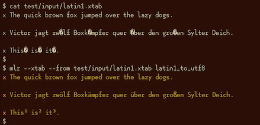
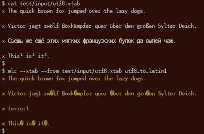

<!---  PLEASE DO NOT EDIT DIRECTLY. EDIT THE .md.in FILE PLEASE. --->

Quick links:
&nbsp;
<a class="quicklink" href="../reference-main-flag-list/index.html">Flags</a>
&nbsp;
<a class="quicklink" href="../reference-verbs/index.html">Verbs</a>
&nbsp;
<a class="quicklink" href="../reference-dsl-builtin-functions/index.html">Functions</a>
&nbsp;
<a class="quicklink" href="../glossary/index.html">Glossary</a>
&nbsp;
<a class="quicklink" href="../release-docs/index.html">Release docs</a>

# Special symbols and formatting

## How can I handle commas-as-data in various formats?

[CSV](file-formats.md) handles this well and by design:

<pre class="pre-highlight-in-pair">
<b>cat commas.csv</b>
</pre>
<pre class="pre-non-highlight-in-pair">
Name,Role
"Xiao, Lin",administrator
"Khavari, Darius",tester
</pre>

Likewise [JSON](file-formats.md#json):

<pre class="pre-highlight-in-pair">
<b>mlr --icsv --ojson cat commas.csv</b>
</pre>
<pre class="pre-non-highlight-in-pair">
[
{
  "Name": "Xiao, Lin",
  "Role": "administrator"
},
{
  "Name": "Khavari, Darius",
  "Role": "tester"
}
]
</pre>

For Miller's [XTAB](file-formats.md#xtab-vertical-tabular) there is no escaping for carriage returns, but commas work fine:

<pre class="pre-highlight-in-pair">
<b>mlr --icsv --oxtab cat commas.csv</b>
</pre>
<pre class="pre-non-highlight-in-pair">
Name Xiao, Lin
Role administrator

Name Khavari, Darius
Role tester
</pre>

But for [key-value-pairs](file-formats.md#dkvp-key-value-pairs) and [index-numbered](file-formats.md#nidx-index-numbered-toolkit-style) formats, commas are the default field separator. And -- as of Miller 5.4.0 anyway -- there is no CSV-style double-quote-handling like there is for CSV. So commas within the data look like delimiters:

<pre class="pre-highlight-in-pair">
<b>mlr --icsv --odkvp cat commas.csv</b>
</pre>
<pre class="pre-non-highlight-in-pair">
Name=Xiao, Lin,Role=administrator
Name=Khavari, Darius,Role=tester
</pre>

One solution is to use a different delimiter, such as a pipe character:

<pre class="pre-highlight-in-pair">
<b>mlr --icsv --odkvp --ofs pipe cat commas.csv</b>
</pre>
<pre class="pre-non-highlight-in-pair">
Name=Xiao, Lin|Role=administrator
Name=Khavari, Darius|Role=tester
</pre>

To be extra-sure to avoid data/delimiter clashes, you can also use control
characters as delimiters -- here, control-A:

<pre class="pre-highlight-in-pair">
<b>mlr --icsv --odkvp --ofs '\001'  cat commas.csv | cat -v</b>
</pre>
<pre class="pre-non-highlight-in-pair">
Name=Xiao, Lin^ARole=administrator
Name=Khavari, Darius^ARole=tester
</pre>

## How can I handle field names with special symbols in them?

Simply surround the field names with curly braces:

<pre class="pre-highlight-in-pair">
<b>echo 'x.a=3,y:b=4,z/c=5' | mlr put '${product.all} = ${x.a} * ${y:b} * ${z/c}'</b>
</pre>
<pre class="pre-non-highlight-in-pair">
x.a=3,y:b=4,z/c=5,product.all=60
</pre>

## How can I put single quotes into strings?

This is a little tricky due to the shell's handling of quotes. For simplicity, let's first put an update script into a file:

<pre class="pre-non-highlight-non-pair">
$a = "It's OK, I said, then 'for now'."
</pre>

<pre class="pre-highlight-in-pair">
<b>echo a=bcd | mlr put -f data/single-quote-example.mlr</b>
</pre>
<pre class="pre-non-highlight-in-pair">
a=It's OK, I said, then 'for now'.
</pre>

So: Miller's DSL uses double quotes for strings, and you can put single quotes (or backslash-escaped double-quotes) inside strings, no problem.

Without putting the update expression in a file, it's messier:

<pre class="pre-highlight-in-pair">
<b>echo a=bcd | mlr put '$a="It'\''s OK, I said, '\''for now'\''."'</b>
</pre>
<pre class="pre-non-highlight-in-pair">
a=It's OK, I said, 'for now'.
</pre>

The idea is that the outermost single-quotes are to protect the `put` expression from the shell, and the double quotes within them are for Miller. To get a single quote in the middle there, you need to actually put it *outside* the single-quoting for the shell. The pieces are the following, all concatenated together:

* `$a="It`
* `\'`
* `s OK, I said,`
* `\'`
* `for now`
* `\'`
* `.`

## How to escape '?' in regexes?

One way is to use square brackets; an alternative is to use simple string-substitution rather than a regular expression.

<pre class="pre-highlight-in-pair">
<b>cat data/question.dat</b>
</pre>
<pre class="pre-non-highlight-in-pair">
a=is it?,b=it is!
</pre>
<pre class="pre-highlight-in-pair">
<b>mlr --oxtab put '$c = gsub($a, "[?]"," ...")' data/question.dat</b>
</pre>
<pre class="pre-non-highlight-in-pair">
a is it?
b it is!
c is it ...
</pre>
<pre class="pre-highlight-in-pair">
<b>mlr --oxtab put '$c = ssub($a, "?"," ...")' data/question.dat</b>
</pre>
<pre class="pre-non-highlight-in-pair">
a is it?
b it is!
c is it ...
</pre>

The
[`ssub`](reference-dsl-builtin-functions.md#ssub) and
[`gssub`](reference-dsl-builtin-functions.md#gssub)
functions exist precisely for this reason: so you don't have to escape anything.

## Latin-1 and UTF-8 character encodings

The `ssub` and `gssub` functions are also handy for dealing with non-UTF-8 strings such as Latin 1, since Go's
`regexp` library -- which Miller uses -- requires UTF-8 strings. For example:

<pre class="pre-highlight-in-pair">
<b>mlr -n put 'end {</b>
<b>  name = "Ka\xf0l\xedn og \xdeormundr";</b>
<b>  name = gssub(name, "\xde", "\u00de");</b>
<b>  name = gssub(name, "\xf0", "\u00f0");</b>
<b>  name = gssub(name, "\xed", "\u00ed");</b>
<b>  print name;</b>
<b>}'</b>
</pre>
<pre class="pre-non-highlight-in-pair">
Kaðlín og Þormundr
</pre>

More generally, though, we have the DSL functions
[`latin1_to_utf8`](reference-dsl-builtin-functions.md#latin1_to_utf8) and
[`utf8_to_latin1`](reference-dsl-builtin-functions.md#utf8_to_latin1)
and the verbs
[`latin1-to-utf8`](reference-verbs.md#latin1-to-utf8) and
[`utf8-to-latin1`](reference-verbs.md#utf8-to-latin1). The former let you fix encodings on a field-by-field
level; the latter, for all records (with less keystroking). (Latin 1 is also known as
[ISO/IEC 8859-1](https://en.wikipedia.org/wiki/ISO/IEC_8859-1).)

In this example, all the inputs are convertible from Latin-1 to UTF-8, since Latin-1 already contains the German characters:

In this example, the English and German pangrams are convertible from UTF-8 to Latin-1, but the
Russian one is not, since Latin-1 doesn't contain the Russian alphabet:

## How to apply math to regex output?

* Use parentheses for capture groups
* Use `\1`, `\2`, etc. to refer to the captures
* The matched patterns are strings, so cast them to `int` or `float`

See also the [page on regular expressions](reference-main-regular-expressions.md).

<pre class="pre-highlight-in-pair">
<b>echo "a=14°45'" | mlr put '$a =~"^([0-9]+)°([0-9]+)" {$degrees = float("\1") + float("\2") / 60}'</b>
</pre>
<pre class="pre-non-highlight-in-pair">
a=14°45',degrees=14.75
</pre>
