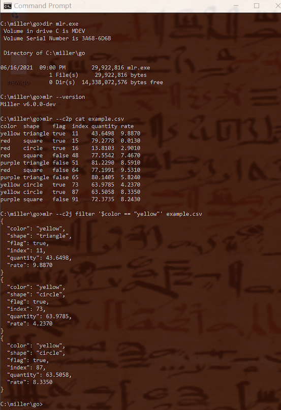

..
    PLEASE DO NOT EDIT DIRECTLY. EDIT THE .rst.in FILE PLEASE.

Miller on Windows
================================================================

Native builds as of Miller 6
----------------------------------------------------------------

Miller was originally developed for Unix-like operating systems including Linux and MacOS. Since the initial release of Miller in 2015, support for Windows has been partial. But as of version 6.0.0, Miller builds directly on Windows.

The experience is now almost the same as on Linux, NetBSD/FreeBSD, and MacOS.

MSYS2 is no longer required, although you can use Miller from within MSYS2 if you like. There is now simply a single ``mlr.exe``, with no ``msys2.dll`` alongside anymore.

See :doc:`installation` for how to get a copy of ``mlr.exe``.

Setup
----------------------------------------------------------------

Simply place ``mlr.exe`` somewhere within your ``PATH`` variable.

To use Miller from within MSYS2/Cygwin, also make sure ``mlr.exe`` is within the ``PATH`` variable.

.. image::  pix/miller-msys.png

Differences
----------------------------------------------------------------

:doc:`output-colorization` doesn't work on Windows, outside of MSYS2.

The Windows-support code within Miller makes effort to support Linux/Unix/MacOS-like command-line syntax including single-quoting of expressions for ``mlr put`` and ``mlr filter`` -- and in the examples above, this often works. However, there are still some cases where more complex expressions aren't successfully parsed from the Windows prompt, even though they are from MSYS2:

.. image::  pix/miller-msys-complex.png

One workaround is to use MSYS2. Another is to put more complex DSL expressions into a file:

.. image::  pix/miller-windows-complex-workaround.png
