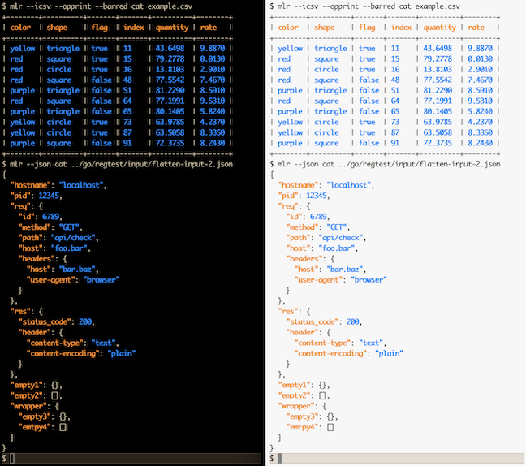
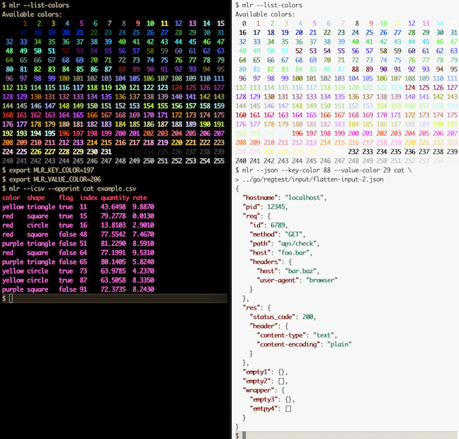

..
    PLEASE DO NOT EDIT DIRECTLY. EDIT THE .rst.in FILE PLEASE.

Output colorization
================================================================

As of version 6.0.0, Miller supports output-colorization. Here are examples using side-by-side black-background and white-background terminals:

Things having colors:

* Keys in CSV header lines, JSON keys, etc
* Values in CSV data lines, JSON scalar values, etc
* "PASS" and "FAIL" in regression-test output
* Some online-help strings

Rules for colorization:

* By default, colorize output only if writing to stdout and stdout is a TTY.

  * Example: color: ``mlr --csv cat foo.csv``
  * Example: no color: ``mlr --csv cat foo.csv > bar.csv``
  * Example: no color: ``mlr --csv cat foo.csv | less``

* The default colors were chosen since they look OK with white or black terminal background, and are differentiable with common varieties of human color vision.

Mechanisms for colorization:

* Miller uses ANSI escape sequences only. This does not work on Windows except on Cygwin.
* Requires ``TERM`` environment variable to be set to non-empty string.
* Doesn't try to check to see whether the terminal is capable of 256-color ANSI vs 16-color ANSI. Note that if colors are in the range 0..15 then 16-color ANSI escapes are used, so this is in the user's control.

How you can control colorization:

* Suppression/unsuppression:

  * ``export MLR_NO_COLOR=true`` means Miller won't color even when it normally would.
  * ``export MLR_ALWAYS_COLOR=true`` means Miller will color even when it normally would not. For example, you might want to use this when piping ``mlr`` output to ``less -r``.
  * Command-line flags ``--no-color`` or ``-M``, ``--always-color`` or ``-C``.

* Color choices can be specified by using environment variables or command-line flags, with values 0..255:

  * ``export MLR_KEY_COLOR=208``
  * ``export MLR_VALUE_COLOR=33``
  * Likewise for ``MLR_PASS_COLOR``, ``MLR_FAIL_COLOR``, ``MLR_HELP_COLOR``, ``MLR_REPL_PS1_COLOR``, and ``MLR_REPL_PS2_COLOR``.
  * Command-line flags ``--key-color 208``, ``--value-color 33``, etc., and likewise for ``--pass-color``, ``--fail-color``, ``--repl-ps1-color``, ``--repl-ps2-color``, and ``--help-color``.
  * This is particularly useful if your terminal's background color clashes with current settings.

If environment-variable settings and command-line flags are both provided, the latter take precedence.

Please do ``mlr --list-color-codes`` to see the available color codes (like ``170``), and ``mlr --list-color-names`` to see available names (like ``orchid``).

