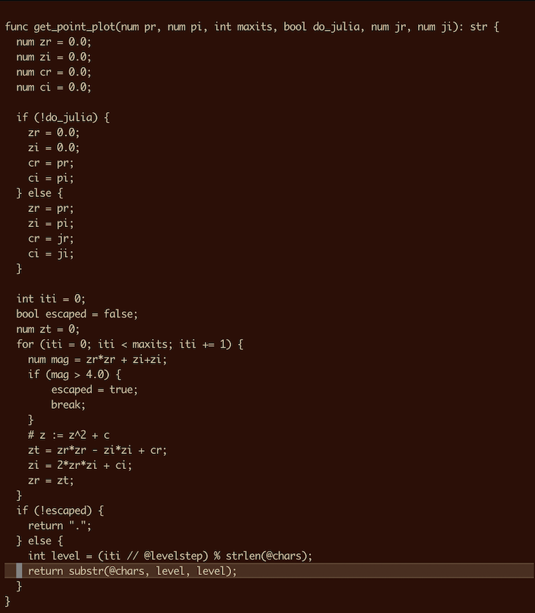
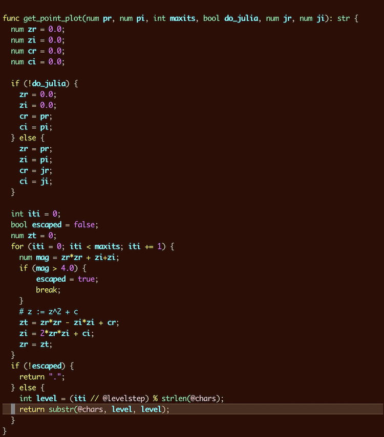

<!---  PLEASE DO NOT EDIT DIRECTLY. EDIT THE .md.in FILE PLEASE. --->

Quick links:
&nbsp;
<a class="quicklink" href="../reference-main-flag-list/index.html">Flag list</a>
&nbsp;
<a class="quicklink" href="../reference-verbs/index.html">Verb list</a>
&nbsp;
<a class="quicklink" href="../reference-dsl-builtin-functions/index.html">Function list</a>
&nbsp;
<a class="quicklink" href="../glossary/index.html">Glossary</a>
&nbsp;
<a class="quicklink" href="https://github.com/johnkerl/miller" target="_blank">Repository ↗</a>

# Syntax highlighting: vimrc

At [https://github.com/johnkerl/miller/tree/main/vim](https://github.com/johnkerl/miller/tree/main/vim) you will
find [ftdetect](https://github.com/johnkerl/miller/tree/main/vim/ftdetect) for telling the `vim` text editor
about the `.mlr` file extension, [syntax](https://github.com/johnkerl/miller/tree/main/vim/syntax) for syntax-highlighting source files in the
[Miller programming language](miller-programming-language.md), and a [README file](https://github.com/johnkerl/miller/blob/main/vim/README.md) shwoing you where to put these where `vim` can find them.

Before-and-after images:

