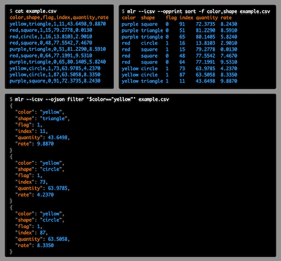

<!---  PLEASE DO NOT EDIT DIRECTLY. EDIT THE .md.in FILE PLEASE. --->
# Introduction

**Miller is a command-line tool for querying, shaping, and reformatting data files in various formats including CSV and JSON.**

In several senses, Miller is more than one tool:

**Format conversion:** You can convert CSV files to JSON, or vice versa, or
pretty-print your data horizontally or vertically to make it easier to read.

**Data manipulation:** With a few keystrokes you can remove columns you don't care about -- or, make new ones using expressions like `$rate = $units / $seconds`.

**Pre-processing/post-processing vs standalone use:** You can use Miller to clean data files and put them into standard formats, perhaps in preparation to load them into a database or a hands-off data-processing pipeline. Or you can use it post-process and summary database-query output. As well, you can use Miller to explore and analyze your data interactively.

**Compact verbs vs programming language:** For low-keystroking you can do things like `mlr --csv sort -f name input.csv` or `mlr --json head -n 1 myfile.json`. The `sort`, `head`, etc are called *verbs*. They're analogs of familiar command-line tools like `sort`, `head`, and so on -- but they're aware of name-indexed, multi-line file formats like CSV and JSON. In addition, though, using Miller's `put` verb you can use programming-language statements for expressions like `$rate = $units / $seconds` which allow you to succintly express your own logic.

**Multiple domains:** People use Miller for data analysis, data science, software engineering, devops/system-administration, journalism, scientific research, and more.

In the following (color added for the illustration) you can see how CSV, tabular, JSON, and other **file formats** share a common theme which is **lists of key-value-pairs**. Miller embraces this common theme.

